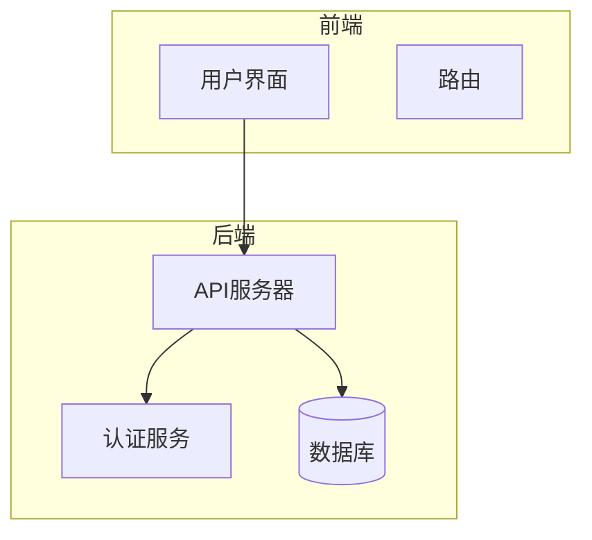
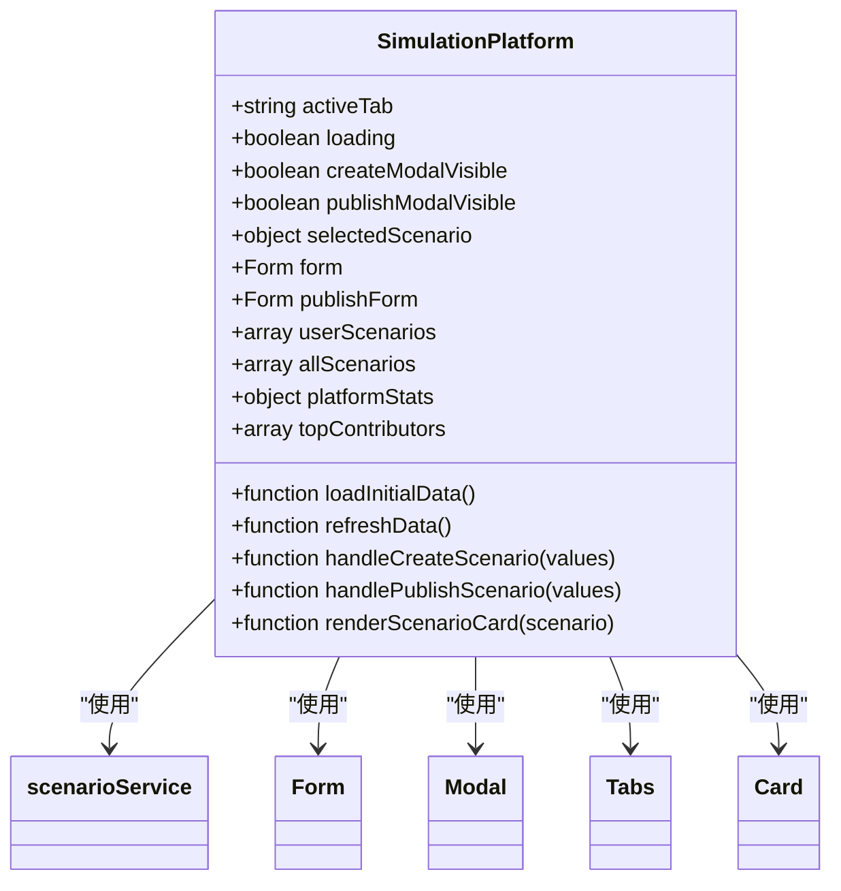
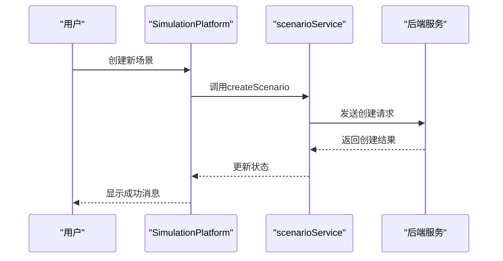
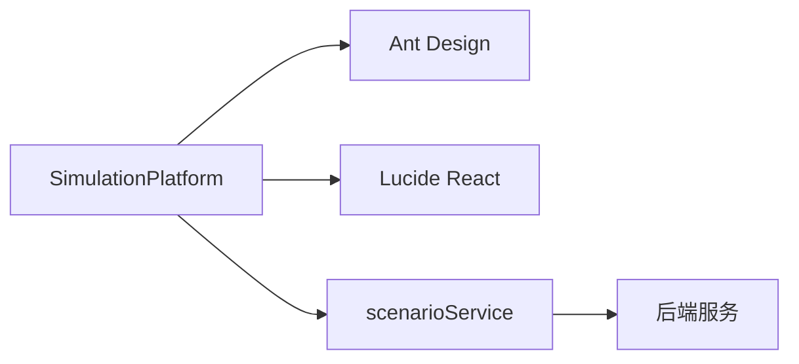

# 通用架构

<cite>
**本文档引用的文件**
- [SimulationPlatform.jsx](file://src/components/SimulationPlatform.jsx)
- [scenarioService.js](file://src/services/scenarioService.js)
- [ScienceDemo.jsx](file://src/components/ScienceDemo.jsx)
- [MentalHealthCoach.jsx](file://src/components/MentalHealthCoach.jsx)
- [App.jsx](file://src/App.jsx)
</cite>

## 目录
1. [引言](#引言)
2. [项目结构](#项目结构)
3. [核心组件](#核心组件)
4. [架构概述](#架构概述)
5. [详细组件分析](#详细组件分析)
6. [依赖分析](#依赖分析)
7. [性能考虑](#性能考虑)
8. [故障排除指南](#故障排除指南)
9. [结论](#结论)

## 引言
模拟平台是一个多学科仿真容器，旨在为教育和培训提供一个开放、可扩展的仿真环境。该平台支持多种学科领域的仿真场景，包括科学演示、心理学实验、家庭教育等。通过iframe生命周期管理和跨域通信机制，平台能够无缝集成各种外部仿真应用，并确保安全性和稳定性。

## 项目结构
该项目采用模块化设计，主要分为以下几个部分：
- `public`：包含静态资源文件，如HTML模板、CSS样式表、JavaScript库等。
- `src`：源代码目录，包含React组件、服务、类型定义和工具函数。
- `components`：存放所有UI组件，每个组件都有独立的JSX和CSS文件。
- `services`：提供数据访问和服务逻辑，如场景管理、用户认证等。
- `types`：定义项目中使用的类型接口。
- `utils`：通用工具函数，如编辑器实例管理、主题管理等。



**图表来源**
- [App.jsx](file://src/App.jsx#L0-L425)

**章节来源**
- [App.jsx](file://src/App.jsx#L0-L425)

## 核心组件
`SimulationPlatform` 组件是整个平台的核心，负责管理仿真场景的生命周期、跨域通信和状态同步。它通过props接收外部配置参数，并使用内部状态机来协调不同仿真场景的加载与交互。

**章节来源**
- [SimulationPlatform.jsx](file://src/components/SimulationPlatform.jsx#L0-L1712)

## 架构概述
`SimulationPlatform` 组件采用了现代化的React架构，结合Ant Design组件库和Lucide图标库，提供了丰富的UI元素和交互体验。组件通过`useState`和`useEffect`钩子管理状态和副作用，确保了高效的状态更新和生命周期管理。



**图表来源**
- [SimulationPlatform.jsx](file://src/components/SimulationPlatform.jsx#L0-L1712)

## 详细组件分析

### SimulationPlatform 分析
`SimulationPlatform` 组件的主要职责包括：
- **场景管理**：通过`scenarioService`获取和管理用户的仿真场景。
- **状态管理**：使用`useState`管理多个状态变量，如`activeTab`、`loading`、`createModalVisible`等。
- **生命周期管理**：通过`useEffect`在组件挂载时加载初始数据，并监听URL哈希变化。
- **事件处理**：处理创建和发布场景的表单提交，以及刷新数据的操作。

#### 状态管理
组件使用多个`useState`钩子来管理不同的状态：
- `activeTab`：当前激活的标签页。
- `loading`：是否正在加载数据。
- `createModalVisible` 和 `publishModalVisible`：控制模态框的显示。
- `selectedScenario`：当前选中的场景。
- `userScenarios` 和 `allScenarios`：存储用户和个人的所有场景。
- `platformStats`：平台统计数据。
- `topContributors`：顶级贡献者列表。

#### 生命周期管理
组件在挂载时通过`useEffect`调用`loadInitialData`方法，加载初始数据。此外，还监听URL哈希变化，以便在浏览器地址栏发生变化时更新当前视图。

```javascript
useEffect(() => {
  loadInitialData()
}, [])
```

#### 事件处理
组件提供了多个事件处理函数，如`handleCreateScenario`和`handlePublishScenario`，用于处理创建和发布场景的表单提交。这些函数通过`scenarioService`与后端进行交互，并更新组件状态。



**图表来源**
- [SimulationPlatform.jsx](file://src/components/SimulationPlatform.jsx#L0-L1712)
- [scenarioService.js](file://src/services/scenarioService.js#L0-L1210)

**章节来源**
- [SimulationPlatform.jsx](file://src/components/SimulationPlatform.jsx#L0-L1712)

### 跨域通信机制
`SimulationPlatform` 组件通过`postMessage` API实现与iframe内容的跨域通信。例如，在`ScienceDemo`和`MentalHealthCoach`组件中，通过监听`message`事件来处理来自iframe的消息。

```javascript
useEffect(() => {
  const handleMessage = (event) => {
    console.log('Received postMessage:', event.data)
    if (event.data && event.data.type === 'NAVIGATE_TO_EVALUATION') {
      console.log('Navigating to my-evaluation')
      setCurrentView('my-evaluation')
    }
  }

  window.addEventListener('message', handleMessage)

  return () => {
    window.removeEventListener('message', handleMessage)
  }
}, [])
```

这种机制允许iframe内的内容向父页面发送导航请求或其他操作指令，从而实现双向通信。

**章节来源**
- [App.jsx](file://src/App.jsx#L0-L425)
- [ScienceDemo.jsx](file://src/components/ScienceDemo.jsx#L0-L38)
- [MentalHealthCoach.jsx](file://src/components/MentalHealthCoach.jsx#L0-L37)

### 安全策略
为了确保平台的安全性，采取了以下措施：
- **内容安全策略（CSP）**：通过设置适当的CSP头，防止XSS攻击。
- **消息来源验证**：在处理`postMessage`消息时，验证消息来源，确保只接受来自可信源的消息。
- **输入验证**：在创建和更新场景时，对输入数据进行严格的验证，防止注入攻击。

```javascript
const validateScenarioData = (data) => {
  const required = ['title', 'description', 'category', 'subject', 'difficulty', 'duration', 'license']
  const missing = required.filter(field => !data[field])

  if (missing.length > 0) {
    throw new Error(`缺少必填字段: ${missing.join(', ')}`)
  }

  if (data.title.length < 5 || data.title.length > 100) {
    throw new Error('标题长度应在5-100字符之间')
  }

  if (data.description.length < 20 || data.description.length > 500) {
    throw new Error('描述长度应在20-500字符之间')
  }

  if (!Object.values(SCENARIO_CATEGORIES).includes(data.category)) {
    throw new Error('无效的场景分类')
  }

  if (!Object.values(SUBJECTS).includes(data.subject)) {
    throw new Error('无效的学科领域')
  }

  if (!Object.values(DIFFICULTY_LEVELS).includes(data.difficulty)) {
    throw new Error('无效的难度等级')
  }

  // 验证互动仿真相关字段
  if (!data.simulationUrl && !data.sourceAttachment) {
    throw new Error('必须提供互动仿真地址或源码附件')
  }

  if (data.simulationUrl) {
    const urlPattern = /^https?:\/\/.+/
    if (!urlPattern.test(data.simulationUrl)) {
      throw new Error('互动仿真地址格式不正确，必须以http://或https://开头')
    }
  }

  if (data.sourceAttachment) {
    const allowedExtensions = ['.zip', '.rar', '.tar.gz', '.7z']
    const fileName = data.sourceAttachment.fileName || ''
    const hasValidExtension = allowedExtensions.some(ext => fileName.toLowerCase().endsWith(ext))

    if (!hasValidExtension) {
      throw new Error('源码附件必须是压缩文件格式（.zip, .rar, .tar.gz, .7z）')
    }

    // 检查文件大小（假设以MB为单位）
    const fileSize = parseFloat(data.sourceAttachment.fileSize)
    if (fileSize > 100) {
      throw new Error('源码附件大小不能超过100MB')
    }
  }

  return true
}
```

**章节来源**
- [scenarioService.js](file://src/services/scenarioService.js#L0-L1210)

### 可扩展性设计
平台支持通过配置文件动态注册新仿真场景。`scenarioService` 提供了`getAllScenarios`、`getUserScenarios`、`getScenarioById`等方法，方便地获取和管理场景数据。此外，`SimulationPlatform` 组件通过`Tabs`组件实现了多标签页的切换，支持发现、我的贡献、社区和贡献者排行榜等多个功能模块。

```javascript
<Tabs 
  activeKey={activeTab} 
  onChange={(key) => {
    console.log('页签切换:', activeTab, '->', key)
    setActiveTab(key)
  }}
  size="large"
  destroyInactiveTabPane={true}
  tabBarExtraContent={
    <Button 
      type="primary" 
      icon={<Plus size={16} />}
      onClick={() => setCreateModalVisible(true)}
    >
      贡献场景
    </Button>
  }
  items={[
    {
      key: 'discover',
      label: <span><Globe size={16} style={{ marginRight: 8 }} />发现</span>,
      children: (
        <div className="discover-content">
          {/* 发现内容 */}
        </div>
      )
    },
    {
      key: 'my-contributions',
      label: <span><User size={16} style={{ marginRight: 8 }} />我的贡献</span>,
      children: (
        <div className="my-contributions">
          {/* 我的贡献内容 */}
        </div>
      )
    },
    {
      key: 'community',
      label: <span><Award size={16} style={{ marginRight: 8 }} />社区</span>,
      children: (
        <div className="community-content">
          {/* 社区内容 */}
        </div>
      )
    },
    {
      key: 'contributors-ranking',
      label: <span><Award size={16} style={{ marginRight: 8 }} />贡献者排行榜</span>,
      children: (
        <div className="contributors-ranking">
          {/* 贡献者排行榜内容 */}
        </div>
      )
    }
  ]}
/>
```

**章节来源**
- [SimulationPlatform.jsx](file://src/components/SimulationPlatform.jsx#L0-L1712)

## 依赖分析
`SimulationPlatform` 组件依赖于多个外部库和内部服务：
- **Ant Design**：提供UI组件，如`Card`、`Row`、`Col`、`Button`等。
- **Lucide React**：提供图标组件，如`Plus`、`Edit`、`Delete`等。
- **scenarioService**：提供场景管理服务，包括创建、更新、删除和查询场景。



**图表来源**
- [SimulationPlatform.jsx](file://src/components/SimulationPlatform.jsx#L0-L1712)
- [scenarioService.js](file://src/services/scenarioService.js#L0-L1210)

**章节来源**
- [SimulationPlatform.jsx](file://src/components/SimulationPlatform.jsx#L0-L1712)
- [scenarioService.js](file://src/services/scenarioService.js#L0-L1210)

## 性能考虑
为了提高性能，`SimulationPlatform` 组件采取了以下措施：
- **懒加载**：通过`destroyInactiveTabPane`属性，销毁非活动的标签页，减少内存占用。
- **异步加载**：使用`Promise.all`并行加载多个数据源，加快初始加载速度。
- **缓存**：通过`useState`缓存已加载的数据，避免重复请求。

```javascript
const loadInitialData = async () => {
  setLoading(true)
  try {
    console.log('=== 开始加载数据 ===')

    // 并行加载数据
    const [userScenariosRes, allScenariosRes, statsRes, contributorsRes] = await Promise.all([
      scenarioService.getUserScenarios(),
      scenarioService.getAllScenarios({ status: SCENARIO_STATUS.PUBLISHED }),
      scenarioService.getPlatformStats(),
      scenarioService.getTopContributors(5)
    ])

    if (userScenariosRes.success) {
      setUserScenarios(userScenariosRes.data)
    } else {
      console.error('获取用户场景失败:', userScenariosRes.error)
    }

    if (allScenariosRes.success) {
      setAllScenarios(allScenariosRes.data)
    } else {
      console.error('获取所有场景失败:', allScenariosRes.error)
    }

    if (statsRes.success) {
      setPlatformStats(statsRes.data)
    }

    if (contributorsRes.success) {
      setTopContributors(contributorsRes.data)
    }

    console.log('=== 数据加载完成 ===')
  } catch (error) {
    console.error('加载数据失败:', error)
    message.error('加载数据失败，请刷新页面重试')
  } finally {
    setLoading(false)
  }
}
```

**章节来源**
- [SimulationPlatform.jsx](file://src/components/SimulationPlatform.jsx#L0-L1712)

## 故障排除指南
如果遇到问题，可以参考以下步骤进行排查：
1. **检查网络连接**：确保网络连接正常，能够访问后端服务。
2. **查看控制台日志**：检查浏览器控制台是否有错误信息。
3. **验证输入数据**：确保创建和更新场景时输入的数据符合要求。
4. **检查权限**：确认当前用户有权限执行相关操作。
5. **重启应用**：尝试重启应用，清除缓存。

**章节来源**
- [SimulationPlatform.jsx](file://src/components/SimulationPlatform.jsx#L0-L1712)
- [scenarioService.js](file://src/services/scenarioService.js#L0-L1210)

## 结论
`SimulationPlatform` 组件通过现代化的React架构和丰富的功能模块，为用户提供了一个强大且灵活的仿真平台。通过合理的状态管理、生命周期管理和跨域通信机制，确保了平台的稳定性和安全性。未来可以通过增加更多的仿真场景和支持更多设备，进一步提升用户体验。