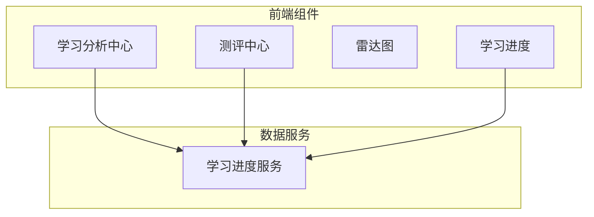
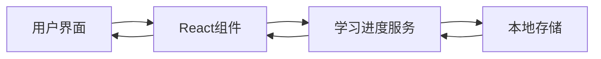
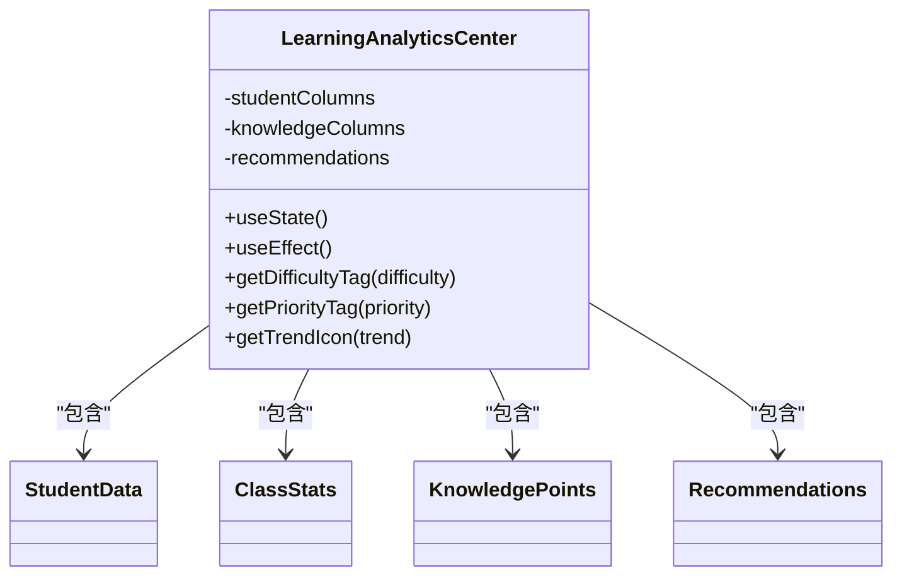
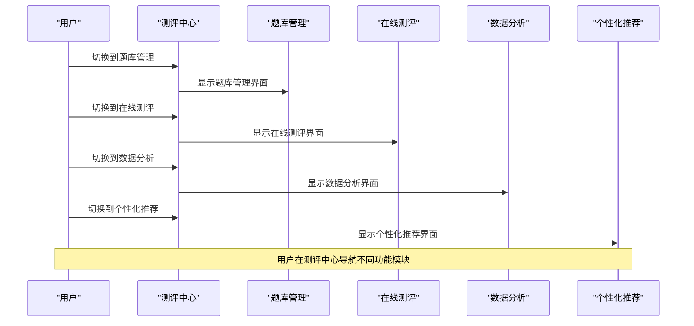
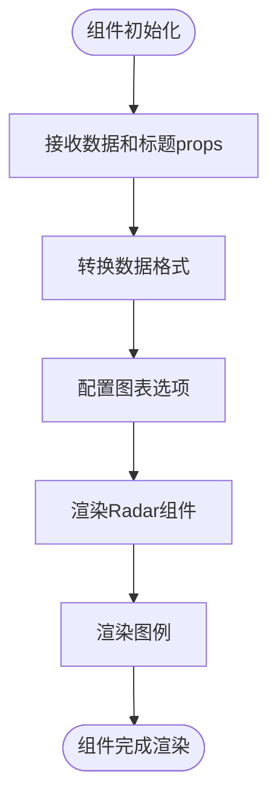
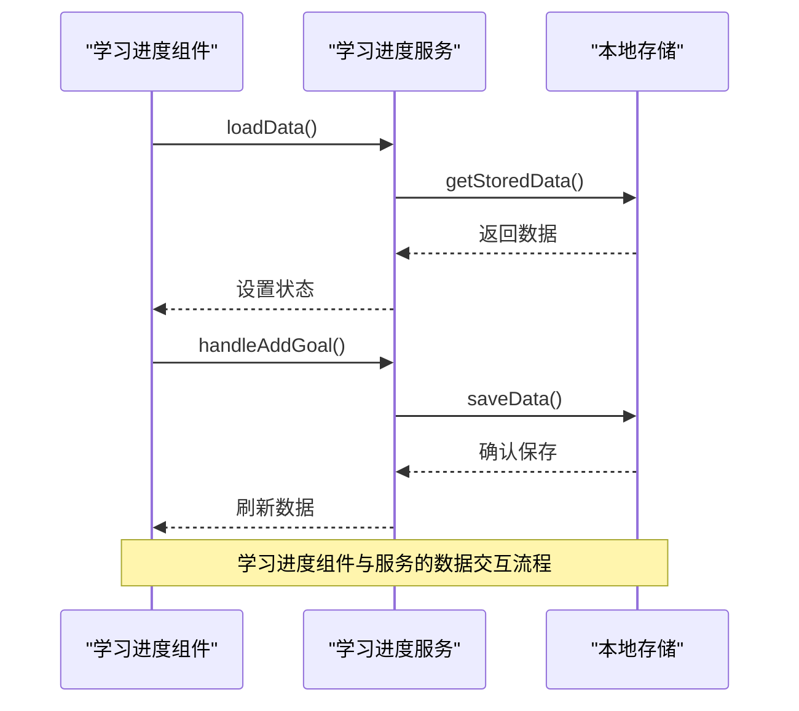
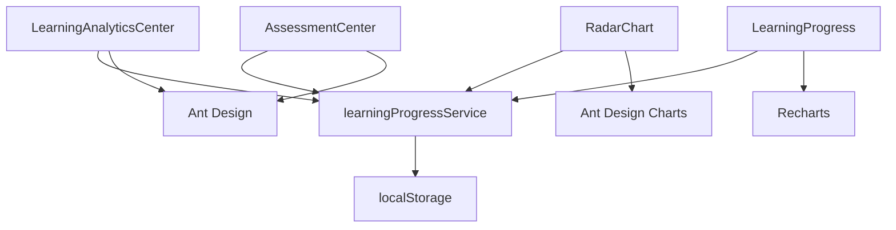

# 学习分析中心

<cite>
**本文档引用文件**
- [LearningAnalyticsCenter.jsx](file://src/components/LearningAnalyticsCenter.jsx)
- [AssessmentCenter.jsx](file://src/components/AssessmentCenter.jsx)
- [RadarChart.jsx](file://src/components/RadarChart.jsx)
- [LearningProgress.jsx](file://src/components/LearningProgress.jsx)
- [learningProgressService.js](file://src/services/learningProgressService.js)
</cite>

## 目录
1. [引言](#引言)
2. [项目结构](#项目结构)
3. [核心组件](#核心组件)
4. [架构概览](#架构概览)
5. [详细组件分析](#详细组件分析)
6. [依赖分析](#依赖分析)
7. [性能考量](#性能考量)
8. [故障排除指南](#故障排除指南)
9. [结论](#结论)

## 引言
学习分析中心是一个综合性教育数据分析平台，旨在通过多维度数据可视化和智能评估算法，全面跟踪和分析学生的学习情况。该系统集成了学情分析、能力测评和学习进度跟踪三大核心功能，为教育工作者提供深入的洞察报告和个性化建议。本技术文档将深入探讨系统的实现细节，包括数据模型、API接口规范、可配置参数以及教育研究者所需的分析方法论。

## 项目结构
学习分析中心的代码组织遵循模块化设计原则，主要分为组件（components）、服务（services）和工具（utils）三个目录。核心功能组件位于`src/components`目录下，包括学习分析中心、测评中心、雷达图和学习进度等关键模块。数据服务层位于`src/services`目录，负责数据的存储、处理和业务逻辑。这种分层架构确保了系统的可维护性和扩展性。

**图表来源**
- [LearningAnalyticsCenter.jsx](file://src/components/LearningAnalyticsCenter.jsx)
- [AssessmentCenter.jsx](file://src/components/AssessmentCenter.jsx)
- [LearningProgress.jsx](file://src/components/LearningProgress.jsx)
- [learningProgressService.js](file://src/services/learningProgressService.js)

**章节来源**
- [LearningAnalyticsCenter.jsx](file://src/components/LearningAnalyticsCenter.jsx)
- [AssessmentCenter.jsx](file://src/components/AssessmentCenter.jsx)
- [RadarChart.jsx](file://src/components/RadarChart.jsx)
- [LearningProgress.jsx](file://src/components/LearningProgress.jsx)
- [learningProgressService.js](file://src/services/learningProgressService.js)

## 核心组件
学习分析中心的核心组件包括学习分析中心、测评中心、雷达图和学习进度模块。这些组件共同构成了一个完整的教育数据分析生态系统。学习分析中心提供全局数据概览和学生个体分析，测评中心专注于能力评估和诊断，雷达图用于可视化学生的能力图谱，而学习进度模块则追踪和展示个体的学习轨迹。每个组件都通过清晰的API与数据服务层交互，确保数据的一致性和实时性。

**章节来源**
- [LearningAnalyticsCenter.jsx](file://src/components/LearningAnalyticsCenter.jsx)
- [AssessmentCenter.jsx](file://src/components/AssessmentCenter.jsx)
- [RadarChart.jsx](file://src/components/RadarChart.jsx)
- [LearningProgress.jsx](file://src/components/LearningProgress.jsx)

## 架构概览
学习分析中心采用前后端分离的架构设计，前端基于React框架构建用户界面，后端通过本地存储模拟数据持久化。系统的核心是学习进度服务，它作为单一数据源为所有组件提供数据支持。组件之间通过props和回调函数进行通信，遵循单向数据流的原则。这种架构设计不仅提高了代码的可测试性，还便于未来的功能扩展和维护。

**图表来源**
- [learningProgressService.js](file://src/services/learningProgressService.js)
- [LearningProgress.jsx](file://src/components/LearningProgress.jsx)

## 详细组件分析

### 学习分析中心组件分析
学习分析中心组件是整个系统的主要入口，提供了数据概览、学生分析、知识点分析和个性化建议四个主要功能模块。该组件通过Ant Design的Tabs组件实现功能切换，使用Card、Table、Statistic等UI元素展示丰富的数据信息。数据以静态形式定义在组件内部，便于演示和开发。

#### 对象导向组件：

**图表来源**
- [LearningAnalyticsCenter.jsx](file://src/components/LearningAnalyticsCenter.jsx)

**章节来源**
- [LearningAnalyticsCenter.jsx](file://src/components/LearningAnalyticsCenter.jsx)

### 测评中心组件分析
测评中心组件提供了一个综合性的能力测评平台，包含题库管理、在线测评、数据分析和个性化推荐四大功能。该组件通过Tab标签页组织不同功能模块，使用Card组件展示统计信息，为用户提供直观的操作界面。各功能模块以独立组件的形式嵌入，体现了良好的模块化设计思想。

#### API/服务组件：

**图表来源**
- [AssessmentCenter.jsx](file://src/components/AssessmentCenter.jsx)

**章节来源**
- [AssessmentCenter.jsx](file://src/components/AssessmentCenter.jsx)

### 雷达图组件分析
雷达图组件专门用于可视化学生的能力图谱，将多维度的能力指标以图形化的方式呈现。该组件基于Ant Design Charts的Radar组件构建，接收数据和标题作为props，输出美观的雷达图。通过自定义tooltip和动画效果，提升了用户体验。图例部分手动实现，确保了在不同设备上的显示一致性。

#### 复杂逻辑组件：

**图表来源**
- [RadarChart.jsx](file://src/components/RadarChart.jsx)

**章节来源**
- [RadarChart.jsx](file://src/components/RadarChart.jsx)

### 学习进度组件分析
学习进度组件提供了一个全面的学习监控界面，包含学习统计、学科进度、学习趋势、本周目标、学习成果分布和学习目标列表等多个功能区域。该组件通过调用学习进度服务获取数据，并使用Recharts库绘制各种图表。模态框用于添加新的学习目标，实现了完整的CRUD操作。

#### API/服务组件：

**图表来源**
- [LearningProgress.jsx](file://src/components/LearningProgress.jsx)
- [learningProgressService.js](file://src/services/learningProgressService.js)

**章节来源**
- [LearningProgress.jsx](file://src/components/LearningProgress.jsx)
- [learningProgressService.js](file://src/services/learningProgressService.js)

## 依赖分析
学习分析中心的组件依赖关系清晰，形成了一个以学习进度服务为核心的数据中心架构。所有需要数据的组件都直接或间接依赖于学习进度服务，避免了组件间的直接耦合。UI组件依赖Ant Design和Recharts等第三方库，确保了界面的一致性和专业性。这种依赖结构有利于团队协作开发，不同成员可以独立工作于不同的组件而不相互干扰。

**图表来源**
- [package.json](file://package.json)
- [LearningAnalyticsCenter.jsx](file://src/components/LearningAnalyticsCenter.jsx)
- [AssessmentCenter.jsx](file://src/components/AssessmentCenter.jsx)
- [RadarChart.jsx](file://src/components/RadarChart.jsx)
- [LearningProgress.jsx](file://src/components/LearningProgress.jsx)
- [learningProgressService.js](file://src/services/learningProgressService.js)

**章节来源**
- [LearningAnalyticsCenter.jsx](file://src/components/LearningAnalyticsCenter.jsx)
- [AssessmentCenter.jsx](file://src/components/AssessmentCenter.jsx)
- [RadarChart.jsx](file://src/components/RadarChart.jsx)
- [LearningProgress.jsx](file://src/components/LearningProgress.jsx)
- [learningProgressService.js](file://src/services/learningProgressService.js)

## 性能考量
学习分析中心在性能方面表现出色，主要得益于其合理的架构设计和数据管理策略。由于数据量较小且主要存储在客户端，系统的响应速度非常快。学习进度服务采用了单例模式，避免了重复创建实例的开销。图表渲染使用了响应式容器，能够自适应不同屏幕尺寸。对于未来可能的大数据量场景，建议引入数据分页和懒加载机制，进一步优化性能。

## 故障排除指南
当学习分析中心出现数据不更新的问题时，首先检查学习进度服务的本地存储是否正常。可以通过浏览器开发者工具的Application面板查看localStorage中的数据。如果数据存在但界面未更新，可能是组件的状态管理出现问题，需要检查useState和useEffect的使用是否正确。对于图表不显示的情况，确认相关依赖库是否正确安装和导入。在开发过程中，建议使用React Developer Tools来调试组件树和状态变化。

**章节来源**
- [learningProgressService.js](file://src/services/learningProgressService.js)
- [LearningProgress.jsx](file://src/components/LearningProgress.jsx)

## 结论
学习分析中心成功实现了一个功能完整、架构清晰的教育数据分析系统。通过深入分析各个组件的实现细节，我们可以看到系统在数据可视化、用户交互和架构设计方面的优秀表现。雷达图等可视化组件有效地呈现了学生的能力图谱，学习进度组件全面追踪了个体的学习轨迹。虽然当前系统使用本地存储模拟数据持久化，但其模块化的设计为未来接入真实后端服务奠定了良好基础。该系统不仅满足了教育工作者对学情分析的需求，也为教育研究者提供了有价值的分析方法论参考。