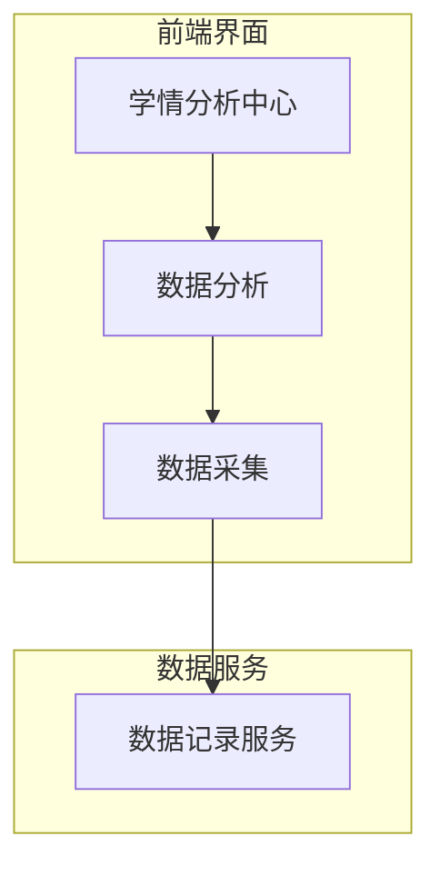
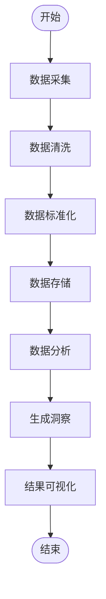
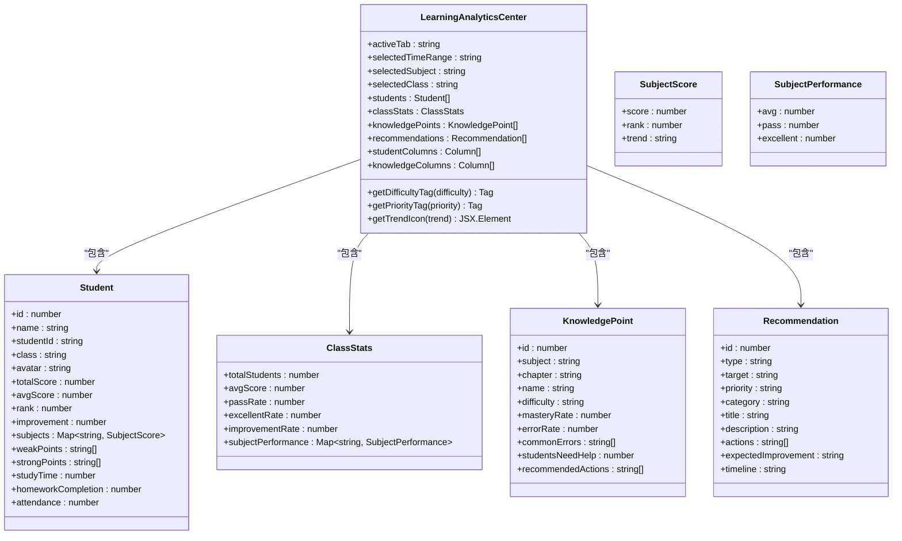
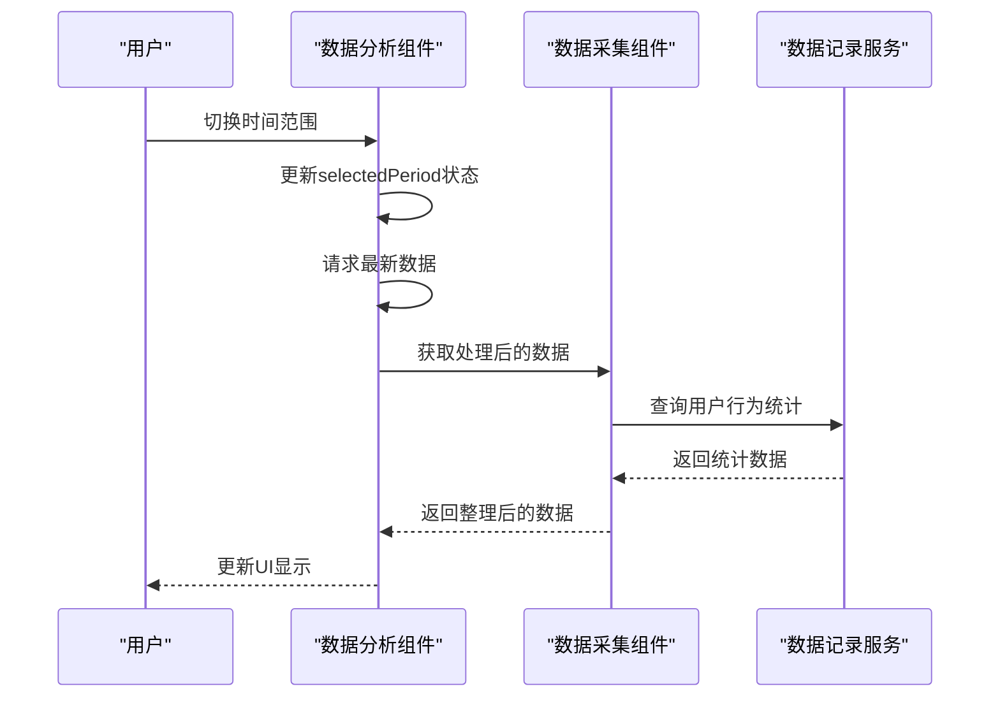
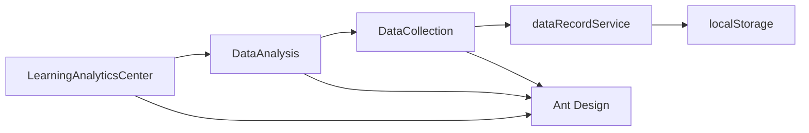

# 学情分析

<cite>
**本文档引用文件**  
- [LearningAnalyticsCenter.jsx](file://src/components/LearningAnalyticsCenter.jsx)
- [DataAnalysis.jsx](file://src/components/DataAnalysis.jsx)
- [DataCollection.jsx](file://src/components/DataCollection.jsx)
- [dataRecordService.js](file://src/services/dataRecordService.js)
</cite>

## 目录
1. [引言](#引言)
2. [项目结构](#项目结构)
3. [核心组件](#核心组件)
4. [架构概览](#架构概览)
5. [详细组件分析](#详细组件分析)
6. [依赖分析](#依赖分析)
7. [性能考量](#性能考量)
8. [故障排除指南](#故障排除指南)
9. [结论](#结论)

## 引言
学情分析模块是教育技术系统中的关键组成部分，旨在通过整合多源数据构建学生画像，为教育工作者提供深入的洞察。该模块不仅关注学生的学术表现，还涵盖了学习行为、参与度和个性化建议等多个维度。

## 项目结构
本项目的结构清晰地划分了不同的功能区域，主要包含以下几个部分：
- `public`：存放静态资源文件，如编辑器、插件和样式表。
- `src`：源代码目录，包含了组件、服务、类型定义和工具函数。
- `components`：UI组件集合，包括学情分析中心、数据分析、数据采集等。
- `services`：业务逻辑和服务层，处理数据记录和外部API交互。
- `utils`：通用工具函数，支持数据生成和主题管理。

**图表来源**
- [LearningAnalyticsCenter.jsx](file://src/components/LearningAnalyticsCenter.jsx#L0-L753)
- [DataAnalysis.jsx](file://src/components/DataAnalysis.jsx#L0-L637)
- [DataCollection.jsx](file://src/components/DataCollection.jsx#L0-L531)
- [dataRecordService.js](file://src/services/dataRecordService.js#L0-L177)

**章节来源**
- [LearningAnalyticsCenter.jsx](file://src/components/LearningAnalyticsCenter.jsx#L0-L753)
- [DataAnalysis.jsx](file://src/components/DataAnalysis.jsx#L0-L637)

## 核心组件
学情分析模块的核心在于`LearningAnalyticsCenter`组件，它负责整合来自不同数据源的信息，并以可视化的方式呈现给用户。此组件利用Ant Design的UI库来构建丰富的交互式界面，允许教师根据时间范围、学科和班级筛选数据。

**章节来源**
- [LearningAnalyticsCenter.jsx](file://src/components/LearningAnalyticsCenter.jsx#L0-L753)

## 架构概览
整个学情分析系统的架构设计遵循分层原则，从数据采集到最终的报告生成，每一层都有明确的责任。数据首先由`DataCollection`组件从多个来源（如在线学习平台、测评系统）收集，然后经过清洗和标准化处理后存储在本地或远程数据库中。接着，`DataAnalysis`组件对这些数据进行深度分析，计算出各种指标并识别学习模式。最后，`LearningAnalyticsCenter`将所有信息汇总，形成全面的学生画像。

**图表来源**
- [DataCollection.jsx](file://src/components/DataCollection.jsx#L0-L531)
- [DataAnalysis.jsx](file://src/components/DataAnalysis.jsx#L0-L637)
- [LearningAnalyticsCenter.jsx](file://src/components/LearningAnalyticsCenter.jsx#L0-L753)

**章节来源**
- [DataCollection.jsx](file://src/components/DataCollection.jsx#L0-L531)
- [DataAnalysis.jsx](file://src/components/DataAnalysis.jsx#L0-L637)

## 详细组件分析

### 学情分析中心组件分析
`LearningAnalyticsCenter`组件提供了四个主要标签页：数据概览、学生分析、知识点分析和个性化建议。每个标签页都展示了不同类型的数据视图，帮助教师快速了解班级整体情况和个人学生的表现。

#### 对于对象导向组件：

**图表来源**
- [LearningAnalyticsCenter.jsx](file://src/components/LearningAnalyticsCenter.jsx#L0-L753)

**章节来源**
- [LearningAnalyticsCenter.jsx](file://src/components/LearningAnalyticsCenter.jsx#L0-L753)

### 数据分析组件分析
`DataAnalysis`组件专注于个人和区域层面的数据分析。它通过两个选项卡分别展示个人用户的测评历史、能力分布以及地区间的比较统计。该组件使用模拟数据初始化状态，实际应用中应替换为真实的数据获取逻辑。

#### 对于API/服务组件：

**图表来源**
- [DataAnalysis.jsx](file://src/components/DataAnalysis.jsx#L0-L637)
- [DataCollection.jsx](file://src/components/DataCollection.jsx#L0-L531)
- [dataRecordService.js](file://src/services/dataRecordService.js#L0-L177)

**章节来源**
- [DataAnalysis.jsx](file://src/components/DataAnalysis.jsx#L0-L637)

## 依赖分析
学情分析模块依赖于多个内部和外部组件。内部依赖包括`DataCollection`用于数据采集，`dataRecordService`用于持久化用户行为数据。外部依赖则涉及Ant Design UI库和其他第三方JavaScript库，如Day.js用于日期操作。

**图表来源**
- [LearningAnalyticsCenter.jsx](file://src/components/LearningAnalyticsCenter.jsx#L0-L753)
- [DataAnalysis.jsx](file://src/components/DataAnalysis.jsx#L0-L637)
- [DataCollection.jsx](file://src/components/DataCollection.jsx#L0-L531)
- [dataRecordService.js](file://src/services/dataRecordService.js#L0-L177)

**章节来源**
- [LearningAnalyticsCenter.jsx](file://src/components/LearningAnalyticsCenter.jsx#L0-L753)
- [DataAnalysis.jsx](file://src/components/DataAnalysis.jsx#L0-L637)
- [DataCollection.jsx](file://src/components/DataCollection.jsx#L0-L531)
- [dataRecordService.js](file://src/services/dataRecordService.js#L0-L177)

## 性能考量
为了确保良好的用户体验，学情分析模块在设计时考虑了性能优化。例如，在`dataRecordService`中限制了每种类型记录的最大数量，避免localStorage过大影响加载速度。此外，组件采用了虚拟滚动和分页技术来处理大量数据的展示问题。

## 故障排除指南
当遇到数据不更新的问题时，请检查以下几点：
- 确认数据源是否处于激活状态。
- 检查网络连接是否正常，特别是对于API类型的源。
- 查看浏览器控制台是否有错误信息。
- 验证localStorage是否已满或被禁用。

**章节来源**
- [DataCollection.jsx](file://src/components/DataCollection.jsx#L0-L531)
- [dataRecordService.js](file://src/services/dataRecordService.js#L0-L177)

## 结论
学情分析模块通过集成多种数据源，实现了对学生学习情况的全方位监控与评估。其灵活的配置选项和直观的可视化界面使得教育工作者能够轻松地获取有价值的信息，进而采取有效的教学干预措施。未来的工作可以进一步增强预测模型的能力，提供更多个性化的学习路径推荐。