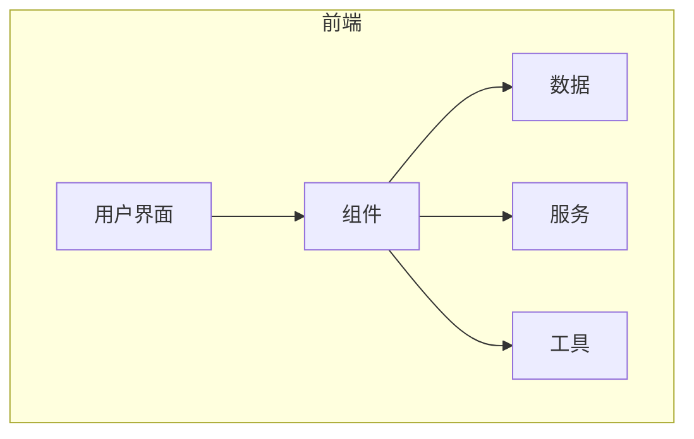
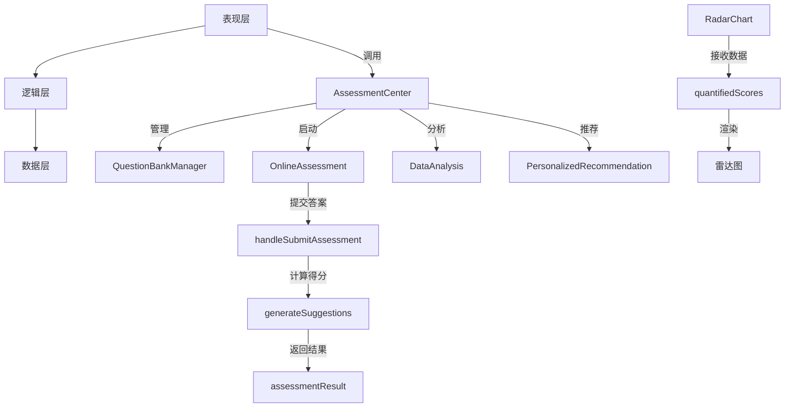
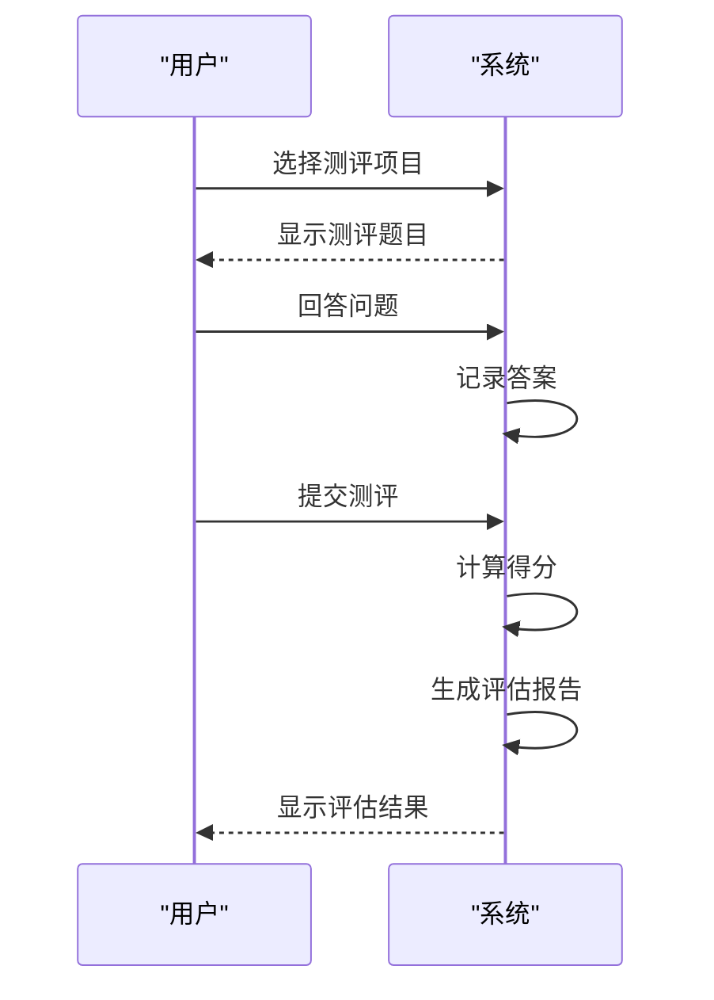
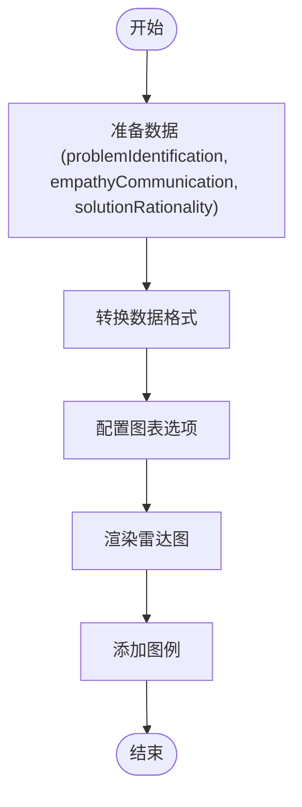
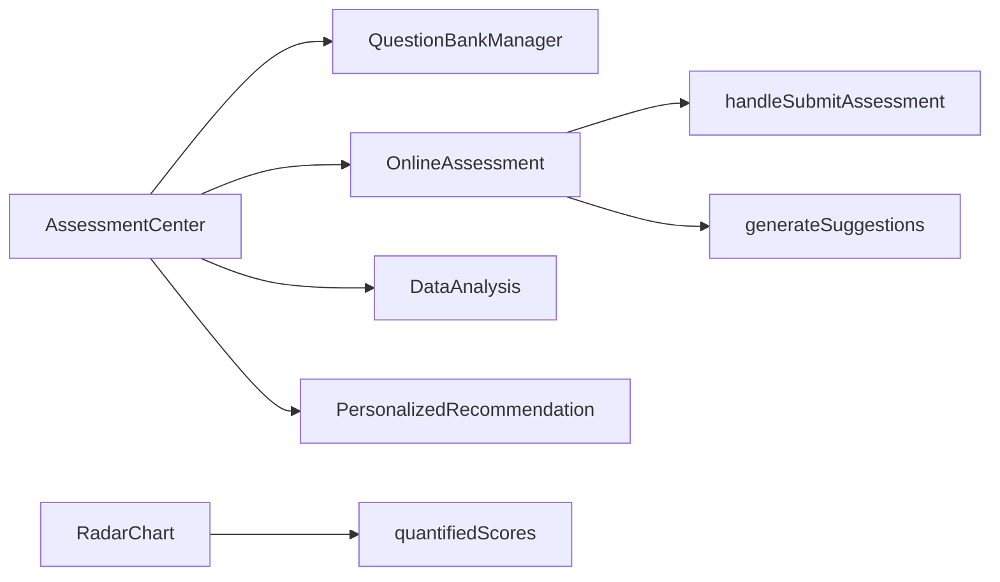

# 能力评估

<cite>
**本文档引用文件**   
- [AssessmentCenter.jsx](file://src/components/AssessmentCenter.jsx)
- [RadarChart.jsx](file://src/components/RadarChart.jsx)
- [OnlineAssessment.jsx](file://src/components/OnlineAssessment.jsx)
- [MyEvaluation.jsx](file://src/components/MyEvaluation.jsx)
</cite>

## 目录
1. [引言](#引言)
2. [项目结构](#项目结构)
3. [核心组件](#核心组件)
4. [架构概述](#架构概述)
5. [详细组件分析](#详细组件分析)
6. [依赖分析](#依赖分析)
7. [性能考虑](#性能考虑)
8. [故障排除指南](#故障排除指南)
9. [结论](#结论)

## 引言
能力评估系统是一个全面的数智素养能力测评工具，旨在为教育者和学习者提供个性化的评估与诊断服务。该系统通过多维度的能力模型（如布鲁姆分类法）进行综合评估，并利用雷达图等可视化技术展示评估结果。系统支持自定义评估标准，能够动态生成详细的评估报告，帮助用户识别优势与不足，制定改进计划。

## 项目结构
本项目采用模块化设计，主要分为以下几个部分：
- `public`：存放静态资源文件，如CSS、JavaScript库和图标。
- `src`：源代码目录，包含组件、数据、服务、类型定义和工具函数。
- `components`：UI组件集合，包括评估中心、在线测评、数据分析等功能模块。
- `data`：模拟数据和测试数据。
- `services`：业务逻辑和服务接口。
- `types`：类型定义。
- `utils`：通用工具函数。

**Diagram sources**
- [AssessmentCenter.jsx](file://src/components/AssessmentCenter.jsx)
- [OnlineAssessment.jsx](file://src/components/OnlineAssessment.jsx)

**Section sources**
- [AssessmentCenter.jsx](file://src/components/AssessmentCenter.jsx)
- [OnlineAssessment.jsx](file://src/components/OnlineAssessment.jsx)

## 核心组件
### AssessmentCenter 组件
`AssessmentCenter` 是整个系统的入口点，负责管理和协调各个子功能模块。它提供了概览、题库管理、在线测评、数据分析和个性化推荐五个主要功能标签页。

**Section sources**
- [AssessmentCenter.jsx](file://src/components/AssessmentCenter.jsx)

### RadarChart 组件
`RadarChart` 组件用于可视化展示用户的多维度能力评分。它接收一个包含各项能力得分的数据对象，将其转换为适合雷达图显示的格式，并配置相应的坐标轴、颜色和交互行为。

**Section sources**
- [RadarChart.jsx](file://src/components/RadarChart.jsx)

## 架构概述
系统采用React框架构建，结合Ant Design组件库实现UI界面。整体架构分为三层：表现层、逻辑层和数据层。

**Diagram sources**
- [AssessmentCenter.jsx](file://src/components/AssessmentCenter.jsx)
- [OnlineAssessment.jsx](file://src/components/OnlineAssessment.jsx)
- [RadarChart.jsx](file://src/components/RadarChart.jsx)

**Section sources**
- [AssessmentCenter.jsx](file://src/components/AssessmentCenter.jsx)
- [OnlineAssessment.jsx](file://src/components/OnlineAssessment.jsx)
- [RadarChart.jsx](file://src/components/RadarChart.jsx)

## 详细组件分析
### AssessmentCenter 分析
`AssessmentCenter` 组件通过Tabs组件组织不同的功能模块，每个标签页对应一个具体的子组件。例如，“在线测评”标签页加载`OnlineAssessment`组件，允许用户选择并完成各种测评任务。

#### 功能特点
- **概览**：显示题库总量、进行中测评数量、已完成测评数量和平均分数。
- **题库管理**：集成`QuestionBankManager`，支持题目创建、编辑和分类。
- **在线测评**：集成`OnlineAssessment`，提供多种题型的支持，包括单选、多选、判断和填空。
- **数据分析**：集成`DataAnalysis`，生成个人和区域的数字画像。
- **个性化推荐**：集成`PersonalizedRecommendation`，根据评估结果推荐学习资源和实践场景。

**Section sources**
- [AssessmentCenter.jsx](file://src/components/AssessmentCenter.jsx)

### OnlineAssessment 分析
`OnlineAssessment` 组件实现了完整的在线测评流程，包括选择测评、进行测评和查看结果三个步骤。

#### 测评流程
1. **选择测评**：用户从预设的测评模板中选择一个项目开始测评。
2. **进行测评**：用户依次回答问题，系统实时记录答案并倒计时。
3. **查看结果**：提交后，系统计算得分并生成评估报告，包括总分、等级、正确率和用时等信息。

#### 评分算法
- **得分计算**：根据正确答案的数量计算得分，公式为 `(正确题数 / 总题数) * 100`。
- **等级划分**：根据得分划分为“优秀”、“良好”、“中等”、“及格”和“不及格”五个等级。
- **建议生成**：根据得分生成个性化的学习建议，鼓励用户继续提升或巩固现有技能。

**Diagram sources**
- [OnlineAssessment.jsx](file://src/components/OnlineAssessment.jsx)

**Section sources**
- [OnlineAssessment.jsx](file://src/components/OnlineAssessment.jsx)

### RadarChart 分析
`RadarChart` 组件使用`@ant-design/charts`库中的`Radar`图表来展示多维度能力评分。它接收一个包含各项能力得分的数据对象，将其转换为适合雷达图显示的格式，并配置相应的坐标轴、颜色和交互行为。

#### 技术实现
- **数据映射**：将输入数据转换为`{item, score, fullScore}`格式，其中`item`表示能力项，`score`表示得分，`fullScore`表示满分。
- **坐标轴配置**：设置x轴为能力项名称，y轴为得分范围（0-100），并添加网格线和标签。
- **样式定制**：定义线条、填充区域、点的颜色和大小，以及提示框的内容和样式。
- **动画效果**：启用波浪进入动画，提升用户体验。

**Diagram sources**
- [RadarChart.jsx](file://src/components/RadarChart.jsx)

**Section sources**
- [RadarChart.jsx](file://src/components/RadarChart.jsx)

## 依赖分析
系统依赖于多个第三方库和内部组件，确保各模块之间的松耦合和高内聚。

**Diagram sources**
- [AssessmentCenter.jsx](file://src/components/AssessmentCenter.jsx)
- [OnlineAssessment.jsx](file://src/components/OnlineAssessment.jsx)
- [RadarChart.jsx](file://src/components/RadarChart.jsx)

**Section sources**
- [AssessmentCenter.jsx](file://src/components/AssessmentCenter.jsx)
- [OnlineAssessment.jsx](file://src/components/OnlineAssessment.jsx)
- [RadarChart.jsx](file://src/components/RadarChart.jsx)

## 性能考虑
为了保证系统的响应速度和用户体验，采取了以下优化措施：
- **懒加载**：仅在需要时加载子组件，减少初始加载时间。
- **状态管理**：使用React的useState和useEffect钩子有效管理组件状态。
- **防抖处理**：对频繁触发的事件（如输入框变化）进行防抖处理，避免不必要的重新渲染。
- **虚拟滚动**：对于长列表，使用虚拟滚动技术提高渲染效率。

## 故障排除指南
### 常见问题
- **无法加载测评**：检查网络连接是否正常，确认服务器端是否有响应。
- **评分不准确**：核对题目答案是否正确配置，确保评分逻辑无误。
- **图表显示异常**：检查数据格式是否符合要求，确认图表库版本兼容性。

### 调试方法
- 使用浏览器开发者工具查看控制台日志，定位错误信息。
- 检查网络请求，确认API调用成功且返回预期数据。
- 在关键节点插入console.log语句，跟踪程序执行流程。

**Section sources**
- [OnlineAssessment.jsx](file://src/components/OnlineAssessment.jsx)
- [RadarChart.jsx](file://src/components/RadarChart.jsx)

## 结论
能力评估系统通过模块化设计和先进的可视化技术，为用户提供了一个全面、灵活且易于使用的评估平台。系统不仅支持多种评估模式和自定义标准，还能生成详细的评估报告和个性化建议，帮助用户持续提升能力水平。未来可以进一步扩展评估模型，引入更多维度的能力指标，增强系统的智能化程度。