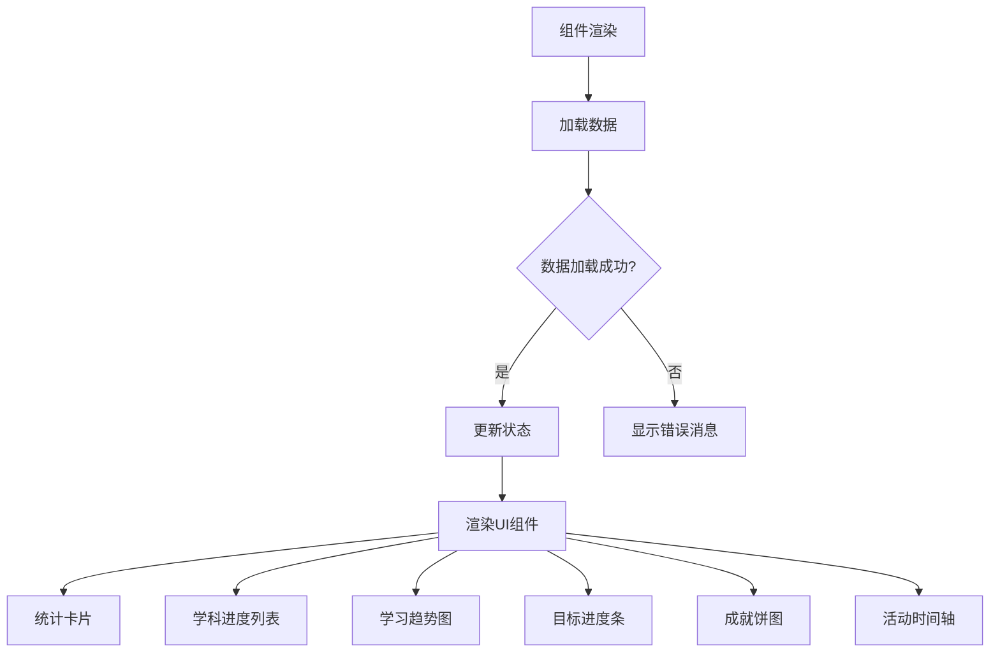

# 进度跟踪

<cite>
**本文档引用文件**
- [LearningProgress.jsx](file://src/components/LearningProgress.jsx)
- [learningProgressService.js](file://src/services/learningProgressService.js)
</cite>

## 目录
1. [学习进度组件技术实现](#学习进度组件技术实现)
2. [学习进度服务数据同步机制](#学习进度服务数据同步机制)
3. [进度可视化设计与用户体验](#进度可视化设计与用户体验)
4. [预警机制与个性化反馈](#预警机制与个性化反馈)

## 学习进度组件技术实现

`LearningProgress` 组件采用 React 函数式组件实现，通过状态管理展示个体及群体的学习轨迹。组件初始化时调用 `useEffect` 钩子加载学习进度数据，使用多个 `useState` 钩子维护学习概要、学科进度、每日趋势、周统计、学习目标、成就和最近活动等状态。

组件通过 `loadData` 异步函数从 `learningProgressService` 服务获取各项数据，并更新对应的状态变量。当数据加载失败时，显示错误消息并记录异常。组件提供时间周期选择器（本周、本月、本季度、本年），允许用户切换不同的时间范围查看进度。

用户可通过模态框添加新的学习目标，表单包含标题、描述、目标值、优先级和截止日期字段，提交后调用服务的 `addStudyGoal` 方法保存目标并重新加载数据。组件还支持导出学习报告功能，将进度数据序列化为 JSON 文件供用户下载。

**Section sources**
- [LearningProgress.jsx](file://src/components/LearningProgress.jsx#L64-L534)

## 学习进度服务数据同步机制

`learningProgressService` 服务采用单例模式实现，使用浏览器 `localStorage` 进行数据持久化存储，确保离线环境下仍可访问和更新学习进度。服务在构造函数中初始化存储键名并调用 `initializeData` 方法创建默认数据结构。

服务提供完整的 CRUD 操作接口：`addStudyRecord` 方法用于记录学习时长和完成课时，自动更新学科进度、总学习时间和每日记录；`updateGoalProgress` 方法更新学习目标进度，当目标完成时自动生成成就活动记录；`addStudyGoal` 和 `removeStudyGoal` 分别处理学习目标的增删操作。

数据同步策略采用即时保存机制，每次数据变更后立即调用 `saveData` 方法更新本地存储。服务内置多种数据计算方法，如 `getDailyTrend` 生成过去7天的学习趋势数据，`calculateStudyStreak` 计算连续学习天数，`getWeeklyStats` 计算周进度统计等。异常处理机制确保在读取或保存数据失败时不会导致应用崩溃。

**Section sources**
- [learningProgressService.js](file://src/services/learningProgressService.js#L0-L405)

## 进度可视化设计与用户体验

组件采用响应式布局，适配不同屏幕尺寸。顶部展示四个关键指标卡片：总学习时长、已完成课程、平均成绩和连续学习天数，使用不同颜色区分重要性。学科进度区域以列表形式展示各学科学习情况，包含进度条、完成课时和学习时长信息。

学习趋势图使用折线图展示每日实际学习时长与目标时长的对比，帮助用户识别学习规律。本周目标卡片显示周学习时长目标的完成进度，学习成果分布采用饼图展示不同等级的分布情况。学习目标列表按优先级颜色分类显示，包含进度条和截止日期信息。

最近活动区域使用时间轴展示学习历程，不同类型的活动（完成、开始、成就）使用不同图标标识。所有图表均采用 `recharts` 库实现，确保视觉一致性和交互体验。CSS 样式文件定义了动画效果、悬停状态和响应式规则，提升整体用户体验。

**Diagram sources**
- [LearningProgress.jsx](file://src/components/LearningProgress.jsx#L64-L534)
- [LearningProgress.css](file://src/components/LearningProgress.css#L0-L301)

## 预警机制与个性化反馈

系统通过多种方式提供预警和反馈。学习目标的 `isOverdue` 属性标记过期目标，结合 `daysLeft` 属性提醒用户剩余时间。连续学习天数（`studyStreak`）作为正向激励指标，鼓励用户保持学习习惯。

个性化反馈体现在多维度数据分析上：`getAchievements` 方法计算已完成科目数量和平均进度，为用户提供整体学习表现评估；`getStudySummary` 汇总关键指标，帮助用户快速了解学习状况。当用户完成学习目标时，系统自动生成成就活动记录，增强成就感。

教育者可通过分析学习趋势和学科进度，及时发现学习滞后的情况并进行干预。例如，当某学科进度明显落后于其他学科，或连续多日无学习记录时，系统可触发提醒。导出的JSON报告包含完整的学习数据，便于深入分析和制定个性化指导方案。

**Section sources**
- [learningProgressService.js](file://src/services/learningProgressService.js#L0-L405)
- [LearningProgress.jsx](file://src/components/LearningProgress.jsx#L64-L534)