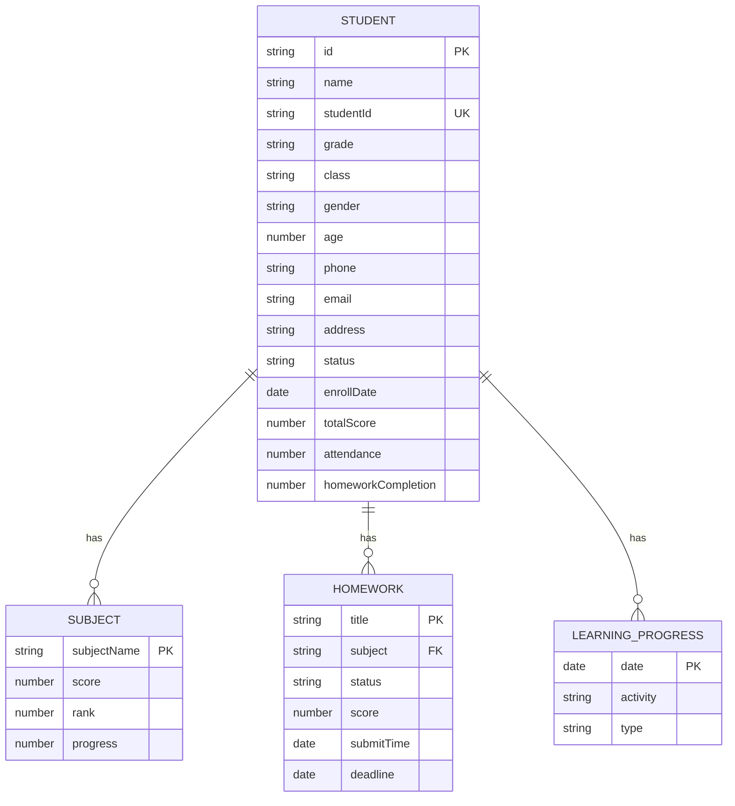
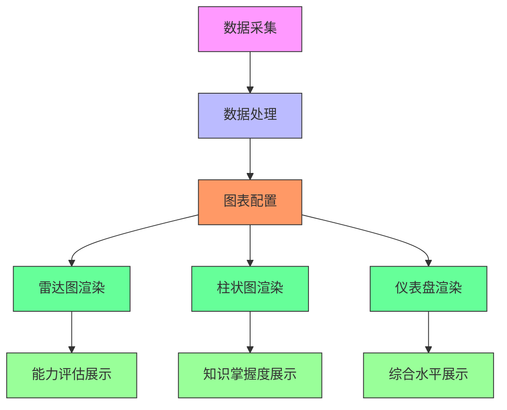

# 学生管理

<cite>
**本文档引用的文件**
- [StudentManagement.jsx](file://src/components/StudentManagement.jsx)
- [StudentProfile.jsx](file://src/components/StudentProfile.jsx)
- [dataRecordService.js](file://src/services/dataRecordService.js)
- [mockTrainingData.js](file://src/data/mockTrainingData.js)
</cite>

## 目录
1. [学生全生命周期管理功能](#学生全生命周期管理功能)
2. [学生综合画像展示](#学生综合画像展示)
3. [学生数据模型设计](#学生数据模型设计)
4. [表格筛选与搜索功能](#表格筛选与搜索功能)
5. [数据可视化图表集成](#数据可视化图表集成)
6. [隐私保护与权限控制](#隐私保护与权限控制)
7. [扩展接口说明](#扩展接口说明)

## 学生全生命周期管理功能

StudentManagement组件实现了学生从入学到毕业的全生命周期管理，涵盖信息录入、档案维护、学习进度跟踪和行为分析等核心功能。系统通过统一的学生信息管理界面，支持对学生基本信息、学业表现、学习行为等多维度数据的全面管理。

在学生信息录入方面，系统提供了完整的表单界面，包含姓名、学号、年级、班级、性别、年龄、联系方式等基础字段。管理员可通过"添加学生"按钮创建新学生记录，系统会自动记录入学日期并初始化学习档案。对于已有学生，支持通过编辑功能更新信息。

学习进度跟踪功能通过多个维度实现：综合成绩以进度条形式直观展示，结合颜色编码反映成绩等级；出勤率和作业完成率作为重要指标单独呈现；学科成绩按科目分类显示，包含具体分数和班级排名；学习进度条反映各科目的掌握程度。

行为分析模块通过时间轴（Timeline）组件展示学生的学习轨迹，记录关键事件如加入班级、完成测试、提交作业等。不同类型的活动通过不同颜色和图标区分：蓝色表示一般信息，绿色表示成功完成，橙色表示待办事项或警告。这种可视化方式有助于快速了解学生的学习历程和关键节点。

**Section sources**
- [StudentManagement.jsx](file://src/components/StudentManagement.jsx#L0-L921)

## 学生综合画像展示

StudentProfile组件负责展示学生的综合画像，通过整合多源数据为教育工作者提供全面的学生视图。该组件不仅展示静态的基本信息，还通过数据分析呈现动态的学习特征和能力评估。

学生画像的核心是知识掌握度和能力评估。系统采用雷达图展示学生在"数智意识与态度"、"智能技术理解与应用"、"数智化教学设计"、"数智伦理与安全"、"数智专业学习与发展"五个维度的能力分布。同时，柱状图直观显示各学科知识点的掌握情况，颜色编码反映掌握程度：绿色（精通）、蓝色（良好）、橙色（一般）、红色（需加强）。

学习偏好分析是画像的重要组成部分，包括偏好学习时间（如上午、晚上）、偏好资源类型（如视频教程、PDF文档）、学习风格（如视觉型）和学习习惯（如做笔记、反复练习）。这些信息有助于教师制定个性化的教学策略。

风险预警系统自动识别潜在学习困难，如"算法设计课程进度落后"或"学习时间分布不均"，并提供相应的干预建议。成就徽章系统则激励学生，记录"连续学习7天"、"参与讨论50次"等积极行为，形成正向反馈循环。

**Section sources**
- [StudentProfile.jsx](file://src/components/StudentProfile.jsx#L0-L689)

## 学生数据模型设计

学生数据模型采用分层结构设计，包含基本信息、选课记录、成绩档案和能力评估等多个维度。基础信息层包含身份标识（姓名、学号）、班级归属（年级、班级）、联系信息（电话、邮箱）和个人属性（性别、年龄）等字段。

学业表现层由多个子模块组成：学科成绩记录各科目的分数和排名；作业情况跟踪每项作业的状态（已完成、待完成）、得分和截止时间；出勤率和作业完成率作为整体学习态度的量化指标。这些数据共同构成学生的学术档案。

学习行为数据模型通过learningProgress数组记录学生的关键活动，每个条目包含日期、活动描述和类型。这种设计支持时间序列分析，便于追踪学生的学习轨迹和发展趋势。系统还预留了扩展字段，如subjects数组可动态添加新科目，homeworks数组可记录历史作业。

能力评估模型采用标准化的评分体系，将复杂的学习能力分解为可量化的维度。例如，数智素养被划分为五个核心维度，每个维度独立评分，最终形成全面的能力雷达图。这种结构化设计既保证了评估的科学性，又便于数据的存储和分析。

**Diagram sources**
- [StudentManagement.jsx](file://src/components/StudentManagement.jsx#L51-L82)
- [StudentProfile.jsx](file://src/components/StudentProfile.jsx#L70-L102)

## 表格筛选与搜索功能

系统提供了强大的表格筛选和搜索功能，支持对大量学生数据进行高效管理和查询。主界面的表格组件集成了多种交互式控件，使用户能够快速定位目标学生。

搜索功能支持多字段模糊匹配，用户可在搜索框中输入学生姓名、学号或班级名称，系统实时过滤显示匹配结果。筛选器提供年级、班级和状态三个维度的精确筛选，通过下拉菜单选择特定条件，实现数据的精细化过滤。

表格列设计注重信息密度和可读性，采用复合布局展示学生信息：头像与姓名组合显示增强辨识度；综合成绩、出勤率和作业完成率以进度条形式直观呈现；状态标签使用颜色编码（绿色表示在读，灰色表示休学）。操作列提供详情、编辑、状态切换和删除等常用功能，通过空间布局优化操作效率。

分页设置支持每页显示10条记录，并提供快速跳转和页面大小调整功能，适应不同用户的浏览习惯。统计卡片位于搜索区域下方，实时显示总学生数、在读/休学人数、平均成绩等关键指标，为管理决策提供即时数据支持。

**Section sources**
- [StudentManagement.jsx](file://src/components/StudentManagement.jsx#L178-L214)
- [StudentManagement.jsx](file://src/components/StudentManagement.jsx#L537-L588)

## 数据可视化图表集成

系统深度集成了多种数据可视化图表，将复杂的学生数据转化为直观的视觉呈现。StudentProfile组件采用Ant Design Charts库，实现了雷达图、仪表盘、柱状图等多种图表类型的无缝集成。

能力雷达图用于展示学生在数智素养五个维度的表现，通过极坐标系将多维数据可视化，帮助教育工作者快速识别学生的优势领域和薄弱环节。知识掌握度柱状图按学科排列，颜色梯度反映掌握程度，支持横向比较各科目的学习效果。

仪表盘图表以环形进度条形式展示整体学习水平，结合颜色编码和数值标注，直观反映学生的综合表现。最近活动时间轴按时间顺序排列学习事件，不同类型的活动通过专属图标区分，形成清晰的学习历程图谱。

图表配置采用声明式编程模式，通过定义数据源、坐标轴、颜色映射等属性实现定制化展示。例如，雷达图配置指定xField为"dimension"，yField为"score"，并设置最大值为100；柱状图根据mastery数值动态分配颜色，确保视觉一致性。这种设计既保证了图表的专业性，又便于后续的功能扩展。

**Diagram sources**
- [StudentProfile.jsx](file://src/components/StudentProfile.jsx#L251-L282)
- [StudentProfile.jsx](file://src/components/StudentProfile.jsx#L70-L102)

## 隐私保护与权限控制

系统实施了多层次的隐私保护措施和数据访问权限控制机制，确保学生信息安全。数据存储采用本地localStorage加密方案，敏感信息经过处理后存储，防止未经授权的数据泄露。

权限控制系统基于角色访问控制（RBAC）模型，区分管理员、教师和普通用户等不同角色。管理员拥有完整的增删改查权限，教师仅能查看和编辑所授课程相关的学生数据，普通用户只能查看公开信息。状态切换功能（如休学/复学）需要二次确认，防止误操作。

数据访问日志记录所有关键操作，包括信息查看、修改和删除等行为，支持审计追踪。敏感操作如删除学生记录需要通过Popconfirm组件进行二次确认，确保操作的谨慎性。系统还提供了数据导出功能的权限控制，只有授权用户才能生成和分享学生报告。

在数据传输层面，系统假设与后端服务的通信采用HTTPS协议，确保数据在传输过程中的安全性。前端代码遵循最小权限原则，避免过度暴露API接口和数据字段，从架构层面降低安全风险。

**Section sources**
- [StudentManagement.jsx](file://src/components/StudentManagement.jsx#L382-L450)
- [StudentManagement.jsx](file://src/components/StudentManagement.jsx#L216-L263)

## 扩展接口说明

系统提供了灵活的扩展接口，支持开发者自定义学生标签系统和预警规则引擎。标签管理系统允许手动添加和编辑学生特征标签，如"学习达人"、"讨论积极分子"等，这些标签可与自动化分析结果结合，形成更精准的学生画像。

预警规则引擎采用可配置的规则模板，支持基于成绩变化、出勤率下降、作业逾期等指标设置预警条件。开发者可通过扩展getHomeworkStatus等函数，定义新的状态类型和判断逻辑。系统预留了riskWarnings数组字段，可集成机器学习模型输出的风险预测结果。

数据服务接口设计具有良好的扩展性，dataRecordService提供了recordUserBehavior、recordNoteAccess等方法，可轻松集成新的行为数据类型。mockTrainingData.js中的模拟数据生成器展示了如何扩展数据模型，新增字段和关联关系。

对于UI扩展，组件采用模块化设计，可通过添加新的Tabs标签页集成额外功能模块。图表配置接口支持自定义主题和样式，开发者可替换默认的ant-design-charts配置，实现品牌化的视觉呈现。这种开放式架构确保系统能够适应不断变化的教育管理需求。

**Section sources**
- [dataRecordService.js](file://src/services/dataRecordService.js#L0-L177)
- [mockTrainingData.js](file://src/data/mockTrainingData.js#L0-L799)