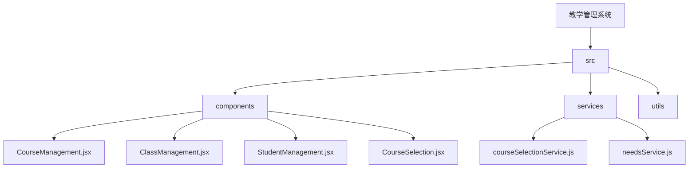
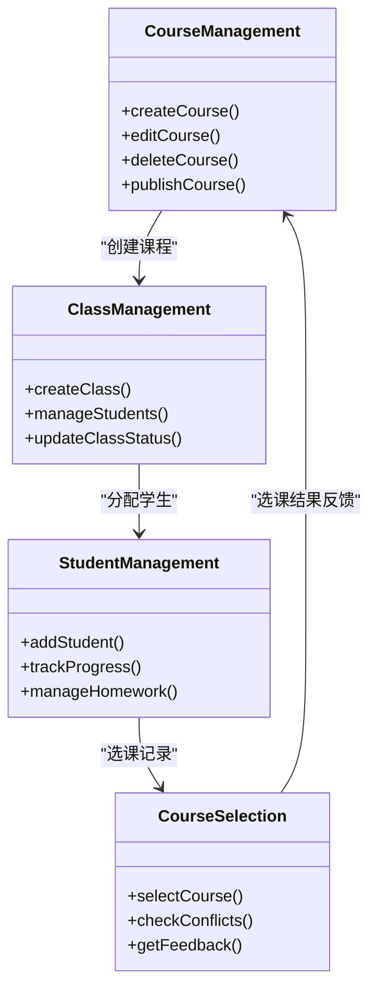
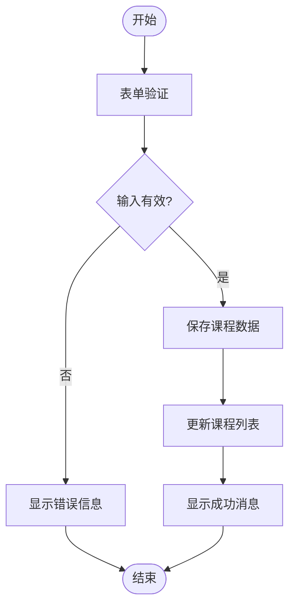
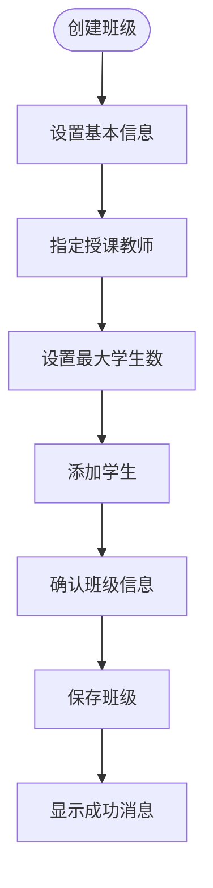
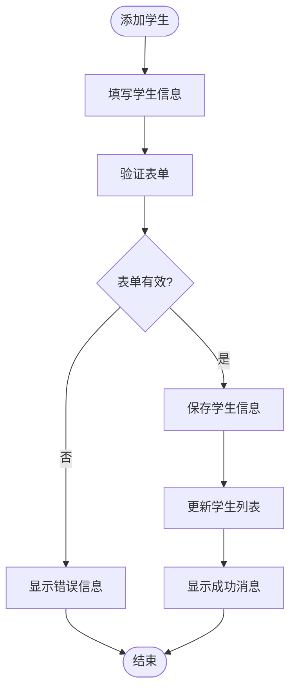
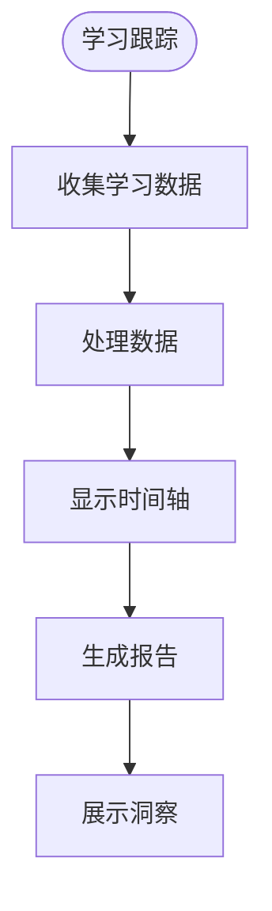
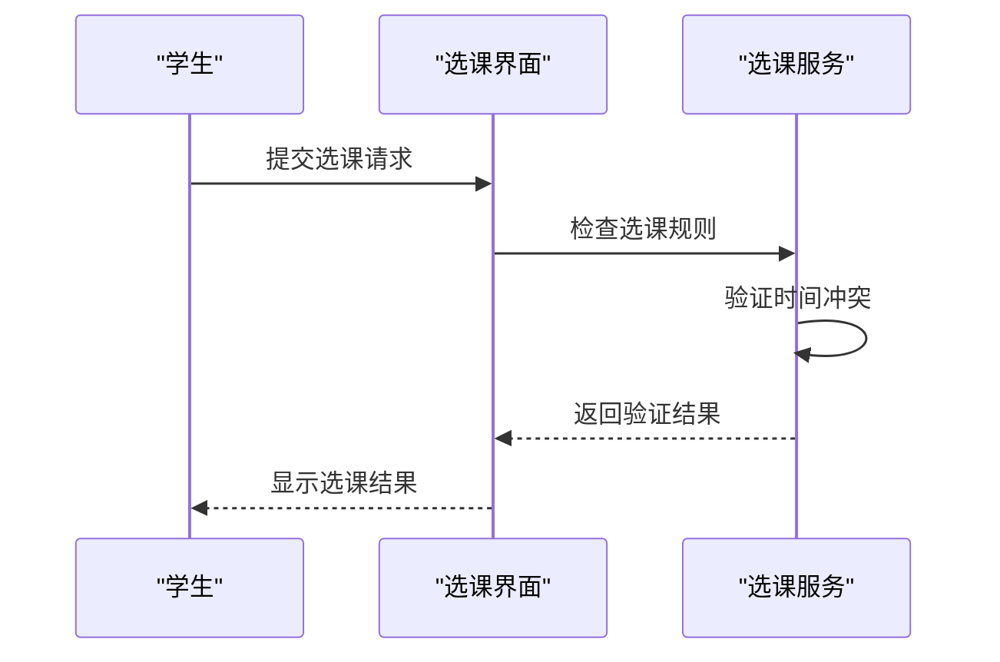
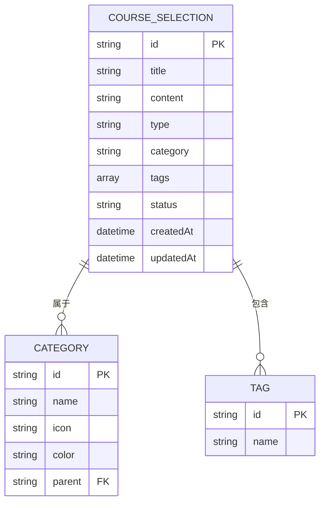

# 教学管理系统

<cite>
**本文档引用文件**   
- [CourseManagement.jsx](file://src/components/CourseManagement.jsx)
- [ClassManagement.jsx](file://src/components/ClassManagement.jsx)
- [StudentManagement.jsx](file://src/components/StudentManagement.jsx)
- [CourseSelection.jsx](file://src/components/CourseSelection.jsx)
- [CourseSelectionEditPage.jsx](file://src/components/CourseSelectionEditPage.jsx)
- [courseSelectionService.js](file://src/services/courseSelectionService.js)
</cite>

## 目录
1. [引言](#引言)
2. [项目结构](#项目结构)
3. [核心功能组件分析](#核心功能组件分析)
4. [课程管理模块](#课程管理模块)
5. [班级管理模块](#班级管理模块)
6. [学生管理模块](#学生管理模块)
7. [选课管理功能实现](#选课管理功能实现)
8. [数据模型与状态同步](#数据模型与状态同步)
9. [管理员操作指南](#管理员操作指南)
10. [开发者API接口说明](#开发者api接口说明)
11. [结论](#结论)

## 引言
教学管理系统是一个全面的教育管理平台，旨在支持完整的教学周期管理。系统主要包含三大核心功能：课程管理、班级管理和学生管理。通过这些功能的协同工作，系统能够有效支持教师的教学活动、学生的学业发展以及管理人员的组织协调。本文档将详细记录系统的完整功能集，并深入分析各组件的实现细节。

## 项目结构
教学管理系统的项目结构清晰地划分了前端组件、服务逻辑和工具函数。系统采用React框架构建用户界面，结合Ant Design组件库提供丰富的UI元素。主要目录包括：

- `src/components`：存放所有React组件，如课程管理、班级管理和学生管理等核心功能组件。
- `src/services`：包含业务逻辑服务，如选课数据服务和培训需求服务。
- `src/utils`：提供辅助工具函数，如模拟数据生成器和主题管理器。

这种分层架构使得代码易于维护和扩展，同时也便于团队协作开发。

**图表来源**
- [CourseManagement.jsx](file://src/components/CourseManagement.jsx)
- [ClassManagement.jsx](file://src/components/ClassManagement.jsx)
- [StudentManagement.jsx](file://src/components/StudentManagement.jsx)
- [CourseSelection.jsx](file://src/components/CourseSelection.jsx)
- [courseSelectionService.js](file://src/services/courseSelectionService.js)

## 核心功能组件分析
教学管理系统的核心功能由三个主要组件构成：课程管理、班级管理和学生管理。这些组件通过共享状态和服务进行交互，形成一个完整的教学管理体系。

### 组件关系图

**图表来源**
- [CourseManagement.jsx](file://src/components/CourseManagement.jsx)
- [ClassManagement.jsx](file://src/components/ClassManagement.jsx)
- [StudentManagement.jsx](file://src/components/StudentManagement.jsx)
- [CourseSelection.jsx](file://src/components/CourseSelection.jsx)

## 课程管理模块
课程管理模块是教学管理系统的基础，负责课程的创建、编辑和发布流程。该模块提供了直观的用户界面，使教师能够轻松管理他们的课程内容。

### 课程创建与编辑流程
课程创建和编辑流程通过一个模态框实现，用户可以在其中填写课程的各种属性，包括课程名称、学科、年级、版本、册次和课程描述。表单验证确保了输入数据的完整性。

**图表来源**
- [CourseManagement.jsx](file://src/components/CourseManagement.jsx#L126-L179)

#### 数据模型设计
课程的数据模型包含了多个字段，以满足不同的管理需求：
- `id`: 唯一标识符
- `name`: 课程名称
- `subject`: 学科
- `grade`: 年级
- `version`: 版本
- `volume`: 册次
- `teacher`: 授课教师
- `studentCount`: 学生人数
- `status`: 状态（进行中/已结束）
- `createTime`: 创建时间
- `description`: 课程描述

**表格来源**
- [CourseManagement.jsx](file://src/components/CourseManagement.jsx#L126-L179)

## 班级管理模块
班级管理模块负责维护班级的组织结构，包括班级的创建、学生分配和状态管理。该模块为教师提供了强大的班级管理工具，帮助他们更好地组织教学活动。

### 班级组织结构维护
班级管理模块允许管理员创建新的班级，并为其指定关联课程、授课教师和最大学生数。每个班级都有一个学生列表，可以动态添加或移除学生。

**图表来源**
- [ClassManagement.jsx](file://src/components/ClassManagement.jsx#L582-L626)

#### 班级详情展示
当用户查看某个班级的详细信息时，系统会显示该班级的基本信息和学生列表。基本信息包括班级名称、关联课程、授课教师、最大学生数、当前学生数、创建时间和状态。学生列表则展示了每位学生的姓名、学号、成绩和出勤率等关键指标。

**表格来源**
- [ClassManagement.jsx](file://src/components/ClassManagement.jsx#L684-L714)

## 学生管理模块
学生管理模块专注于学生信息的管理和学习跟踪功能。它不仅提供了学生基本信息的录入和编辑功能，还支持对学生的学业表现进行全面监控。

### 学生信息管理
学生信息管理功能允许管理员添加新学生或编辑现有学生的信息。每个学生记录包含以下字段：
- `id`: 唯一标识符
- `name`: 姓名
- `studentId`: 学号
- `grade`: 年级
- `class`: 班级
- `gender`: 性别
- `age`: 年龄
- `phone`: 联系电话
- `email`: 邮箱
- `address`: 家庭住址
- `avatar`: 头像
- `status`: 状态（在读/休学）
- `enrollDate`: 入学时间

**图表来源**
- [StudentManagement.jsx](file://src/components/StudentManagement.jsx#L51-L82)

### 学习跟踪功能
学习跟踪功能通过时间轴的形式展示学生的学习轨迹，包括加入班级、完成测试、提交作业等活动。此外，系统还提供了详细的科目成绩、作业完成情况和学习进度统计。

**图表来源**
- [StudentManagement.jsx](file://src/components/StudentManagement.jsx#L874-L921)

## 选课管理功能实现
选课管理功能是教学管理系统中的一个重要组成部分，它实现了选课规则、冲突检测和结果反馈等功能。该功能通过`CourseSelection`组件和`courseSelectionService`服务协同工作来完成。

### 选课规则与冲突检测
选课规则定义了学生在选择课程时必须遵守的条件，例如同一时间段内不能选择两门课程。冲突检测机制会在学生尝试选课时自动检查是否存在时间冲突或其他限制条件。

**图表来源**
- [CourseSelection.jsx](file://src/components/CourseSelection.jsx#L267-L315)
- [courseSelectionService.js](file://src/services/courseSelectionService.js#L116-L166)

### 结果反馈机制
一旦选课请求被处理，系统会立即向学生提供反馈。如果选课成功，学生将收到确认消息；如果失败，则会收到具体的错误原因，如时间冲突或名额已满。

**表格来源**
- [CourseSelection.jsx](file://src/components/CourseSelection.jsx#L357-L408)

## 数据模型与状态同步
为了确保数据的一致性和实时性，教学管理系统采用了本地存储和状态管理相结合的方式。`courseSelectionService`服务负责与localStorage交互，而React的状态管理机制则用于在组件间同步数据。

### 数据模型设计
选课数据模型包含以下关键字段：
- `id`: 唯一标识符
- `title`: 选课标题
- `content`: 选课内容
- `type`: 类型（组织培训/自主学习）
- `category`: 分类
- `tags`: 标签
- `status`: 状态
- `createdAt`: 创建时间
- `updatedAt`: 更新时间

**图表来源**
- [courseSelectionService.js](file://src/services/courseSelectionService.js#L452-L496)

### 表单验证逻辑
表单验证逻辑确保了用户输入的数据符合预期格式。例如，在创建课程时，系统会检查课程名称是否为空，年级和学科是否已选择等。

**表格来源**
- [CourseManagement.jsx](file://src/components/CourseManagement.jsx#L498-L532)

### 状态同步机制
状态同步机制通过React的useState和useEffect钩子实现。每当数据发生变化时，相关组件会自动重新渲染，从而保持UI与数据的一致性。

## 管理员操作指南
本节为管理员提供了使用教学管理系统的操作指南，涵盖了课程管理、班级管理和学生管理的主要功能。

### 课程管理操作
1. **创建课程**：点击“创建课程”按钮，填写课程信息并保存。
2. **编辑课程**：在课程列表中找到目标课程，点击“编辑”按钮进行修改。
3. **删除课程**：选择要删除的课程，点击“删除”按钮确认操作。
4. **发布课程**：将课程状态从“草稿”改为“进行中”，使其对学生可见。

### 班级管理操作
1. **创建班级**：点击“创建班级”按钮，填写班级信息并保存。
2. **管理学生**：在班级详情页面中，可以添加或移除学生。
3. **更新班级状态**：切换班级状态以控制其可用性。

### 学生管理操作
1. **添加学生**：点击“添加学生”按钮，填写学生信息并保存。
2. **编辑学生信息**：在学生列表中找到目标学生，点击“编辑”按钮进行修改。
3. **查看学习轨迹**：点击学生姓名进入详情页面，查看其学习历史和成绩。

## 开发者API接口说明
本节为开发者提供了系统内部API接口的详细说明，以便于进一步扩展和集成。

### 课程管理API
- `createCourse(courseData)`: 创建新课程
- `updateCourse(id, courseData)`: 更新现有课程
- `deleteCourse(id)`: 删除课程
- `getAllCourses()`: 获取所有课程列表

### 班级管理API
- `createClass(classData)`: 创建新班级
- `updateClass(id, classData)`: 更新现有班级
- `deleteClass(id)`: 删除班级
- `getClassesByCourse(courseId)`: 根据课程获取班级列表

### 学生管理API
- `addStudent(studentData)`: 添加新学生
- `updateStudent(id, studentData)`: 更新现有学生信息
- `removeStudentFromClass(classId, studentId)`: 从班级中移除学生
- `getStudentsByClass(classId)`: 根据班级获取学生列表

### 选课管理API
- `createCourseSelection(selectionData)`: 创建新的选课记录
- `updateCourseSelection(id, selectionData)`: 更新现有选课记录
- `deleteCourseSelection(id)`: 删除选课记录
- `checkCourseConflict(studentId, courseId)`: 检查选课冲突

## 结论
教学管理系统通过课程管理、班级管理和学生管理三大核心功能的紧密协作，实现了完整的教学周期管理。系统不仅提供了直观易用的用户界面，还具备强大的数据管理和分析能力。通过对`CourseManagement`、`ClassManagement`和`StudentManagement`组件的深入分析，我们了解了它们各自的实现细节和相互之间的协作方式。此外，`CourseSelection`功能的实现展示了如何通过服务层和组件层的配合来完成复杂的业务逻辑。未来，可以通过引入更多智能化特性，如个性化推荐和自动化评估，进一步提升系统的价值和用户体验。