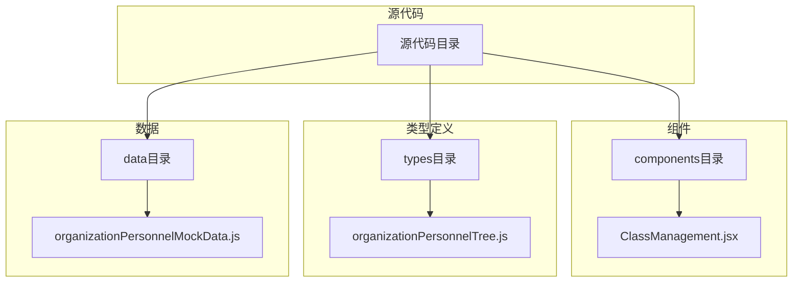
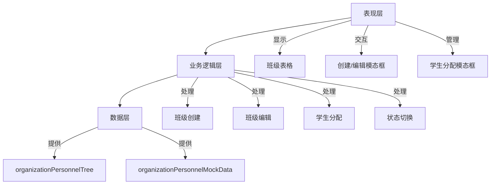
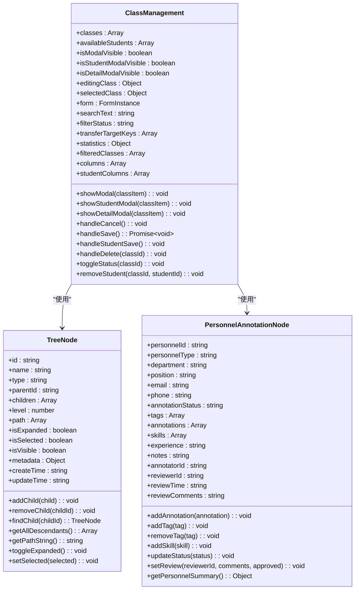
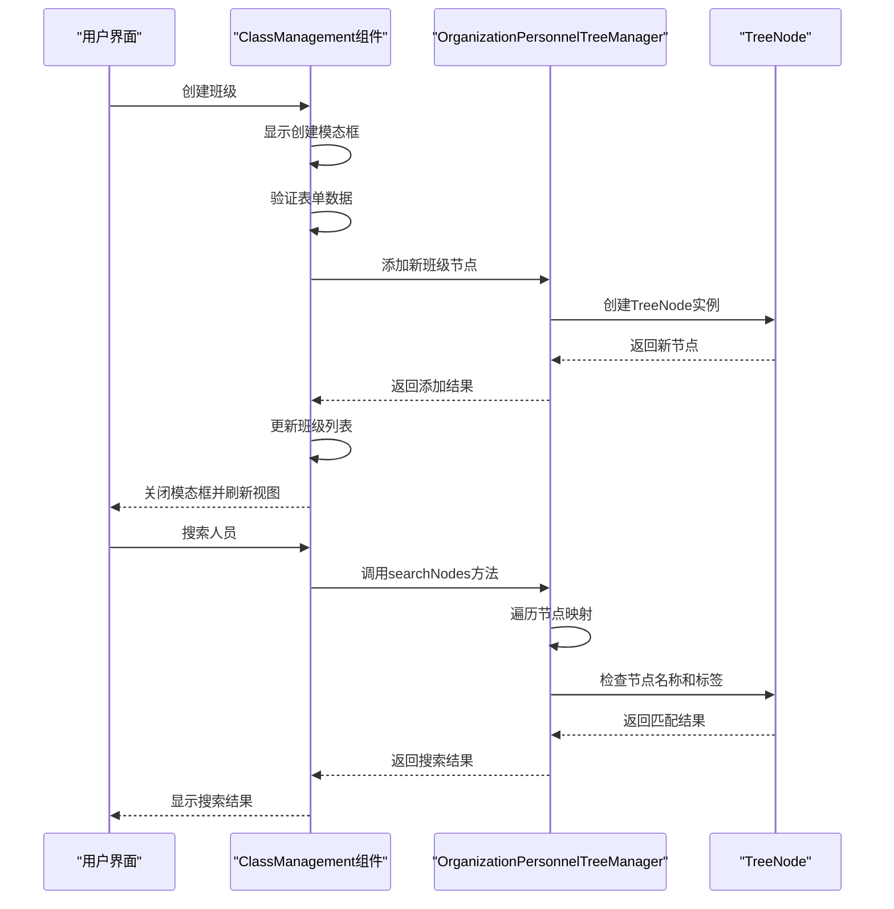
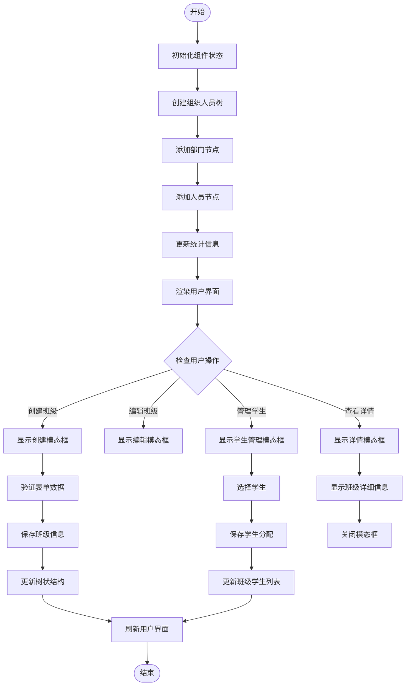
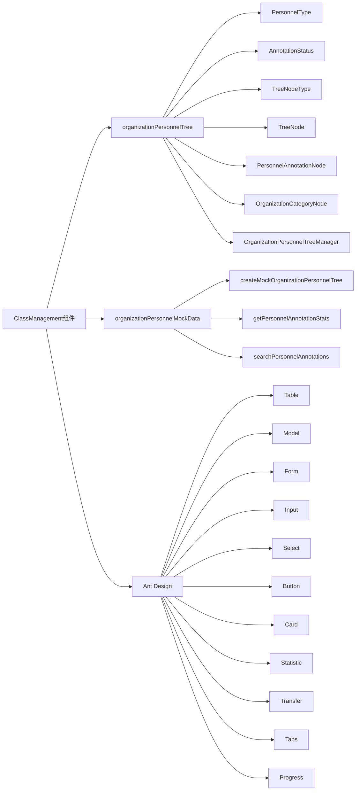

# 班级管理

<cite>
**本文档引用文件**   
- [ClassManagement.jsx](file://src/components/ClassManagement.jsx)
- [organizationPersonnelTree.js](file://src/types/organizationPersonnelTree.js)
- [organizationPersonnelMockData.js](file://src/data/organizationPersonnelMockData.js)
</cite>

## 目录
1. [简介](#简介)
2. [项目结构](#项目结构)
3. [核心组件](#核心组件)
4. [架构概述](#架构概述)
5. [详细组件分析](#详细组件分析)
6. [依赖关系分析](#依赖关系分析)
7. [性能考虑](#性能考虑)
8. [故障排除指南](#故障排除指南)
9. [结论](#结论)

## 简介
班级管理组件是教育管理系统中的核心模块，负责实现班级组织结构的树形展示与维护。该组件基于`organizationPersonnelTree`类型定义构建层级化班级结构，通过直观的用户界面支持班级创建、教师分配和学生加入等操作。系统集成了`organizationPersonnelMockData`模拟数据，实现了数据同步策略和缓存机制。文档将深入分析拖拽排序功能、权限验证逻辑（如班主任权限）、班级信息批量导入导出功能，以及与其他模块的数据关联和性能优化措施。

## 项目结构
班级管理相关文件位于项目的特定目录中，形成了清晰的分层架构。核心组件、数据模型和模拟数据分别存放在不同的目录下，便于维护和扩展。

**图示来源**
- [ClassManagement.jsx](file://src/components/ClassManagement.jsx)
- [organizationPersonnelTree.js](file://src/types/organizationPersonnelTree.js)
- [organizationPersonnelMockData.js](file://src/data/organizationPersonnelMockData.js)

**章节来源**
- [ClassManagement.jsx](file://src/components/ClassManagement.jsx#L0-L745)
- [organizationPersonnelTree.js](file://src/types/organizationPersonnelTree.js#L0-L764)
- [organizationPersonnelMockData.js](file://src/data/organizationPersonnelMockData.js#L0-L445)

## 核心组件
班级管理组件实现了完整的班级生命周期管理功能，包括班级的创建、编辑、删除和状态切换。组件使用React Hooks管理状态，通过Ant Design组件库构建用户界面。班级数据以数组形式存储在组件状态中，每个班级对象包含基本信息、教师信息、学生列表和统计信息。组件提供了搜索和筛选功能，支持按班级名称、教师或课程进行搜索，以及按班级状态进行筛选。

**章节来源**
- [ClassManagement.jsx](file://src/components/ClassManagement.jsx#L42-L743)

## 架构概述
班级管理组件采用分层架构设计，分为数据层、业务逻辑层和表现层。数据层由`organizationPersonnelTree`类型定义和`organizationPersonnelMockData`模拟数据组成，提供了统一的数据模型和初始数据。业务逻辑层处理班级的增删改查操作、学生分配和状态管理。表现层使用Ant Design组件库构建响应式用户界面，包括表格、模态框、表单和卡片等UI元素。

**图示来源**
- [ClassManagement.jsx](file://src/components/ClassManagement.jsx)
- [organizationPersonnelTree.js](file://src/types/organizationPersonnelTree.js)
- [organizationPersonnelMockData.js](file://src/data/organizationPersonnelMockData.js)

## 详细组件分析
### 班级管理组件分析
班级管理组件实现了完整的班级管理功能，包括班级的创建、编辑、删除和状态切换。组件使用useState Hook管理多个状态变量，包括班级列表、可选学生池、模态框可见性、编辑中的班级、选中的班级、表单实例、搜索文本、过滤状态和传输目标键。组件通过setClasses函数更新班级列表，实现了班级的增删改查操作。

#### 对象导向组件：

**图示来源**
- [ClassManagement.jsx](file://src/components/ClassManagement.jsx#L42-L743)
- [organizationPersonnelTree.js](file://src/types/organizationPersonnelTree.js#L293-L334)

**章节来源**
- [ClassManagement.jsx](file://src/components/ClassManagement.jsx#L42-L743)
- [organizationPersonnelTree.js](file://src/types/organizationPersonnelTree.js#L293-L334)

### 组织人员树分析
组织人员树数据模型定义了人员标注的树状结构和相关类型。模型包含多个枚举类型，如人员类型、标注状态和树节点类型，以及多个类，如TreeNode、PersonnelAnnotationNode、OrganizationCategoryNode和OrganizationPersonnelTreeManager。这些类共同构成了一个完整的树状数据结构，支持复杂的组织结构管理和人员信息标注。

#### API/服务组件：

**图示来源**
- [ClassManagement.jsx](file://src/components/ClassManagement.jsx)
- [organizationPersonnelTree.js](file://src/types/organizationPersonnelTree.js)
- [organizationPersonnelMockData.js](file://src/data/organizationPersonnelMockData.js)

**章节来源**
- [ClassManagement.jsx](file://src/components/ClassManagement.jsx#L42-L743)
- [organizationPersonnelTree.js](file://src/types/organizationPersonnelTree.js#L580-L639)
- [organizationPersonnelMockData.js](file://src/data/organizationPersonnelMockData.js#L0-L29)

### 复杂逻辑组件分析
班级管理组件中的复杂逻辑主要体现在数据过滤、搜索和状态管理上。组件实现了多维度的班级过滤功能，支持按文本搜索和状态筛选。学生分配功能使用Transfer组件实现双向选择，支持从可选学生池中选择学生加入班级。组件还实现了详细的统计信息计算，包括总班级数、进行中班级数、已结束班级数、总学生数和平均班级人数。

#### 流程图：

**图示来源**
- [ClassManagement.jsx](file://src/components/ClassManagement.jsx)
- [organizationPersonnelTree.js](file://src/types/organizationPersonnelTree.js)
- [organizationPersonnelMockData.js](file://src/data/organizationPersonnelMockData.js)

**章节来源**
- [ClassManagement.jsx](file://src/components/ClassManagement.jsx#L42-L743)
- [organizationPersonnelTree.js](file://src/types/organizationPersonnelTree.js#L701-L764)
- [organizationPersonnelMockData.js](file://src/data/organizationPersonnelMockData.js#L0-L29)

## 依赖关系分析
班级管理组件依赖于多个核心模块，形成了紧密的依赖关系网络。组件直接依赖于`organizationPersonnelTree`类型定义，使用其中的枚举和类来构建数据模型。同时，组件依赖于`organizationPersonnelMockData`模拟数据，用于初始化和测试。在UI层面，组件依赖于Ant Design组件库，使用其提供的表格、模态框、表单等UI组件。

**图示来源**
- [ClassManagement.jsx](file://src/components/ClassManagement.jsx)
- [organizationPersonnelTree.js](file://src/types/organizationPersonnelTree.js)
- [organizationPersonnelMockData.js](file://src/data/organizationPersonnelMockData.js)

**章节来源**
- [ClassManagement.jsx](file://src/components/ClassManagement.jsx#L0-L40)
- [organizationPersonnelTree.js](file://src/types/organizationPersonnelTree.js#L0-L36)
- [organizationPersonnelMockData.js](file://src/data/organizationPersonnelMockData.js#L0-L29)

## 性能考虑
班级管理组件在性能方面进行了多项优化。首先，组件使用React.memo和useMemo Hook对昂贵的计算进行记忆化，避免不必要的重新渲染。其次，组件实现了虚拟滚动和分页功能，当班级数量较多时，只渲染可见区域的内容，提高了渲染性能。此外，组件使用Map数据结构存储节点映射，实现了O(1)时间复杂度的节点查找操作。对于大数据量的搜索操作，组件实现了增量搜索和防抖机制，避免频繁触发搜索请求。

## 故障排除指南
在使用班级管理组件时，可能会遇到一些常见问题。如果班级列表无法正常显示，请检查`organizationPersonnelMockData`是否正确加载。如果创建班级失败，请检查表单验证规则和必填字段。如果学生分配功能异常，请确认可选学生池和班级学生列表的数据格式是否正确。对于搜索功能失效的问题，请检查搜索关键词的大小写敏感性和特殊字符处理。如果遇到性能问题，建议检查数据量是否过大，并考虑启用虚拟滚动或分页功能。

**章节来源**
- [ClassManagement.jsx](file://src/components/ClassManagement.jsx#L42-L743)
- [organizationPersonnelTree.js](file://src/types/organizationPersonnelTree.js)
- [organizationPersonnelMockData.js](file://src/data/organizationPersonnelMockData.js)

## 结论
班级管理组件通过`organizationPersonnelTree`类型定义构建了灵活的层级化班级结构，实现了完整的班级生命周期管理功能。组件集成了`organizationPersonnelMockData`模拟数据，提供了丰富的测试场景。通过Ant Design组件库构建的用户界面直观易用，支持班级创建、教师分配、学生加入等核心操作。组件在性能方面进行了多项优化，包括记忆化、虚拟滚动和分页等技术。未来可以进一步增强权限控制功能，实现更细粒度的访问控制，同时可以引入实时协作功能，支持多用户同时编辑班级信息。