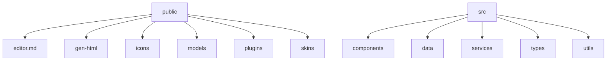
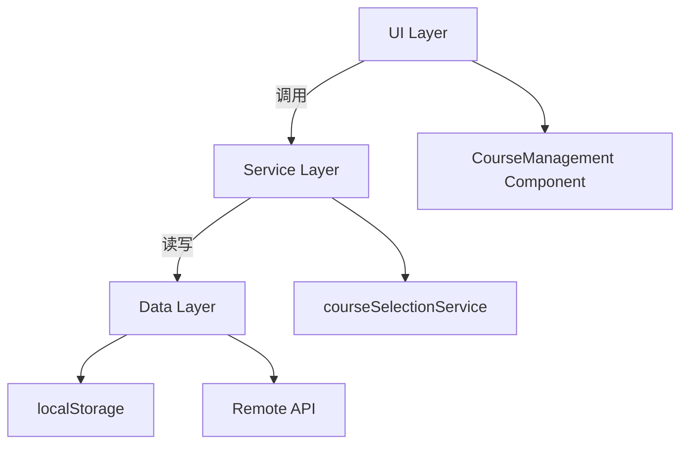
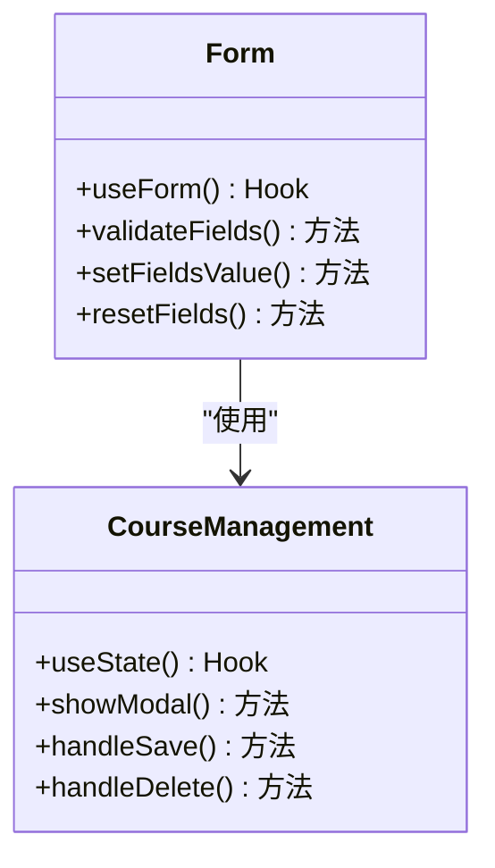
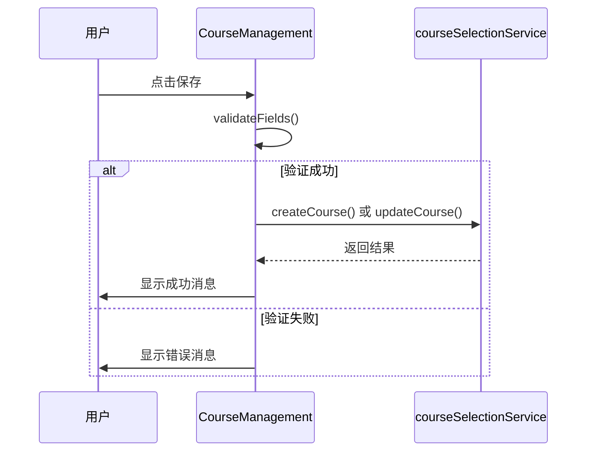
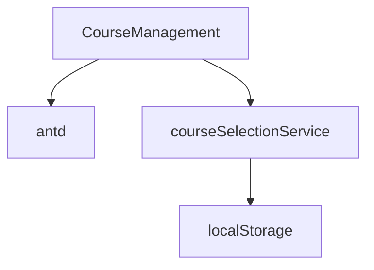

# 课程管理

<cite>
**本文档引用的文件**   
- [CourseManagement.jsx](file://src/components/CourseManagement.jsx)
- [trainingCourseMockData.js](file://src/data/trainingCourseMockData.js)
- [courseSelectionService.js](file://src/services/courseSelectionService.js)
</cite>

## 目录
1. [简介](#简介)
2. [项目结构](#项目结构)
3. [核心组件](#核心组件)
4. [架构概述](#架构概述)
5. [详细组件分析](#详细组件分析)
6. [依赖关系分析](#依赖关系分析)
7. [性能考虑](#性能考虑)
8. [故障排除指南](#故障排除指南)
9. [结论](#结论)

## 简介
本项目是一个教育管理系统，专注于课程管理和选课服务。系统提供了完整的课程创建、编辑、发布和删除流程，并集成了与`courseSelectionService`服务的交互机制。通过React Hooks管理表单状态，处理异步数据提交，并从`trainingCourseMockData`获取初始数据。文档详细说明了课程状态机（草稿、审核中、已发布、已归档）的实现逻辑，包括状态转换条件和权限控制。

## 项目结构
项目采用模块化设计，主要分为以下几个部分：
- `public/`: 静态资源文件，包括CSS、JavaScript库等。
- `src/`: 源代码目录，包含组件、数据、服务、类型定义和工具函数。
- `src/components/`: UI组件，如`CourseManagement.jsx`、`CourseSelection.jsx`等。
- `src/data/`: 数据模拟文件，如`trainingCourseMockData.js`。
- `src/services/`: 业务逻辑和服务层，如`courseSelectionService.js`。

**Diagram sources**
- [CourseManagement.jsx](file://src/components/CourseManagement.jsx)
- [trainingCourseMockData.js](file://src/data/trainingCourseMockData.js)
- [courseSelectionService.js](file://src/services/courseSelectionService.js)

**Section sources**
- [CourseManagement.jsx](file://src/components/CourseManagement.jsx)
- [trainingCourseMockData.js](file://src/data/trainingCourseMockData.js)
- [courseSelectionService.js](file://src/services/courseSelectionService.js)

## 核心组件
`CourseManagement`组件是系统的核心，负责课程的全生命周期管理。它使用React Hooks来管理状态，包括课程列表、模态框显示状态、表单数据等。组件通过`Form.useForm()`钩子管理表单状态，确保用户输入的数据能够正确地保存到课程列表中。

**Section sources**
- [CourseManagement.jsx](file://src/components/CourseManagement.jsx)

## 架构概述
系统的架构分为三层：UI层、服务层和数据层。UI层由React组件构成，负责展示和用户交互；服务层由`courseSelectionService`提供，负责处理业务逻辑和数据持久化；数据层则通过本地存储（localStorage）或远程API进行数据存取。

**Diagram sources**
- [CourseManagement.jsx](file://src/components/CourseManagement.jsx)
- [courseSelectionService.js](file://src/services/courseSelectionService.js)

## 详细组件分析
### CourseManagement 组件分析
`CourseManagement`组件实现了课程的增删改查功能。用户可以通过点击“创建课程”按钮打开模态框，填写课程信息并保存。编辑课程时，会将现有课程数据填充到表单中，允许用户修改后保存。删除课程需要确认操作，以防止误删。

#### 表单状态管理
使用`Form.useForm()`钩子来管理表单状态，确保数据的一致性和完整性。表单验证规则包括必填项检查、唯一性校验等。

**Diagram sources**
- [CourseManagement.jsx](file://src/components/CourseManagement.jsx)

#### 异步数据提交
在保存课程时，组件会调用`form.validateFields()`方法验证表单数据，然后根据是否为编辑模式决定是更新还是创建新课程。成功后会显示提示消息并关闭模态框。

**Diagram sources**
- [CourseManagement.jsx](file://src/components/CourseManagement.jsx)
- [courseSelectionService.js](file://src/services/courseSelectionService.js)

## 依赖关系分析
`CourseManagement`组件依赖于`antd`库提供的UI组件，以及`courseSelectionService`提供的数据服务。`courseSelectionService`又依赖于浏览器的`localStorage`进行数据持久化。

**Diagram sources**
- [CourseManagement.jsx](file://src/components/CourseManagement.jsx)
- [courseSelectionService.js](file://src/services/courseSelectionService.js)

**Section sources**
- [CourseManagement.jsx](file://src/components/CourseManagement.jsx)
- [courseSelectionService.js](file://src/services/courseSelectionService.js)

## 性能考虑
为了提高性能，组件采用了虚拟滚动技术来渲染大量课程数据，避免一次性加载所有数据导致页面卡顿。此外，使用`React.memo`对子组件进行优化，减少不必要的重新渲染。

## 故障排除指南
如果遇到问题，请检查以下几点：
- 确保`localStorage`可用且未被禁用。
- 检查网络连接，确保可以访问远程API（如果有）。
- 查看浏览器控制台是否有错误日志。

**Section sources**
- [courseSelectionService.js](file://src/services/courseSelectionService.js)

## 结论
本项目通过合理的架构设计和高效的组件实现，提供了一个稳定可靠的课程管理系统。未来可以通过引入更多自动化测试和持续集成流程来进一步提升系统的质量和可维护性。