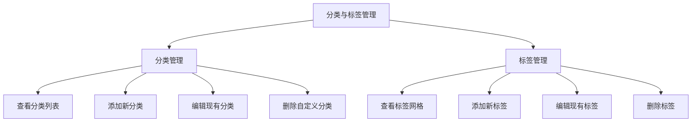
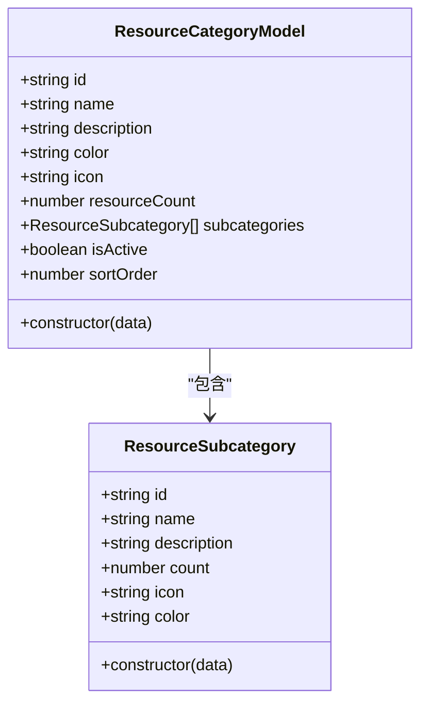
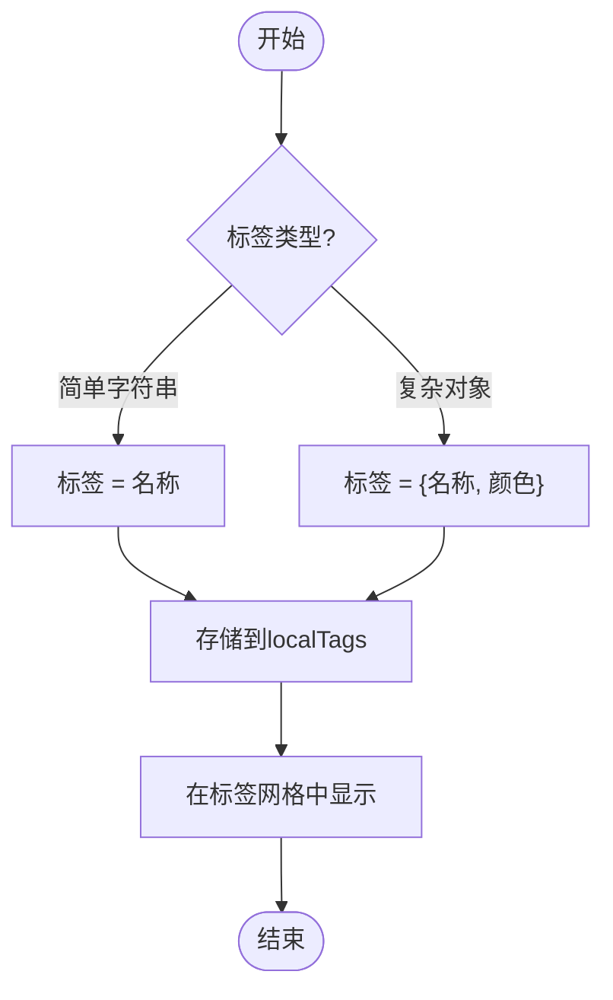
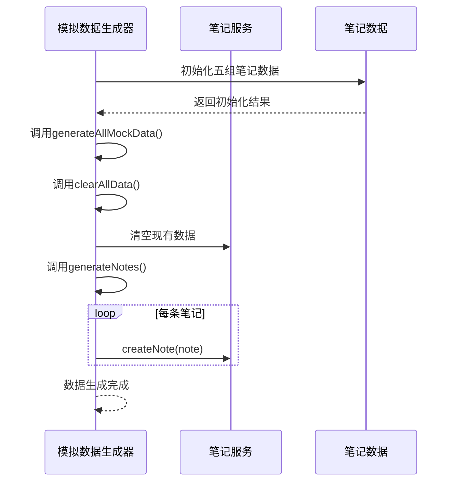
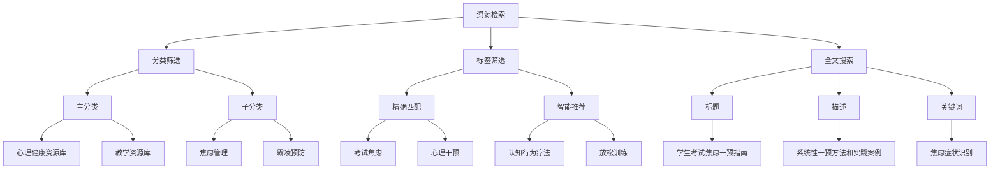

# 分类与标签体系

<cite>
**本文档引用文件**  
- [CategoryTagManager.jsx](file://src/components/CategoryTagManager.jsx)
- [resourceLibrary.js](file://src/types/resourceLibrary.js)
- [mockDataGenerator.js](file://src/utils/mockDataGenerator.js)
- [resourceLibraryService.js](file://src/services/resourceLibraryService.js)
- [resourceLibraryMockData.js](file://src/data/resourceLibraryMockData.js)
</cite>

## 目录
1. [引言](#引言)
2. [分类与标签管理界面](#分类与标签管理界面)
3. [分类模型设计](#分类模型设计)
4. [标签系统实现机制](#标签系统实现机制)
5. [测试数据生成与验证](#测试数据生成与验证)
6. [资源检索与个性化推荐](#资源检索与个性化推荐)
7. [结论](#结论)

## 引言

本系统构建了一套完整的分类与标签管理体系，旨在为教育资源的组织、管理和检索提供结构化支持。该体系以`ResourceModel`为核心数据模型，通过`CategoryTagManager`组件提供直观的用户界面，实现了分类和标签的创建、编辑和管理功能。分类体系采用层级结构，支持主分类与子分类的嵌套关系，并具备继承特性和约束规则。标签系统则提供了自动建议、批量操作和智能匹配等高级功能，增强了资源的可发现性和关联性。通过`mockDataGenerator`生成的测试数据，可以验证分类体系的可扩展性和稳定性。整个体系不仅服务于资源的高效检索，还为个性化推荐算法提供了丰富的数据基础，从而提升用户体验和学习效果。

## 分类与标签管理界面

`CategoryTagManager`组件提供了统一的分类和标签管理界面，支持用户对资源分类和标签进行可视化操作。该组件以模态框形式呈现，包含两个主要选项卡：分类管理和标签管理。在分类管理界面中，用户可以查看现有分类列表，每个分类项显示其名称、图标、颜色以及关联的笔记数量。系统预设了"工作"、"学习"、"个人"、"想法"和"收藏"等默认分类，这些系统分类具有保护机制，不允许删除或编辑。用户可以通过点击"添加分类"按钮创建自定义分类，在编辑表单中设置分类名称、选择图标并指定颜色。对于已存在的分类，用户可以进行编辑或删除操作，但需通过确认对话框防止误操作。

**图示来源**
- [CategoryTagManager.jsx](file://src/components/CategoryTagManager.jsx#L0-L534)

在标签管理界面中，所有标签以卡片网格的形式展示，每个标签卡片显示其名称、颜色和使用次数。用户可以通过点击"添加标签"按钮来创建新的标签，在编辑表单中只需输入标签名称并选择颜色即可完成创建。与分类不同，标签没有系统预设的限制，所有标签均可自由编辑和删除。当用户开始编辑某个分类或标签时，界面会动态调整布局，在右侧显示编辑表单，左侧继续显示当前列表，这种设计提高了操作效率，避免了页面跳转带来的体验中断。

**章节来源**
- [CategoryTagManager.jsx](file://src/components/CategoryTagManager.jsx#L0-L534)

## 分类模型设计

基于`resourceLibrary.js`中的类型定义，分类模型采用了面向对象的设计模式，核心类为`ResourceCategoryModel`和`ResourceSubcategory`。主分类模型`ResourceCategoryModel`包含id、name、description、color、icon、resourceCount、subcategories、isActive和sortOrder等属性，其中`subcategories`属性是一个`ResourceSubcategory`对象数组，实现了分类的层级结构。子分类模型`ResourceSubcategory`同样包含id、name、description、count、icon和color等基本属性，形成了主分类与子分类之间的聚合关系。

**图示来源**
- [resourceLibrary.js](file://src/types/resourceLibrary.js#L0-L463)

分类模型的设计体现了继承特性，所有分类都遵循相同的属性结构和行为规范。同时，模型中包含了多种约束规则：`id`字段必须唯一且不可为空；`name`字段为必填项；`color`字段采用十六进制颜色代码格式；`resourceCount`表示该分类下的资源数量，用于统计展示；`isActive`标志位控制分类的激活状态，可用于临时禁用某些分类而不删除它们；`sortOrder`字段定义了分类的显示顺序，支持自定义排序。此外，枚举类型`ResourceCategory`定义了五种主分类：心理健康资源库、教学资源库、技术培训资源库、家庭教育资源库和学校管理资源库，为分类体系提供了标准化的基础。

**章节来源**
- [resourceLibrary.js](file://src/types/resourceLibrary.js#L0-L463)

## 标签系统实现机制

标签系统的实现机制围绕灵活性和智能化两个核心目标展开。在数据结构层面，标签既可以作为简单的字符串存在，也可以作为包含name和color属性的复杂对象，这种双重表示方式兼顾了存储效率和功能丰富性。`CategoryTagManager`组件中的标签管理功能支持批量操作，用户可以一次性添加、编辑或删除多个标签，提高了管理效率。标签的颜色选择器预设了10种常用颜色，同时也允许用户自定义颜色，满足个性化需求。

**图示来源**
- [CategoryTagManager.jsx](file://src/components/CategoryTagManager.jsx#L0-L534)

智能匹配功能是标签系统的一大亮点。虽然当前代码中未直接实现自动建议算法，但通过`searchSuggestions.js`等潜在的数据源，系统可以基于用户历史行为和资源内容进行标签推荐。例如，当用户创建关于"人工智能"的笔记时，系统可以自动建议"AI"、"机器学习"、"深度学习"等相关标签。这种智能匹配不仅减少了用户的输入负担，还有助于建立一致的标签体系，避免同义词造成的碎片化。标签的使用统计（如`stats.tags`）也为智能推荐提供了数据支持，高频使用的标签可以被优先推荐。

**章节来源**
- [CategoryTagManager.jsx](file://src/components/CategoryTagManager.jsx#L0-L534)

## 测试数据生成与验证

`mockDataGenerator.js`文件中的`MockDataGenerator`类负责生成测试数据，用于验证分类体系的可扩展性和稳定性。该类预定义了五组不同类型的笔记数据：学习笔记、工作笔记、个人笔记、想法笔记和组织培训笔记，每组数据都分配了相应的分类和标签。例如，学习笔记包括"建构主义教学理论"、"数据结构课程设计"等主题，均标记为"study"分类，并配有"教学理论"、"数据结构"等标签。这种多样化的测试数据覆盖了系统的主要使用场景，能够有效检验分类体系的实际表现。

**图示来源**
- [mockDataGenerator.js](file://src/utils/mockDataGenerator.js#L0-L575)

通过运行`generateAllMockData()`方法，可以一键生成完整的测试环境，包含数十条笔记和相关数据记录。这一过程不仅验证了分类体系的可扩展性——能够容纳大量不同分类和标签的资源，还测试了系统的边界情况，如特殊字符处理、大数据量性能等。生成的数据还包括搜索行为记录，模拟了用户使用标签进行资源检索的场景，为后续的功能测试提供了基础。此外，`resourceLibraryMockData.js`文件提供了更专业的资源库测试数据，涵盖了心理健康、教学资源、技术培训等多个领域，进一步增强了测试的全面性。

**章节来源**
- [mockDataGenerator.js](file://src/utils/mockDataGenerator.js#L0-L575)

## 资源检索与个性化推荐

分类与标签在资源检索中扮演着关键角色，构成了多维度的过滤和查询体系。`resourceLibraryService.js`中的`getAllResources`方法实现了基于分类、子分类、资源类型、难度等级、目标受众、年龄组和关键词的复合筛选功能。用户可以通过组合不同的筛选条件，快速定位所需资源。例如，查找"教学资源库"中针对"初中生"的"视频"类型资源，系统会返回所有符合条件的结果，并按指定方式排序。标签作为非结构化的元数据，提供了更灵活的检索途径，支持模糊匹配和语义搜索。

**图示来源**
- [resourceLibraryService.js](file://src/services/resourceLibraryService.js#L0-L837)

个性化推荐算法充分利用了分类与标签体系提供的丰富数据。`getRecommendedResources`方法基于当前资源的相关资源ID、分类和标签信息，计算出最可能感兴趣的推荐列表。系统首先尝试使用预定义的相关资源，如果数量不足，则根据相同分类和相似标签的资源进行补充。热门资源和最新资源的推荐则分别依赖于浏览量、点赞数和创建时间等统计指标。这些推荐策略共同作用，为用户提供了精准的内容发现体验。未来还可以引入机器学习算法，基于用户行为数据不断优化推荐模型，实现真正的个性化服务。

**章节来源**
- [resourceLibraryService.js](file://src/services/resourceLibraryService.js#L0-L837)

## 结论

本系统的分类与标签体系设计合理、实现完善，为教育资源的组织和管理提供了坚实的基础。通过`ResourceCategoryModel`和`ResourceSubcategory`构成的层级分类模型，实现了资源的有序组织和高效导航。`CategoryTagManager`组件提供了直观易用的管理界面，支持分类和标签的全生命周期管理。标签系统的灵活性和潜在的智能匹配能力，增强了资源的可发现性和关联性。利用`mockDataGenerator`生成的多样化测试数据，充分验证了体系的可扩展性和稳定性。最终，这套体系不仅满足了基本的资源检索需求，更为个性化推荐算法提供了丰富的数据支撑，有望显著提升用户的学习体验和效率。建议未来进一步完善标签的自动建议算法，并增加分类间的关联关系，使整个体系更加智能化和网络化。