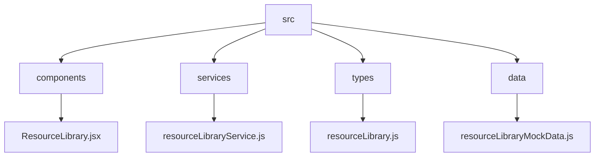
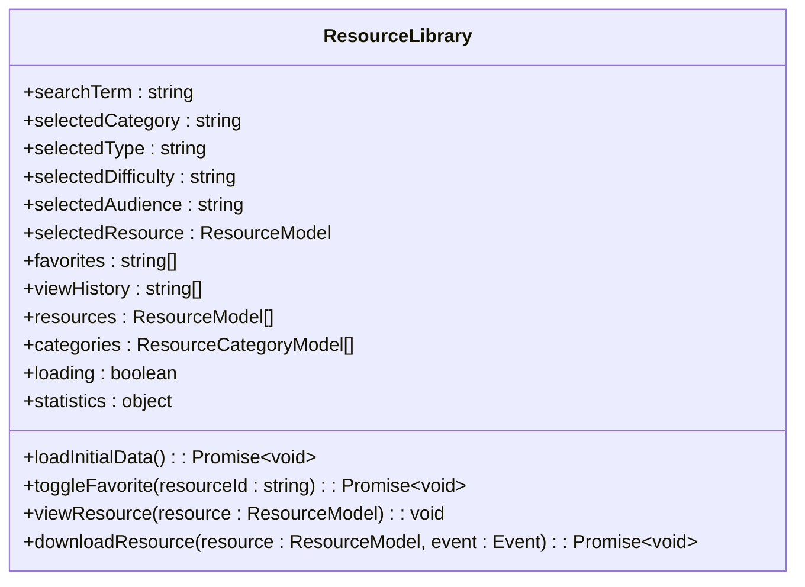
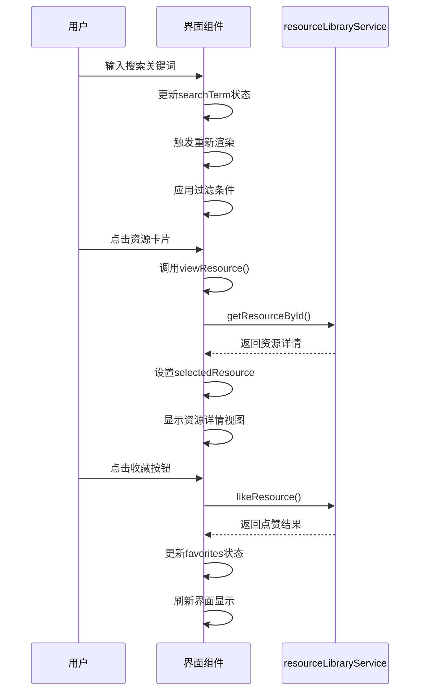
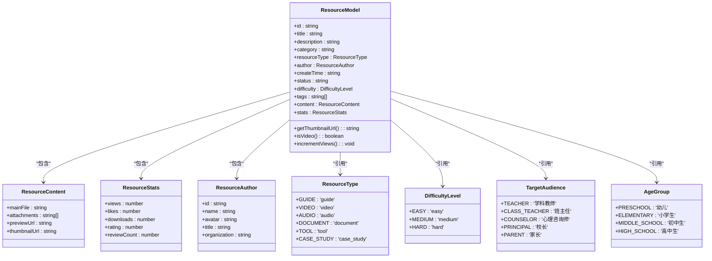
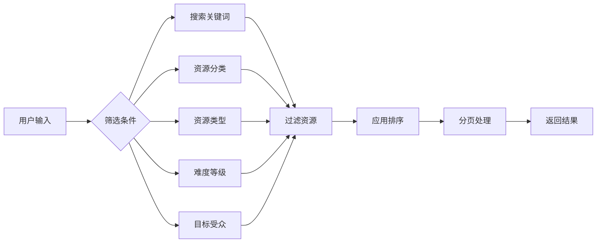
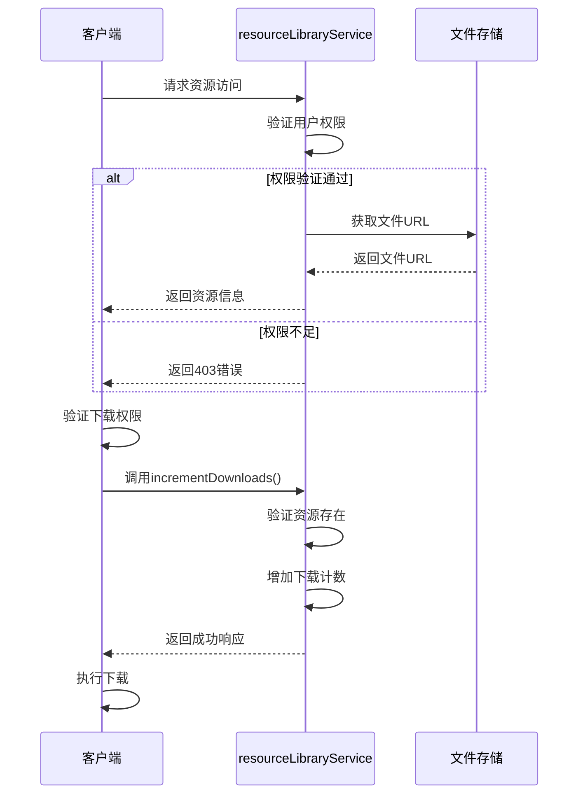
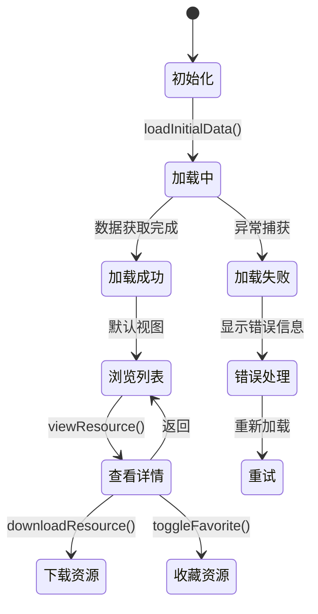
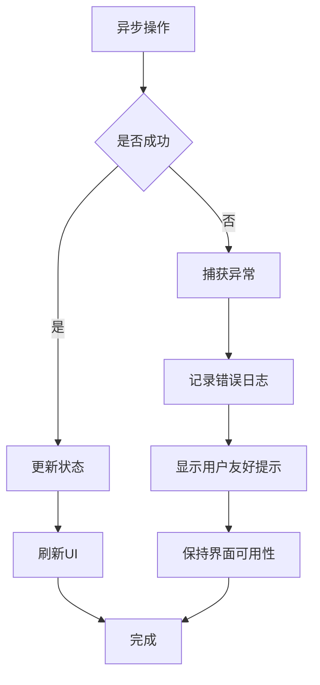

# 资源库管理

<cite>
**本文档引用的文件**
- [ResourceLibrary.jsx](file://src/components/ResourceLibrary.jsx)
- [resourceLibraryService.js](file://src/services/resourceLibraryService.js)
- [resourceLibrary.js](file://src/types/resourceLibrary.js)
- [resourceLibraryMockData.js](file://src/data/resourceLibraryMockData.js)
</cite>

## 目录
1. [项目结构](#项目结构)
2. [核心组件](#核心组件)
3. [UI架构与交互逻辑](#ui架构与交互逻辑)
4. [资源元数据模型](#资源元数据模型)
5. [服务接口分析](#服务接口分析)
6. [功能实现细节](#功能实现细节)
7. [状态管理与错误处理](#状态管理与错误处理)

## 项目结构



**图表来源**
- [ResourceLibrary.jsx](file://src/components/ResourceLibrary.jsx)
- [resourceLibraryService.js](file://src/services/resourceLibraryService.js)
- [resourceLibrary.js](file://src/types/resourceLibrary.js)
- [resourceLibraryMockData.js](file://src/data/resourceLibraryMockData.js)

**章节来源**
- [ResourceLibrary.jsx](file://src/components/ResourceLibrary.jsx)
- [resourceLibraryService.js](file://src/services/resourceLibraryService.js)

## 核心组件

资源库管理模块的核心是`ResourceLibrary`组件，它负责展示和管理海量教育资源。该组件通过调用`resourceLibraryService`服务获取数据，并提供搜索、筛选、分页等功能。

**章节来源**
- [ResourceLibrary.jsx](file://src/components/ResourceLibrary.jsx#L0-L80)

## UI架构与交互逻辑

### 组件结构
`ResourceLibrary`组件采用React函数式组件实现，使用useState和useEffect钩子管理组件状态和生命周期。



**图表来源**
- [ResourceLibrary.jsx](file://src/components/ResourceLibrary.jsx#L0-L80)

**章节来源**
- [ResourceLibrary.jsx](file://src/components/ResourceLibrary.jsx#L0-L80)

### 交互流程
用户与资源库的交互主要通过搜索、筛选和点击操作完成。



**图表来源**
- [ResourceLibrary.jsx](file://src/components/ResourceLibrary.jsx#L200-L250)
- [resourceLibraryService.js](file://src/services/resourceLibraryService.js#L100-L150)

**章节来源**
- [ResourceLibrary.jsx](file://src/components/ResourceLibrary.jsx#L200-L250)

## 资源元数据模型

### 数据类型定义
资源库使用TypeScript接口定义了完整的数据模型，确保类型安全。



**图表来源**
- [resourceLibrary.js](file://src/types/resourceLibrary.js#L0-L464)

**章节来源**
- [resourceLibrary.js](file://src/types/resourceLibrary.js#L0-L464)

## 服务接口分析

### API接口列表
`resourceLibraryService`提供了完整的RESTful风格API接口。

```mermaid
flowchart TD
A[资源库服务API] --> B[获取所有资源 getAllResources()]
A --> C[根据ID获取资源 getResourceById()]
A --> D[获取分类 getCategories()]
A --> E[按分类获取资源 getResourcesByCategory()]
A --> F[搜索资源 searchResources()]
A --> G[获取推荐资源 getRecommendedResources()]
A --> H[点赞资源 likeResource()]
A --> I[增加下载量 incrementDownloads()]
A --> J[获取热门资源 getPopularResources()]
A --> K[获取最新资源 getLatestResources()]
A --> L[获取统计信息 getStatistics()]
B --> M[支持筛选、排序、分页]
F --> N[支持全文搜索]
H --> O[更新点赞数]
I --> P[更新下载量]
```

**图表来源**
- [resourceLibraryService.js](file://src/services/resourceLibraryService.js#L100-L800)

**章节来源**
- [resourceLibraryService.js](file://src/services/resourceLibraryService.js#L100-L800)

### 接口调用示例
以下是关键API接口的调用方式和返回结构。

| 接口方法 | 参数 | 返回结构 | 用途 |
|---------|------|---------|------|
| getAllResources() | filters: ResourceFilter | {success: boolean, data: ResourceModel[], total: number} | 获取资源列表 |
| getResourceById(id) | id: string | {success: boolean, data: ResourceModel} | 获取单个资源详情 |
| searchResources(query) | query: string | {success: boolean, data: ResourceModel[]} | 搜索资源 |
| likeResource(id) | id: string | {success: boolean, data: {likes: number}} | 点赞资源 |
| incrementDownloads(id) | id: string | {success: boolean, data: {downloads: number}} | 记录下载 |

**章节来源**
- [resourceLibraryService.js](file://src/services/resourceLibraryService.js#L100-L800)

## 功能实现细节

### 分页与筛选
资源库实现了多维度的筛选和分页功能。



**图表来源**
- [ResourceLibrary.jsx](file://src/components/ResourceLibrary.jsx#L150-L200)
- [resourceLibraryService.js](file://src/services/resourceLibraryService.js#L100-L200)

**章节来源**
- [ResourceLibrary.jsx](file://src/components/ResourceLibrary.jsx#L150-L200)

### 权限验证机制
系统实现了基本的权限控制和文件访问控制。



**图表来源**
- [ResourceLibrary.jsx](file://src/components/ResourceLibrary.jsx#L206-L257)
- [resourceLibraryService.js](file://src/services/resourceLibraryService.js#L500-L600)

**章节来源**
- [ResourceLibrary.jsx](file://src/components/ResourceLibrary.jsx#L206-L257)

## 状态管理与错误处理

### 状态管理策略
组件使用React Hooks进行状态管理，确保数据一致性。



**图表来源**
- [ResourceLibrary.jsx](file://src/components/ResourceLibrary.jsx#L80-L150)

**章节来源**
- [ResourceLibrary.jsx](file://src/components/ResourceLibrary.jsx#L80-L150)

### 错误处理机制
系统实现了全面的错误处理和用户体验优化。



**图表来源**
- [ResourceLibrary.jsx](file://src/components/ResourceLibrary.jsx#L90-L120)
- [resourceLibraryService.js](file://src/services/resourceLibraryService.js#L100-L800)

**章节来源**
- [ResourceLibrary.jsx](file://src/components/ResourceLibrary.jsx#L90-L120)