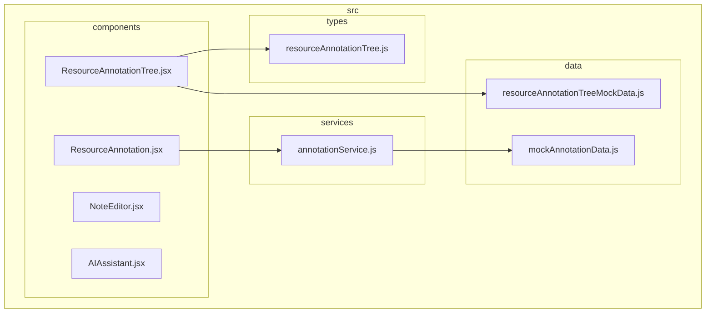
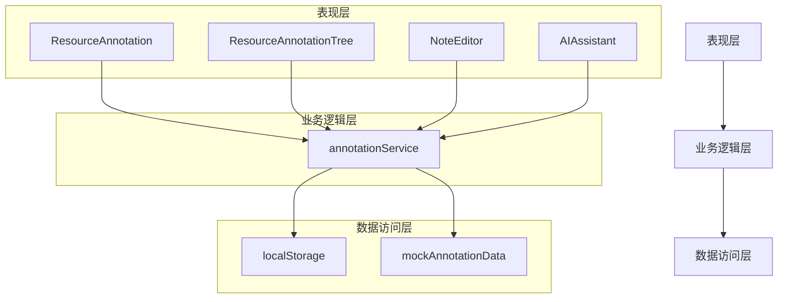
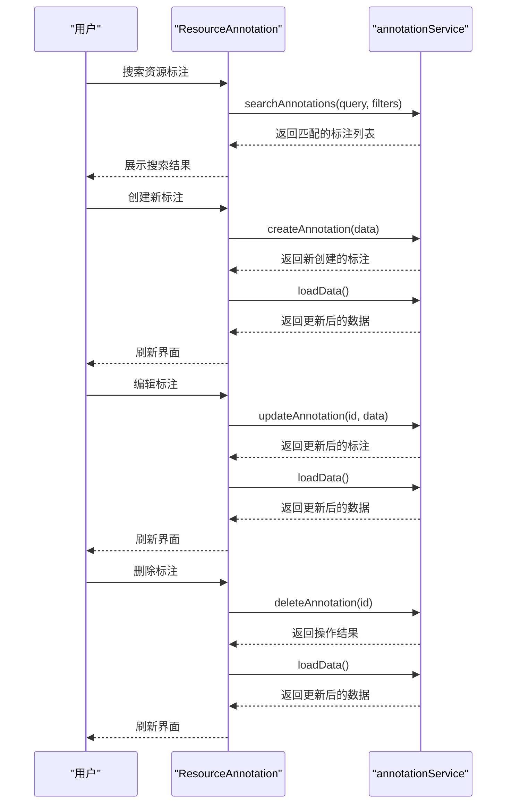
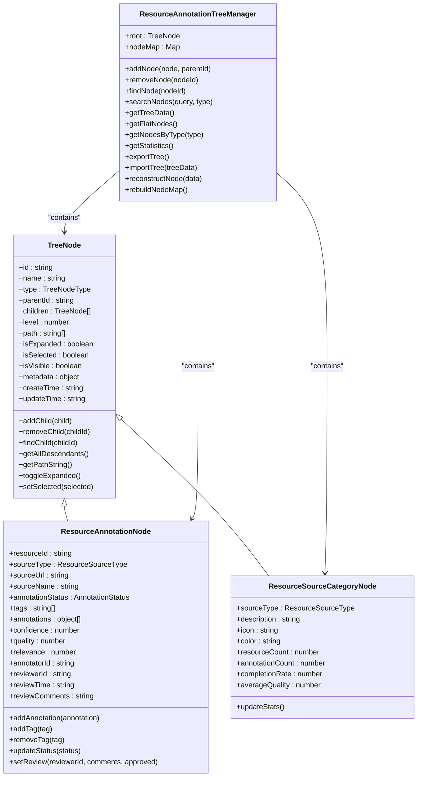
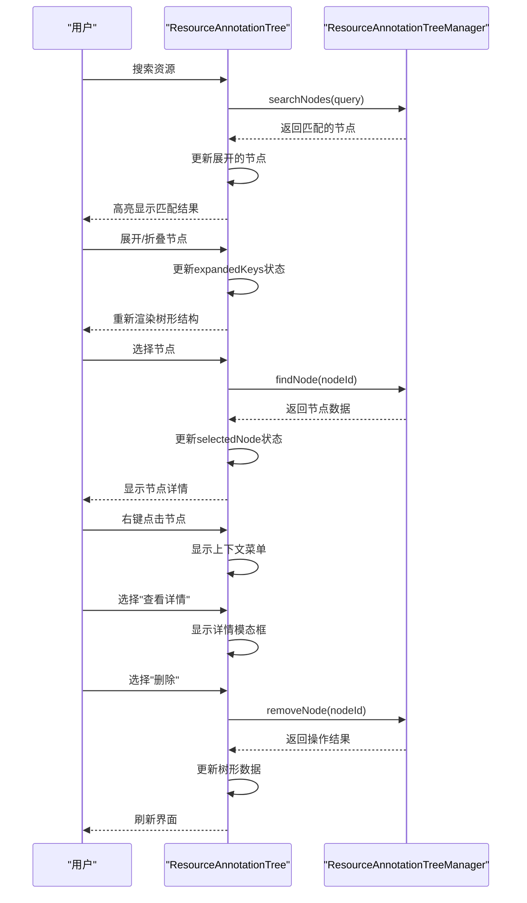
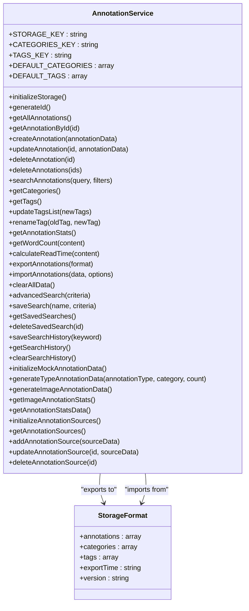
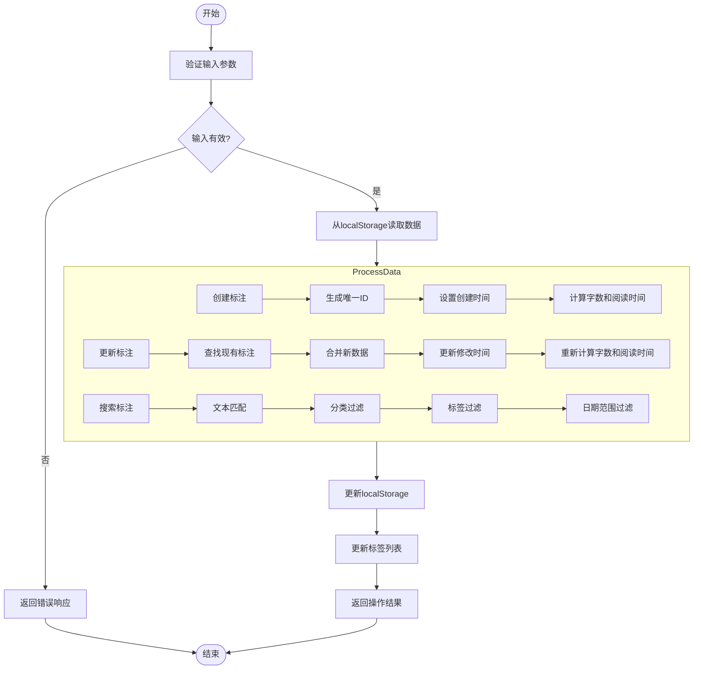
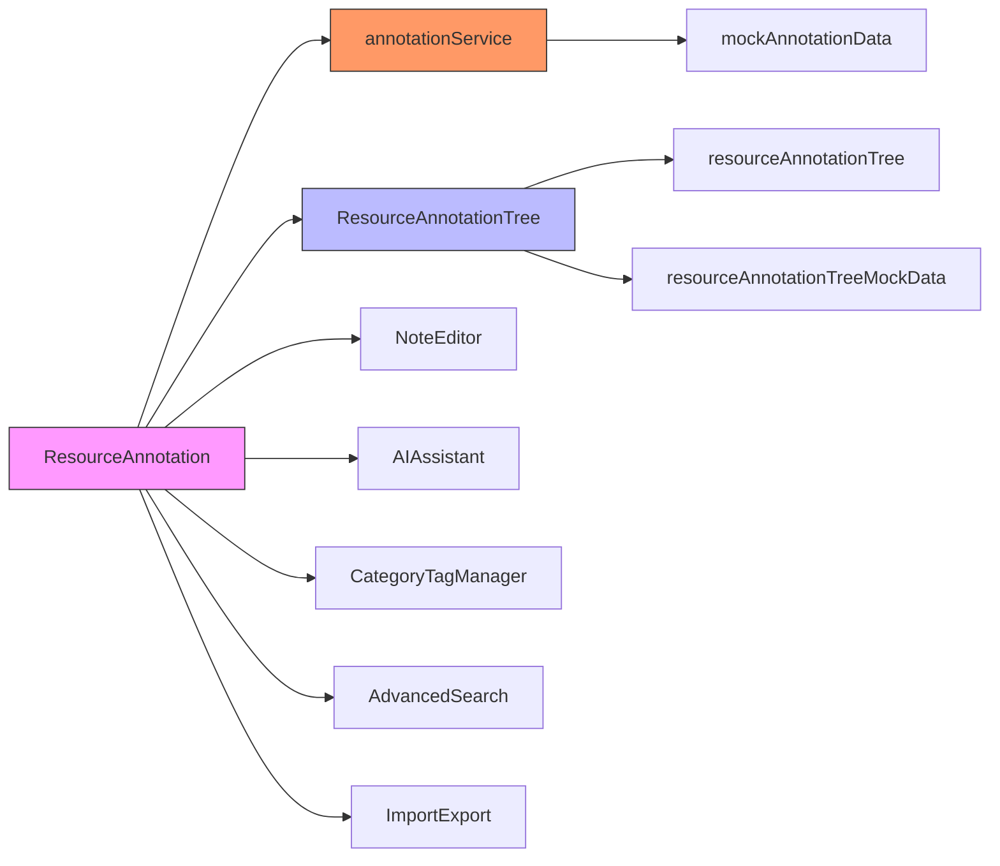

# 资源标注

<cite>
**本文档引用的文件**
- [ResourceAnnotation.jsx](file://src/components/ResourceAnnotation.jsx)
- [ResourceAnnotationTree.jsx](file://src/components/ResourceAnnotationTree.jsx)
- [annotationService.js](file://src/services/annotationService.js)
- [mockAnnotationData.js](file://src/data/mockAnnotationData.js)
- [resourceAnnotationTree.js](file://src/types/resourceAnnotationTree.js)
</cite>

## 目录
1. [简介](#简介)
2. [项目结构](#项目结构)
3. [核心组件](#核心组件)
4. [架构概述](#架构概述)
5. [详细组件分析](#详细组件分析)
6. [依赖分析](#依赖分析)
7. [性能考虑](#性能考虑)
8. [故障排除指南](#故障排除指南)
9. [结论](#结论)

## 简介
本系统实现了教育资源的智能标注与管理功能，重点提供资源标注工具、层级化组织结构和数据服务。通过ResourceAnnotation组件实现高亮、批注、标签标记等交互功能，利用ResourceAnnotationTree组件构建多级分类的树形导航体系，并通过annotationService服务处理标注数据的存储、同步和查询逻辑。系统采用本地存储机制，支持模拟数据生成、搜索过滤、导入导出等功能，为教育资源的可发现性和复用效率提供了技术支撑。

## 项目结构
系统采用模块化设计，主要包含组件、服务、数据和类型定义四个核心目录。组件目录包含UI界面相关组件，服务目录提供业务逻辑处理，数据目录存放模拟数据和静态资源，类型定义目录规范数据结构。

**图示来源**
- [ResourceAnnotation.jsx](file://src/components/ResourceAnnotation.jsx)
- [ResourceAnnotationTree.jsx](file://src/components/ResourceAnnotationTree.jsx)
- [annotationService.js](file://src/services/annotationService.js)
- [mockAnnotationData.js](file://src/data/mockAnnotationData.js)
- [resourceAnnotationTree.js](file://src/types/resourceAnnotationTree.js)

**本节来源**
- [src/components](file://src/components)
- [src/services](file://src/services)
- [src/data](file://src/data)
- [src/types](file://src/types)

## 核心组件
系统的核心由ResourceAnnotation、ResourceAnnotationTree和annotationService三个主要部分构成。ResourceAnnotation组件提供用户界面和交互功能，包括搜索、过滤、创建、编辑和删除资源标注等操作；ResourceAnnotationTree组件负责构建和展示资源的层级化组织结构，支持树形导航和可视化统计；annotationService服务则处理所有数据持久化操作，包括CRUD、搜索、导入导出等功能。这些组件协同工作，形成了完整的资源标注管理系统。

**本节来源**
- [ResourceAnnotation.jsx](file://src/components/ResourceAnnotation.jsx#L0-L799)
- [ResourceAnnotationTree.jsx](file://src/components/ResourceAnnotationTree.jsx#L0-L799)
- [annotationService.js](file://src/services/annotationService.js#L0-L799)

## 架构概述
系统采用分层架构设计，分为表现层、业务逻辑层和数据访问层。表现层由React组件构成，负责用户界面展示和交互；业务逻辑层由annotationService服务实现，处理核心业务规则；数据访问层基于浏览器localStorage实现，提供数据持久化存储。

**图示来源**
- [ResourceAnnotation.jsx](file://src/components/ResourceAnnotation.jsx)
- [ResourceAnnotationTree.jsx](file://src/components/ResourceAnnotationTree.jsx)
- [annotationService.js](file://src/services/annotationService.js)

**本节来源**
- [src/components](file://src/components)
- [src/services](file://src/services)
- [src/data](file://src/data)

## 详细组件分析

### ResourceAnnotation组件分析
ResourceAnnotation组件是系统的主界面组件，提供资源标注的完整管理功能。该组件实现了搜索、过滤、分类浏览、创建、编辑、删除等核心功能，并集成了AI助手、高级搜索、导入导出等扩展功能。

#### 组件交互流程

**图示来源**
- [ResourceAnnotation.jsx](file://src/components/ResourceAnnotation.jsx#L0-L799)
- [annotationService.js](file://src/services/annotationService.js#L0-L799)

### ResourceAnnotationTree组件分析
ResourceAnnotationTree组件负责构建和展示资源的层级化组织结构，支持多级分类和树形导航。该组件基于Ant Design的Tree组件实现，结合自定义节点渲染和右键菜单功能，提供了丰富的树形操作体验。

#### 树形结构数据模型

**图示来源**
- [resourceAnnotationTree.js](file://src/types/resourceAnnotationTree.js#L0-L434)

#### 树形组件交互流程

**图示来源**
- [ResourceAnnotationTree.jsx](file://src/components/ResourceAnnotationTree.jsx#L0-L799)
- [resourceAnnotationTree.js](file://src/types/resourceAnnotationTree.js#L0-L434)

**本节来源**
- [ResourceAnnotationTree.jsx](file://src/components/ResourceAnnotationTree.jsx#L0-L799)
- [resourceAnnotationTree.js](file://src/types/resourceAnnotationTree.js#L0-L434)

### annotationService服务分析
annotationService服务是系统的核心业务逻辑层，负责处理所有数据操作。该服务基于localStorage实现数据持久化，提供了完整的CRUD操作、搜索过滤、导入导出等功能。

#### 数据服务接口

**图示来源**
- [annotationService.js](file://src/services/annotationService.js#L0-L799)

#### 数据服务调用流程

**图示来源**
- [annotationService.js](file://src/services/annotationService.js#L0-L799)

**本节来源**
- [annotationService.js](file://src/services/annotationService.js#L0-L799)

## 依赖分析
系统各组件之间的依赖关系清晰明确，遵循单向依赖原则，确保了良好的模块化和可维护性。

**图示来源**
- [ResourceAnnotation.jsx](file://src/components/ResourceAnnotation.jsx)
- [ResourceAnnotationTree.jsx](file://src/components/ResourceAnnotationTree.jsx)
- [annotationService.js](file://src/services/annotationService.js)

**本节来源**
- [package.json](file://package.json)

## 性能考虑
系统在性能方面主要考虑以下几个方面：首先，采用localStorage作为数据存储方案，避免了网络请求延迟，提高了数据访问速度；其次，通过合理的状态管理和数据缓存，减少了不必要的重复计算和渲染；再次，在搜索和过滤操作中采用了高效的算法，确保在大数据量下的响应速度；最后，通过懒加载和虚拟滚动等技术优化，提升了大型树形结构的渲染性能。

**本节来源**
- [ResourceAnnotation.jsx](file://src/components/ResourceAnnotation.jsx)
- [ResourceAnnotationTree.jsx](file://src/components/ResourceAnnotationTree.jsx)
- [annotationService.js](file://src/services/annotationService.js)

## 故障排除指南
当系统出现异常时，可参考以下常见问题及解决方案：

1. **数据未保存**：检查浏览器是否禁用了localStorage，或尝试清除浏览器缓存后重试。
2. **搜索无结果**：确认搜索关键词是否正确，检查是否有大小写敏感问题，尝试使用更通用的搜索词。
3. **树形结构不显示**：检查控制台是否有JavaScript错误，确认数据初始化是否成功，尝试刷新页面。
4. **导入导出失败**：确保导入文件格式正确（JSON），检查文件大小是否超出限制，确认浏览器权限设置。
5. **性能缓慢**：当数据量过大时，建议定期导出备份并清理不必要的标注，以提高系统响应速度。

**本节来源**
- [ResourceAnnotation.jsx](file://src/components/ResourceAnnotation.jsx)
- [ResourceAnnotationTree.jsx](file://src/components/ResourceAnnotationTree.jsx)
- [annotationService.js](file://src/services/annotationService.js)

## 结论
本资源标注系统通过精心设计的组件架构和数据模型，实现了教育资源的高效管理和智能标注功能。系统采用模块化设计，各组件职责分明，易于维护和扩展。通过本地存储方案保证了数据的安全性和访问速度，同时提供了丰富的用户交互功能，包括搜索、过滤、分类、导入导出等。系统的树形结构设计使得大量资源能够有序组织，便于导航和查找。未来可进一步增强协作功能，支持多用户同时编辑和版本控制，提升系统的实用价值。