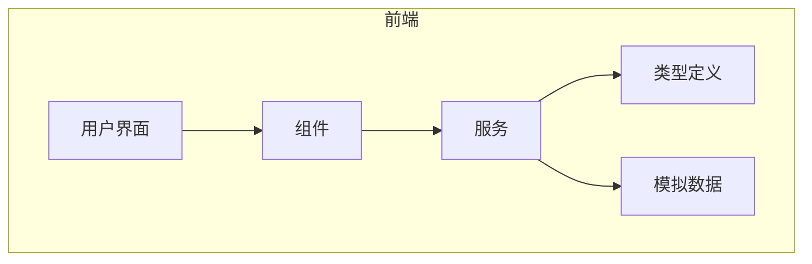
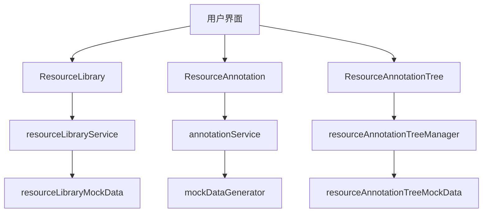
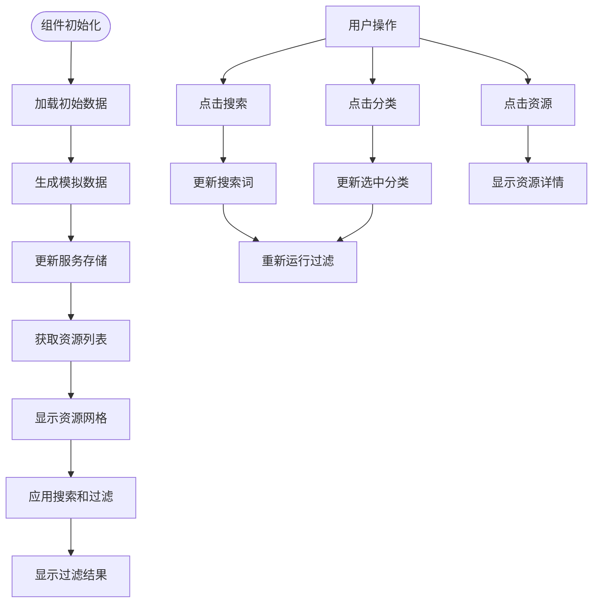
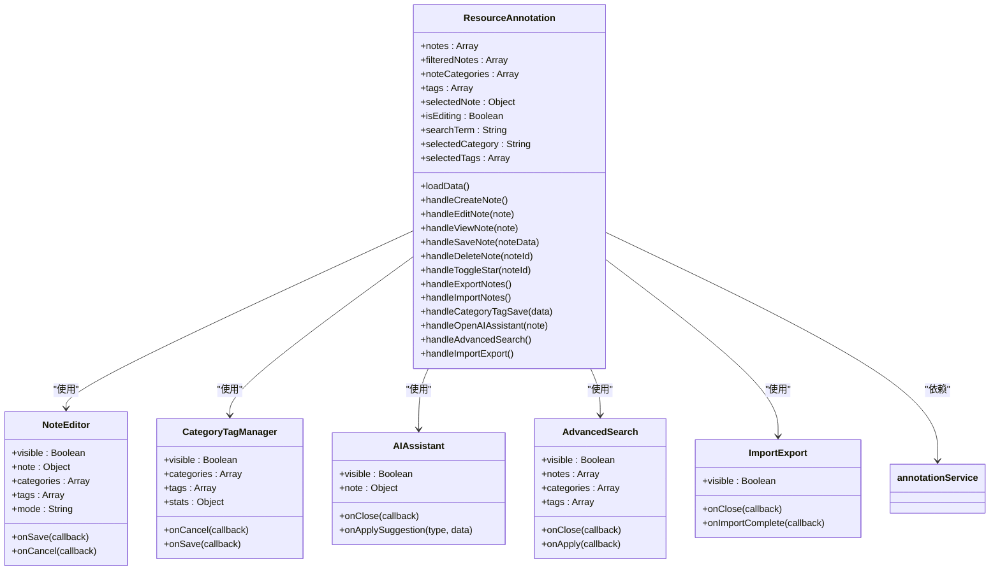
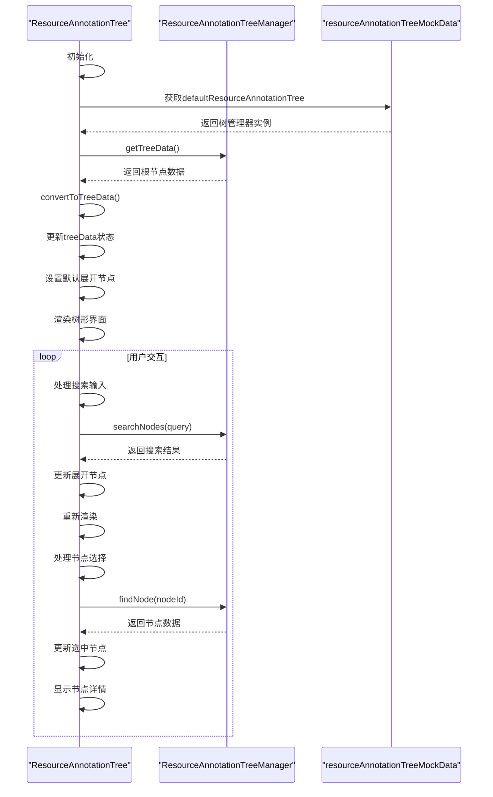
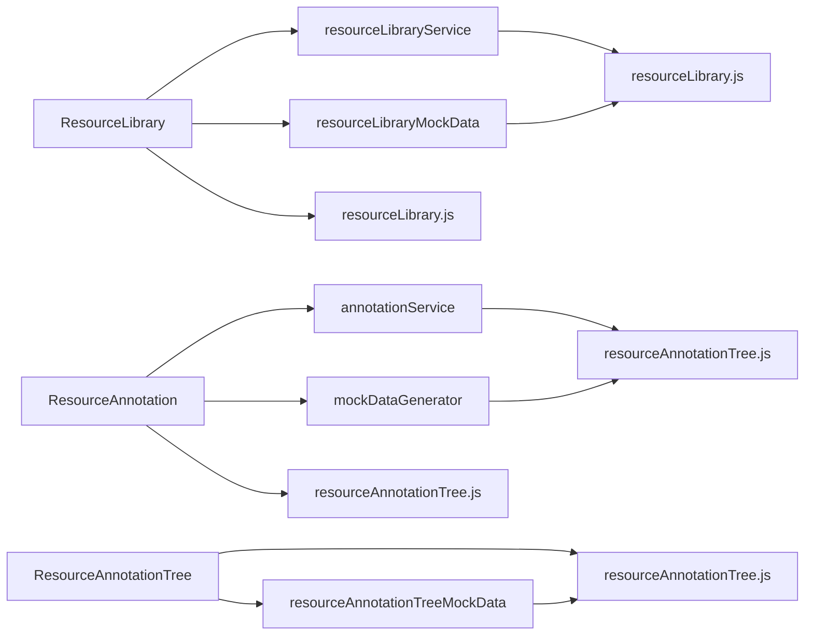

# 资源管理系统

<cite>
**本文档引用的文件**   
- [ResourceLibrary.jsx](file://src/components/ResourceLibrary.jsx)
- [ResourceAnnotation.jsx](file://src/components/ResourceAnnotation.jsx)
- [ResourceAnnotationTree.jsx](file://src/components/ResourceAnnotationTree.jsx)
- [resourceLibraryService.js](file://src/services/resourceLibraryService.js)
- [resourceLibrary.js](file://src/types/resourceLibrary.js)
- [resourceAnnotationTree.js](file://src/types/resourceAnnotationTree.js)
- [resourceLibraryMockData.js](file://src/data/resourceLibraryMockData.js)
- [resourceAnnotationTreeMockData.js](file://src/data/resourceAnnotationTreeMockData.js)
</cite>

## 目录
1. [简介](#简介)
2. [项目结构](#项目结构)
3. [核心组件](#核心组件)
4. [架构概述](#架构概述)
5. [详细组件分析](#详细组件分析)
6. [依赖分析](#依赖分析)
7. [性能考虑](#性能考虑)
8. [故障排除指南](#故障排除指南)
9. [结论](#结论)

## 简介
资源管理系统是一个全面的教育技术平台，旨在帮助教育工作者高效地管理、标注和组织海量教育资源。系统包含三大核心功能：资源库管理、资源标注和分类体系。通过直观的用户界面和强大的后端服务，系统支持资源的浏览、搜索、管理和复用，为教师、心理咨询师、学校管理者等不同角色提供个性化的资源访问体验。

## 项目结构
资源管理系统的项目结构清晰，遵循现代前端开发的最佳实践。主要目录包括`components`（存放所有React组件）、`services`（提供数据访问接口）、`types`（定义数据模型）和`data`（存储模拟数据）。这种分层架构使得代码易于维护和扩展。

**Diagram sources**
- [ResourceLibrary.jsx](file://src/components/ResourceLibrary.jsx)
- [ResourceAnnotation.jsx](file://src/components/ResourceAnnotation.jsx)
- [ResourceAnnotationTree.jsx](file://src/components/ResourceAnnotationTree.jsx)

**Section sources**
- [ResourceLibrary.jsx](file://src/components/ResourceLibrary.jsx)
- [ResourceAnnotation.jsx](file://src/components/ResourceAnnotation.jsx)
- [ResourceAnnotationTree.jsx](file://src/components/ResourceAnnotationTree.jsx)

## 核心组件
系统的核心组件包括ResourceLibrary、ResourceAnnotation和ResourceAnnotationTree，分别负责资源浏览与管理、资源标注和树状组织结构。这些组件通过清晰的职责划分和良好的交互设计，共同构建了一个完整的资源管理解决方案。

**Section sources**
- [ResourceLibrary.jsx](file://src/components/ResourceLibrary.jsx#L1-L657)
- [ResourceAnnotation.jsx](file://src/components/ResourceAnnotation.jsx#L1-L799)
- [ResourceAnnotationTree.jsx](file://src/components/ResourceAnnotationTree.jsx#L1-L799)

## 架构概述
资源管理系统的架构采用前后端分离的设计模式，前端使用React框架构建用户界面，后端通过服务层提供数据访问接口。系统通过模拟数据初始化，展示了真实场景下的数据交互流程。

**Diagram sources**
- [ResourceLibrary.jsx](file://src/components/ResourceLibrary.jsx#L1-L657)
- [ResourceAnnotation.jsx](file://src/components/ResourceAnnotation.jsx#L1-L799)
- [ResourceAnnotationTree.jsx](file://src/components/ResourceAnnotationTree.jsx#L1-L799)
- [resourceLibraryService.js](file://src/services/resourceLibraryService.js#L1-L799)
- [resourceLibraryMockData.js](file://src/data/resourceLibraryMockData.js#L1-L799)
- [resourceAnnotationTreeMockData.js](file://src/data/resourceAnnotationTreeMockData.js#L1-L511)

## 详细组件分析

### ResourceLibrary组件分析
ResourceLibrary组件实现了资源库的完整浏览、搜索和管理功能。组件通过状态管理维护搜索条件、筛选选项和资源列表，并提供详细的资源信息展示。

#### 组件交互逻辑

**Diagram sources**
- [ResourceLibrary.jsx](file://src/components/ResourceLibrary.jsx#L1-L657)

**Section sources**
- [ResourceLibrary.jsx](file://src/components/ResourceLibrary.jsx#L1-L657)

### ResourceAnnotation组件分析
ResourceAnnotation组件提供了资源标注的创建、编辑和管理功能。组件集成了AI助手、高级搜索和导入导出等高级特性，支持复杂的资源标注工作流。

#### 功能模块关系

**Diagram sources**
- [ResourceAnnotation.jsx](file://src/components/ResourceAnnotation.jsx#L1-L799)

**Section sources**
- [ResourceAnnotation.jsx](file://src/components/ResourceAnnotation.jsx#L1-L799)

### ResourceAnnotationTree组件分析
ResourceAnnotationTree组件实现了资源的树状组织结构，支持多级分类和复杂的数据展示。组件通过Ant Design的Tree组件实现高效的树形数据渲染，并提供丰富的交互功能。

#### 数据处理流程

**Diagram sources**
- [ResourceAnnotationTree.jsx](file://src/components/ResourceAnnotationTree.jsx#L1-L799)
- [resourceAnnotationTreeMockData.js](file://src/data/resourceAnnotationTreeMockData.js#L1-L511)

**Section sources**
- [ResourceAnnotationTree.jsx](file://src/components/ResourceAnnotationTree.jsx#L1-L799)

## 依赖分析
系统各组件之间的依赖关系清晰，通过服务层解耦了数据访问逻辑。核心依赖包括UI组件库、数据服务和类型定义。

**Diagram sources**
- [ResourceLibrary.jsx](file://src/components/ResourceLibrary.jsx#L1-L657)
- [ResourceAnnotation.jsx](file://src/components/ResourceAnnotation.jsx#L1-L799)
- [ResourceAnnotationTree.jsx](file://src/components/ResourceAnnotationTree.jsx#L1-L799)
- [resourceLibraryService.js](file://src/services/resourceLibraryService.js#L1-L799)
- [resourceLibraryMockData.js](file://src/data/resourceLibraryMockData.js#L1-L799)
- [resourceAnnotationTreeMockData.js](file://src/data/resourceAnnotationTreeMockData.js#L1-L511)
- [resourceLibrary.js](file://src/types/resourceLibrary.js#L1-L463)
- [resourceAnnotationTree.js](file://src/types/resourceAnnotationTree.js#L1-L434)

**Section sources**
- [resourceLibraryService.js](file://src/services/resourceLibraryService.js#L1-L799)
- [resourceLibraryMockData.js](file://src/data/resourceLibraryMockData.js#L1-L799)
- [resourceAnnotationTreeMockData.js](file://src/data/resourceAnnotationTreeMockData.js#L1-L511)

## 性能考虑
系统在性能方面做了多项优化：
1. 使用useMemo和useCallback进行性能优化
2. 通过虚拟滚动和分页减少DOM元素数量
3. 实现懒加载和按需加载策略
4. 使用防抖技术优化搜索性能
5. 通过服务层缓存减少重复计算

## 故障排除指南
常见问题及解决方案：
- **资源加载失败**：检查网络连接，确认模拟数据是否正确生成
- **搜索无结果**：验证搜索关键词是否包含特殊字符，尝试清除筛选条件
- **标注保存失败**：检查表单必填项是否完整，确认服务层是否有错误日志
- **树形结构不显示**：验证树管理器是否正确初始化，检查节点数据格式

**Section sources**
- [ResourceLibrary.jsx](file://src/components/ResourceLibrary.jsx#L1-L657)
- [ResourceAnnotation.jsx](file://src/components/ResourceAnnotation.jsx#L1-L799)
- [ResourceAnnotationTree.jsx](file://src/components/ResourceAnnotationTree.jsx#L1-L799)

## 结论
资源管理系统通过精心设计的架构和组件，实现了教育资源的高效管理和利用。系统不仅提供了基础的资源浏览和搜索功能，还通过创新的标注和树状组织结构，支持更深层次的资源复用和知识管理。未来可以进一步扩展权限控制、协作编辑和智能推荐等功能，提升系统的智能化水平。