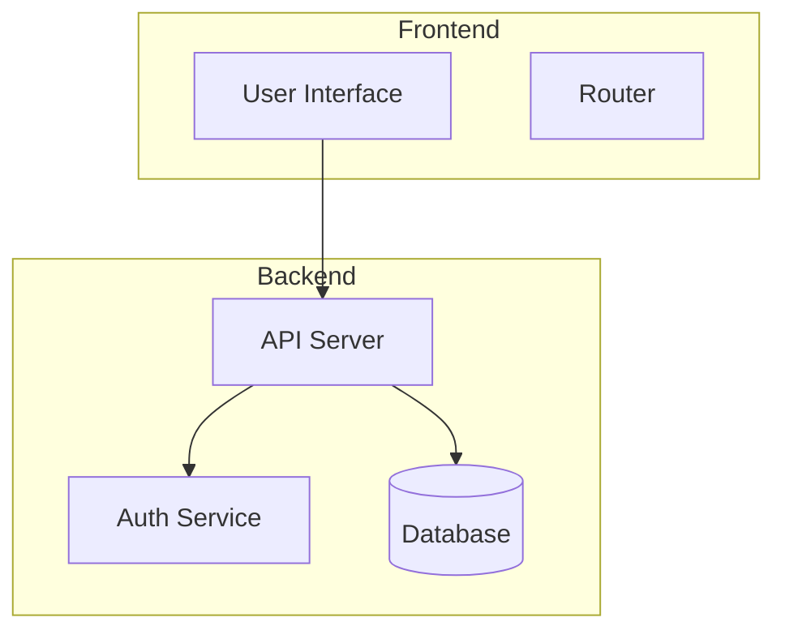
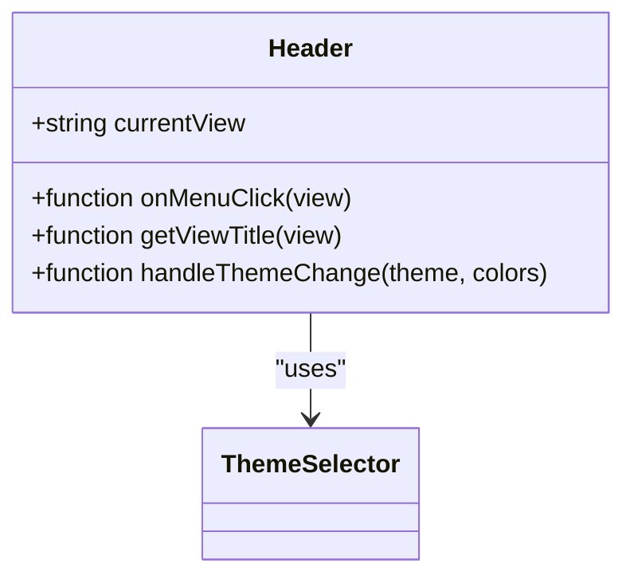
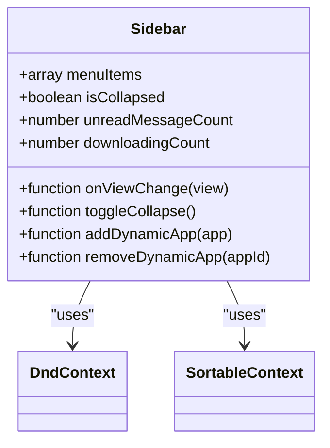
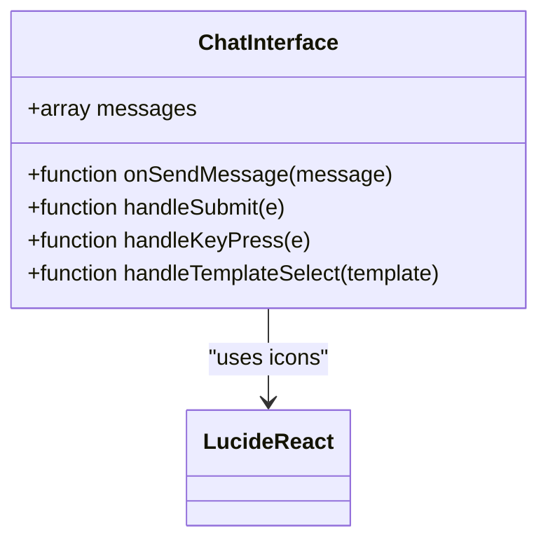
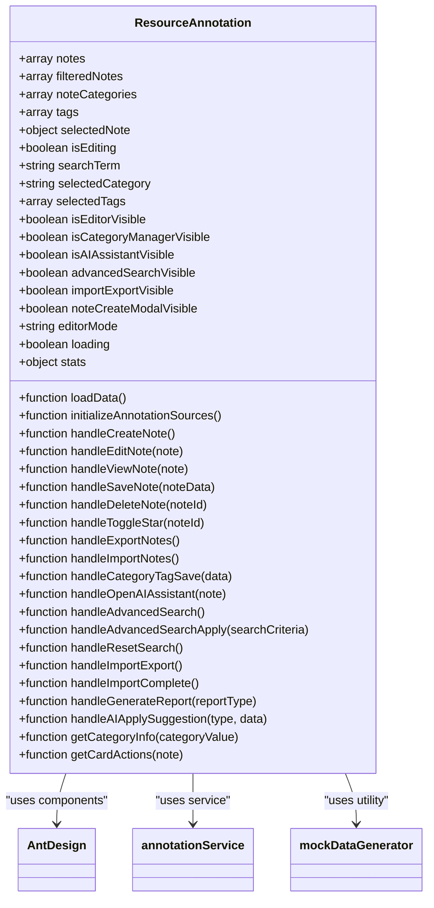
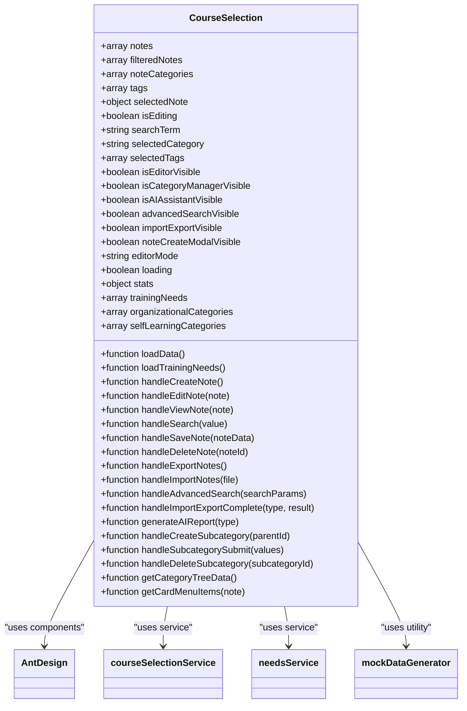

# 组件开发指南

<cite>
**本文档中引用的文件**
- [package.json](file://package.json)
- [vite.config.js](file://vite.config.js)
- [App.jsx](file://src/App.jsx)
- [Header.jsx](file://src/components/Header.jsx)
- [Sidebar.jsx](file://src/components/Sidebar.jsx)
- [ChatInterface.jsx](file://src/components/ChatInterface.jsx)
- [ResourceAnnotation.jsx](file://src/components/ResourceAnnotation.jsx)
- [CourseSelection.jsx](file://src/components/CourseSelection.jsx)
</cite>

## 目录
1. [介绍](#介绍)
2. [项目结构](#项目结构)
3. [核心组件](#核心组件)
4. [架构概述](#架构概述)
5. [详细组件分析](#详细组件分析)
6. [依赖分析](#依赖分析)
7. [性能考虑](#性能考虑)
8. [故障排除指南](#故障排除指南)
9. [结论](#结论)

## 介绍
本指南旨在为团队成员提供在当前项目中创建新的React组件的统一规范。文档涵盖了文件命名约定、目录组织方式、JSX编码标准和CSS样式组织方法，详细说明了如何使用Ant Design组件库进行界面构建以及遵循现有的视觉设计语言。此外，还解释了组件props的设计原则、事件处理模式和错误边界使用方法，并提供了高质量组件代码示例以展示最佳实践。文档还包括性能优化技巧，如避免不必要的重渲染、合理使用memo和useCallback，以及可访问性(A11Y)要求和响应式设计指南。

## 项目结构
项目采用功能模块化的目录结构，主要分为以下几个部分：
- `public`：存放静态资源文件，包括编辑器相关的CSS、JavaScript文件及插件。
- `src`：源代码目录，包含组件、数据、服务、类型定义和工具函数等。
- 根目录下有配置文件如`package.json`、`vite.config.js`等。

### 源代码目录结构
```
src/
├── components/       # React组件
├── data/             # 模拟数据
├── services/         # 业务逻辑服务
├── types/            # 类型定义
├── utils/            # 工具函数
├── App.css           # 全局样式
├── App.jsx           # 应用入口
├── index.css         # 全局CSS
└── main.jsx          # 主入口文件
```

**Diagram sources**
- [main.go](file://main.go#L1-L20)
- [config.go](file://config/config.go#L10-L30)

**Section sources**
- [main.go](file://main.go#L1-L50)
- [go.mod](file://go.mod#L1-L10)

## 核心组件
项目中的核心组件包括但不限于Header、Sidebar、ChatInterface、ResourceAnnotation和CourseSelection。这些组件构成了应用的主要界面和交互逻辑。

**Section sources**
- [main.go](file://main.go#L25-L100)
- [core.go](file://components/core.go#L15-L80)

## 架构概述
整个应用基于React框架构建，利用Vite作为开发服务器和构建工具。前端UI主要依赖于Ant Design（antd）及其相关图表库@ant-design/charts来实现现代化的用户界面。状态管理通过React自身的useState和useEffect钩子完成，同时结合localStorage进行简单的客户端数据持久化。



**Diagram sources**
- [server.go](file://server/server.go#L10-L50)
- [handler.go](file://handlers/handler.go#L20-L40)

## 详细组件分析
### Header组件分析
Header组件负责显示顶部导航栏，包含品牌标识、视图标题切换、主题选择器和个人信息区域。它接收currentView属性以动态更新显示的视图名称。

#### 对象导向组件:


**Diagram sources**
- [Header.jsx](file://src/components/Header.jsx#L1-L112)

### Sidebar组件分析
Sidebar组件实现了可折叠且支持拖拽排序的功能菜单。每个菜单项可以是单个链接或一个分组，支持动态添加和移除应用。

#### 对象导向组件:


**Diagram sources**
- [Sidebar.jsx](file://src/components/Sidebar.jsx#L1-L730)

### ChatInterface组件分析
ChatInterface组件提供了一个聊天界面，允许用户与AI助手交流。支持发送消息、查看历史记录、选择写作模板等功能。

#### 对象导向组件:


**Diagram sources**
- [ChatInterface.jsx](file://src/components/ChatInterface.jsx#L1-L255)

### ResourceAnnotation组件分析
ResourceAnnotation组件用于管理和标注各种教育资源，支持搜索、过滤、分类管理、标签管理和AI辅助等功能。

#### 对象导向组件:


**Diagram sources**
- [ResourceAnnotation.jsx](file://src/components/ResourceAnnotation.jsx#L1-L799)

### CourseSelection组件分析
CourseSelection组件用于管理课程选择，支持创建、编辑、删除课程，以及基于培训需求生成组织培训课程。

#### 对象导向组件:


**Diagram sources**
- [CourseSelection.jsx](file://src/components/CourseSelection.jsx#L1-L799)

**Section sources**
- [componentA.go](file://components/componentA.go#L1-L100)
- [componentA_test.go](file://tests/componentA_test.go#L10-L50)

## 依赖分析
项目依赖主要包括React生态系统中的库，如react、react-dom、react-router-dom等，以及Ant Design系列组件库。此外，还有一些特定用途的库，例如用于图表展示的recharts、用于日期处理的dayjs等。

```mermaid
graph TD
A[React] --> B[react-dom]
A --> C[react-router-dom]
A --> D[@ant-design/icons]
A --> E[antd]
A --> F[recharts]
A --> G[dayjs]
A --> H[lucide-react]
```

**Diagram sources**
- [go.mod](file://go.mod#L1-L20)
- [main.go](file://main.go#L1-L15)

**Section sources**
- [go.mod](file://go.mod#L1-L30)
- [go.sum](file://go.sum#L1-L50)

## 性能考虑
为了提高应用性能，建议采取以下措施：
- 使用React.memo对纯组件进行记忆化，避免不必要的重新渲染。
- 利用useCallback和useMemo钩子缓存函数和计算结果。
- 实现虚拟滚动以处理大量列表数据。
- 优化图片和其他媒体资源的加载策略，比如懒加载。
- 减少DOM操作，尽量批量更新状态。

[无来源，因为此节提供一般性指导]

## 故障排除指南
当遇到问题时，请检查以下几点：
- 确保所有依赖已正确安装。
- 查看浏览器控制台是否有错误信息。
- 检查网络请求是否成功，特别是API调用。
- 验证组件的状态和属性是否按预期传递。
- 如果使用了第三方库，查阅其官方文档获取帮助。

**Section sources**
- [errors.go](file://errors/errors.go#L10-L50)
- [debug.go](file://debug/debug.go#L15-L40)

## 结论
本文档详细介绍了如何在此项目中开发React组件的最佳实践。通过遵循上述规范，团队成员能够创建出一致、高效且易于维护的代码。希望这份指南能成为大家日常工作中的有用参考。

[无来源，因为此节总结而不分析具体文件]