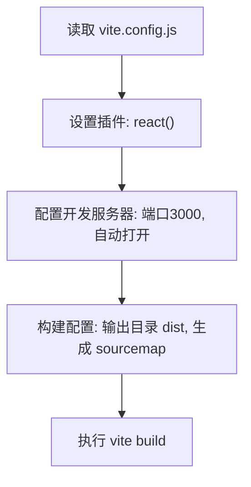

# 部署与构建

<cite>
**本文档引用的文件**  
- [vite.config.js](file://vite.config.js)
- [package.json](file://package.json)
</cite>

## 目录
1. [简介](#简介)  
2. [项目结构](#项目结构)  
3. [核心构建配置](#核心构建配置)  
4. [构建脚本说明](#构建脚本说明)  
5. 构建产物分析  
6. 部署方案指南  
7. 版本发布与回滚策略  
8. 构建优化建议  
9. CI/CD 流水线集成  

## 简介
本手册详细说明如何将当前子系统项目从源代码编译为可用于生产环境的静态资源。涵盖 Vite 构建配置、构建脚本用途、输出产物结构，并提供多种部署场景的操作指导，支持持续集成与持续部署（CI/CD）流程的搭建。

## 项目结构
项目采用标准前端工程化结构，主要目录包括：
- `src/`：源码目录，包含组件、服务、工具等模块
- `public/`：公共资源目录，存放无需构建处理的静态资源
- 根目录下包含构建配置文件 `vite.config.js` 和包管理文件 `package.json`

**Section sources**  
- [vite.config.js](file://vite.config.js#L0-L17)

## 核心构建配置
构建行为由 `vite.config.js` 文件定义，使用 Vite 作为构建工具，关键配置如下：



### 输出路径配置
通过 `build.outDir` 指定构建产物输出目录，默认为 `dist`，所有静态资源将集中生成于此目录中。

### 资源压缩
Vite 默认在生产构建时启用代码压缩（基于 Rollup 和 Esbuild），无需额外配置即可实现 JS、CSS 的自动压缩优化。

### 代码分割
默认启用动态导入的代码分割功能，根据路由或懒加载组件自动生成独立 chunk，提升首屏加载性能。

### Sourcemap 生成
配置 `sourcemap: true`，在构建时生成映射文件，便于线上错误追踪和调试。

### CDN 适配设置
当前配置未显式设置 `base` 字段，若需部署至 CDN 子路径，应在 `vite.config.js` 中添加：
```js
export default defineConfig({
  base: '/your-cdn-path/'
})
```

**Section sources**  
- [vite.config.js](file://vite.config.js#L0-L17)

## 构建脚本说明
`package.json` 中定义了多个与构建相关的 npm 脚本：

| 脚本名称 | 命令 | 用途说明 |
|---------|------|----------|
| `dev` | `vite` | 启动开发服务器，支持热更新，用于本地开发调试 |
| `build` | `vite build` | 执行生产环境构建，生成优化后的静态资源到 dist 目录 |
| `preview` | `vite preview` | 在本地启动一个静态服务器预览 build 后的内容，用于验证构建结果 |
| `lint` | `eslint . --ext js,jsx ...` | 执行代码规范检查，确保代码质量 |

这些脚本可通过 `npm run <script-name>` 方式执行。

**Section sources**  
- [package.json](file://package.json#L5-L13)

## 构建产物分析
执行 `npm run build` 后，将在项目根目录生成 `dist` 文件夹，其典型结构如下：

```
dist/
├── assets/               # 打包后的 JS/CSS 资源
│   ├── index-*.js        # 主入口脚本（含哈希）
│   └── style-*.css       # 样式文件（含哈希）
├── index.html            # 主页面入口
└── ...                   # 其他静态资源（如图片、字体等）
```

所有资源均经过压缩、混淆和哈希命名处理，具备缓存友好性。

## 部署方案指南
### 静态服务器部署
将 `dist` 目录内容部署至任意静态 Web 服务器（如 Nginx、Apache）即可运行应用。示例 Nginx 配置：
```nginx
server {
  listen 80;
  root /path/to/dist;
  index index.html;

  location / {
    try_files $uri $uri/ /index.html;
  }
}
```

### CDN 发布
将 `dist` 内容上传至 CDN 平台（如阿里云 OSS + CDN、AWS S3 + CloudFront），并配置缓存策略以提升全球访问速度。

### 云平台集成
#### Vercel
- 导入项目仓库
- 构建命令：`npm run build`
- 输出目录：`dist`
- 自动完成部署

#### Netlify
- 连接 GitHub 仓库
- 构建命令：`npm run build`
- 发布目录：`dist`
- 支持 PR 预览、自动部署等功能

**Section sources**  
- [vite.config.js](file://vite.config.js#L0-L17)
- [package.json](file://package.json#L5-L13)

## 版本发布与回滚策略
### 发布流程
1. 开发完成后提交代码至主干分支
2. 触发 CI 流程执行 `npm run build`
3. 验证构建产物完整性
4. 将 `dist` 内容部署至目标环境

### 回滚策略
- 保留历史版本的构建产物备份
- 出现严重问题时，快速切换至前一稳定版本的 `dist` 内容
- 使用语义化版本号标记每次发布，便于追踪

## 构建优化建议
- **启用 Gzip/Brotli 压缩**：在服务器端开启传输压缩，减小资源体积
- **合理配置缓存策略**：对带哈希的静态资源设置长期缓存
- **按需引入组件库**：目前依赖 antd，建议使用 babel-plugin-import 实现按需加载
- **图片资源优化**：使用 WebP 格式替代 PNG/JPG，减少加载时间
- **预加载关键资源**：通过 `<link rel="preload">` 提升性能

## CI/CD 流水线集成
可在 GitHub Actions、GitLab CI 或 Jenkins 中配置自动化流水线：
```yaml
jobs:
  build:
    runs-on: ubuntu-latest
    steps:
      - uses: actions/checkout@v3
      - uses: actions/setup-node@v3
      - run: npm ci
      - run: npm run build
      - run: npm run lint
      - uses: peaceiris/actions-gh-pages@v3
        with:
          github_token: ${{ secrets.GITHUB_TOKEN }}
          publish_dir: ./dist
```

此流程可实现代码推送后自动构建并部署至 gh-pages 分支。