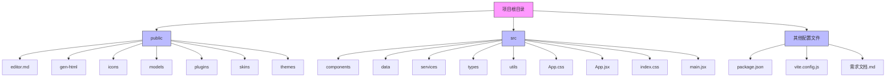
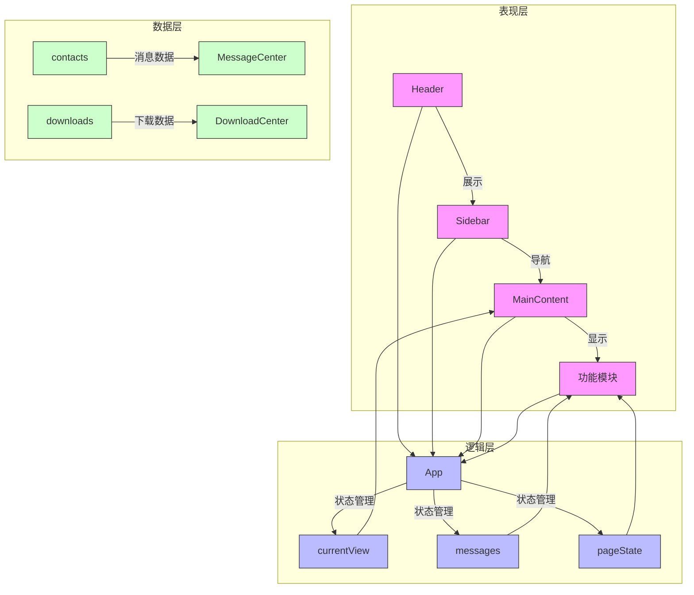
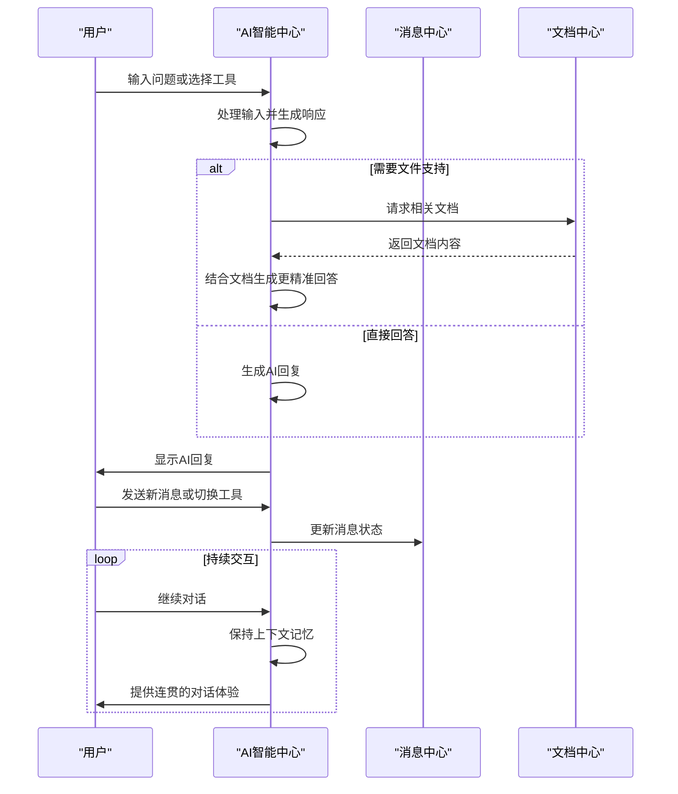
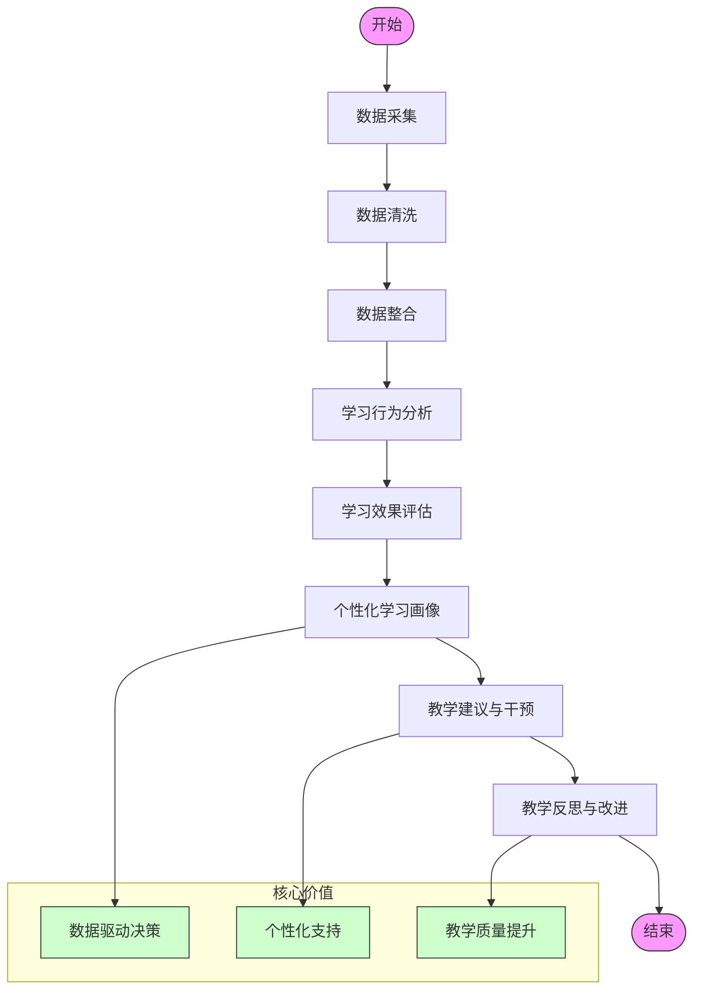

# 项目概述

<cite>
**本文档引用文件**  
- [需求文档.md](file://需求文档.md)
- [package.json](file://package.json)
- [vite.config.js](file://vite.config.js)
- [src/main.jsx](file://src/main.jsx)
- [src/App.jsx](file://src/App.jsx)
- [src/components/UnifiedAICenter.jsx](file://src/components/UnifiedAICenter.jsx)
- [src/components/AIAssistantCenter.jsx](file://src/components/AIAssistantCenter.jsx)
- [src/components/LearningAnalytics.jsx](file://src/components/LearningAnalytics.jsx)
- [src/components/LearningAnalyticsCenter.jsx](file://src/components/LearningAnalyticsCenter.jsx)
</cite>

## 目录
1. [简介](#简介)
2. [项目结构](#项目结构)
3. [核心组件](#核心组件)
4. [架构概览](#架构概览)
5. [详细组件分析](#详细组件分析)
6. [依赖分析](#依赖分析)
7. [性能考虑](#性能考虑)
8. [故障排除指南](#故障排除指南)
9. [结论](#结论)

## 简介
智慧教学平台是一个基于React技术栈开发的AI驱动型教学管理与学习分析系统，旨在为教育工作者提供全方位的智能化教研支持服务。该系统集成了AI对话、文档管理、课程准备、听课评课、会议管理、消息通讯等多个核心功能模块，构建了一个完整的智慧教育生态系统。作为AI驱动的教学管理与学习分析平台，本系统通过整合人工智能技术与教育教学实践，实现了教学流程的智能化、数据化和个性化。

系统采用现代化的前端架构设计，以React 18.2.0为核心框架，结合Ant Design 5.27.3 UI组件库和Vite 4.4.5构建工具，确保了高性能的用户体验和高效的开发流程。平台不仅提供了丰富的教学辅助工具，还通过深度数据分析为教师提供精准的教学决策支持，真正实现了"数据驱动教学"的理念。

## 项目结构
智慧教学平台的项目结构遵循功能模块化的设计原则，将不同功能的代码组织在相应的目录中，便于维护和扩展。整个项目主要由`public`、`src`等核心目录构成，其中`src`目录包含了应用的主要源代码。



**图示来源**
- [需求文档.md](file://需求文档.md)
- [package.json](file://package.json)
- [vite.config.js](file://vite.config.js)

**章节来源**
- [需求文档.md](file://需求文档.md)

## 核心组件
智慧教学平台的核心组件构成了系统的骨架，这些组件通过精心设计的状态管理和数据流实现了复杂的功能交互。`App.jsx`作为主应用组件，负责协调各个功能模块的显示和状态管理；`main.jsx`则是应用的入口点，负责渲染根组件；`UnifiedAICenter.jsx`实现了AI智能中心的核心功能，提供多模态AI对话和智能生成功能。

系统通过`useState`和`useEffect`等React Hooks实现状态管理，采用props传递的方式进行组件间通信，并利用URL哈希变化来管理页面导航状态。这种设计模式既保持了组件的独立性，又确保了状态的一致性和可预测性。例如，在`App.jsx`中定义的`currentView`状态控制着当前显示的功能模块，而`pageState`则用于传递特定页面的数据上下文。

**章节来源**
- [src/main.jsx](file://src/main.jsx#L0-L9)
- [src/App.jsx](file://src/App.jsx#L0-L425)
- [src/components/UnifiedAICenter.jsx](file://src/components/UnifiedAICenter.jsx#L0-L799)

## 架构概览
智慧教学平台采用了现代化的前端架构设计，以React函数式组件+Hooks的模式构建用户界面，实现了高效的状态管理和组件复用。系统整体架构分为表现层、逻辑层和数据层三个层次，各层之间通过清晰的接口进行交互，确保了代码的可维护性和可扩展性。



**图示来源**
- [src/App.jsx](file://src/App.jsx#L0-L425)
- [src/components/Header.jsx](file://src/components/Header.jsx)
- [src/components/Sidebar.jsx](file://src/components/Sidebar.jsx)
- [src/components/MainContent.jsx](file://src/components/MainContent.jsx)

## 详细组件分析

### AI智能中心分析
AI智能中心是智慧教学平台的核心功能模块，为用户提供全方位的智能化教研支持服务。该组件通过集成多种AI模型和智能工具，实现了从课程设计到学情分析的全流程辅助。

#### 组件关系图
```mermaid
classDiagram
class UnifiedAICenter {
+messages : Array
+inputMessage : String
+isLoading : Boolean
+currentTool : String
+deepThinking : Boolean
+sidebarCollapsed : Boolean
+showSettings : Boolean
+handleSendMessage(message)
+setCurrentTool(tool)
+toggleDeepThinking()
+toggleSidebar()
+openSettings()
}
class AIAssistantCenter {
+activeTab : String
+messages : Array
+inputMessage : String
+isLoading : Boolean
+lessonPlanForm : Object
+analysisData : Object
+handleSendMessage()
+generateAIResponse(input)
+handleGenerateLessonPlan()
+renderTabContent()
}
UnifiedAICenter --> AIAssistantCenter : "包含"
UnifiedAICenter --> MessageCenter : "集成"
UnifiedAICenter --> DocsCenter : "集成"
AIAssistantCenter --> LessonPreparation : "关联"
AIAssistantCenter --> LearningAnalytics : "关联"
AIAssistantCenter --> ResourceLibrary : "关联"
note right of UnifiedAICenter
核心AI对话和智能生成功能
支持多种AI模型接入
实时流式对话
富文本编辑器集成
end note
note left of AIAssistantCenter
提供智能对话、教案生成、
学情分析、资源推荐等功能
采用标签页形式组织功能
支持模拟AI响应
end note
```

**图示来源**
- [src/components/UnifiedAICenter.jsx](file://src/components/UnifiedAICenter.jsx#L0-L799)
- [src/components/AIAssistantCenter.jsx](file://src/components/AIAssistantCenter.jsx#L0-L518)

#### 功能交互流程


**图示来源**
- [src/components/UnifiedAICenter.jsx](file://src/components/UnifiedAICenter.jsx#L0-L799)
- [src/components/MessageCenter.jsx](file://src/components/MessageCenter.jsx)
- [src/components/DocsCenter.jsx](file://src/components/DocsCenter.jsx)

**章节来源**
- [src/components/UnifiedAICenter.jsx](file://src/components/UnifiedAICenter.jsx#L0-L799)
- [src/components/AIAssistantCenter.jsx](file://src/components/AIAssistantCenter.jsx#L0-L518)

### 学习分析中心分析
学习分析中心是智慧教学平台的重要组成部分，通过收集、整合、分析学生的学习数据，为教师提供全面、精准的学生学习情况洞察，支持个性化教学、精准干预和教学改进。

#### 数据分析流程


**图示来源**
- [src/components/LearningAnalytics.jsx](file://src/components/LearningAnalytics.jsx#L0-L298)
- [src/components/LearningAnalyticsCenter.jsx](file://src/components/LearningAnalyticsCenter.jsx#L0-L753)

#### 组件结构
```mermaid
classDiagram
class LearningAnalytics {
+activeTab : String
+platformStats : Object
+renderOverview()
+renderDataCollection()
+renderBehaviorAnalysis()
+renderEffectEvaluation()
+renderStudentProfile()
+renderTeachingSupport()
+renderReflectionImprovement()
}
class LearningAnalyticsCenter {
+activeTab : String
+selectedTimeRange : String
+selectedSubject : String
+selectedClass : String
+students : Array
+classStats : Object
+knowledgePoints : Array
+recommendations : Array
+getDifficultyTag(difficulty)
+getPriorityTag(priority)
+getTrendIcon(trend)
+studentColumns : Array
+knowledgeColumns : Array
}
LearningAnalytics --> DataCollection : "使用"
LearningAnalytics --> BehaviorAnalysis : "使用"
LearningAnalytics --> EffectEvaluation : "使用"
LearningAnalytics --> StudentProfile : "使用"
LearningAnalytics --> TeachingSupport : "使用"
LearningAnalytics --> ReflectionImprovement : "使用"
LearningAnalyticsCenter --> LearningAnalytics : "扩展"
note right of LearningAnalytics
学情分析平台主组件
包含多个子功能模块
提供平台概览和核心价值
end note
note left of LearningAnalyticsCenter
学情分析中心增强版
提供更详细的数据分析
支持时间范围和学科筛选
包含学生、知识点、建议等维度
end note
```

**图示来源**
- [src/components/LearningAnalytics.jsx](file://src/components/LearningAnalytics.jsx#L0-L298)
- [src/components/LearningAnalyticsCenter.jsx](file://src/components/LearningAnalyticsCenter.jsx#L0-L753)

**章节来源**
- [src/components/LearningAnalytics.jsx](file://src/components/LearningAnalytics.jsx#L0-L298)
- [src/components/LearningAnalyticsCenter.jsx](file://src/components/LearningAnalyticsCenter.jsx#L0-L753)

## 依赖分析
智慧教学平台的依赖关系清晰地反映了其技术选型和架构设计。项目通过`package.json`文件管理所有依赖项，分为生产环境依赖和开发环境依赖两大类。

```mermaid
graph LR
A[智慧教学平台] --> B[@ant-design/charts]
A --> C[@ant-design/icons]
A --> D[@dnd-kit/core]
A --> E[@dnd-kit/sortable]
A --> F[@wangeditor/editor]
A --> G[antd]
A --> H[chart.js]
A --> I[dayjs]
A --> J[lucide-react]
A --> K[react]
A --> L[react-chartjs-2]
A --> M[react-dnd]
A --> N[react-dom]
A --> O[react-quill]
A --> P[react-router-dom]
A --> Q[recharts]
A --> R[@vitejs/plugin-react]
A --> S[vite]
style A fill:#f9f,stroke:#333
style B fill:#bbf,stroke:#333
style C fill:#bbf,stroke:#333
style D fill:#bbf,stroke:#333
style E fill:#bbf,stroke:#333
style F fill:#bbf,stroke:#333
style G fill:#bbf,stroke:#333
style H fill:#bbf,stroke:#333
style I fill:#bbf,stroke:#333
style J fill:#bbf,stroke:#333
style K fill:#bbf,stroke:#333
style L fill:#bbf,stroke:#333
style M fill:#bbf,stroke:#333
style N fill:#bbf,stroke:#333
style O fill:#bbf,stroke:#333
style P fill:#bbf,stroke:#333
style Q fill:#bbf,stroke:#333
style R fill:#bbf,stroke:#333
style S fill:#bbf,stroke:#333
```

**图示来源**
- [package.json](file://package.json#L0-L42)

**章节来源**
- [package.json](file://package.json#L0-L42)
- [vite.config.js](file://vite.config.js#L0-L17)

## 性能考虑
智慧教学平台在性能方面进行了充分的考虑和优化，确保了系统的响应速度和用户体验。根据需求文档中的非功能性需求，系统需要满足页面加载时间小于3秒、支持并发用户数超过1000、系统响应时间小于2秒等性能要求。

系统采用Vite作为构建工具，利用其快速的冷启动和热更新特性，显著提升了开发效率和生产环境的加载速度。同时，通过代码分割、懒加载等技术手段，优化了首屏加载时间。在数据处理方面，系统采用了高效的数据结构和算法，确保了大规模数据处理的性能表现。

## 故障排除指南
当遇到智慧教学平台使用问题时，可以按照以下步骤进行排查：

1. **检查网络连接**：确保设备已连接到互联网，且网络稳定。
2. **清除缓存**：尝试访问`clear-storage.html`页面清除本地存储数据。
3. **检查浏览器兼容性**：确保使用Chrome、Firefox、Safari或Edge等主流浏览器的最新版本。
4. **查看控制台日志**：打开浏览器开发者工具，查看是否有错误信息输出。
5. **重启应用**：关闭并重新打开应用，或刷新页面。
6. **检查依赖更新**：确认所有依赖包是否为最新版本，避免因版本不兼容导致的问题。

**章节来源**
- [clear-storage.html](file://clear-storage.html)

## 结论
智慧教学平台作为一个AI驱动的教学管理与学习分析平台，通过先进的技术架构和丰富的功能模块，为教育工作者提供了全方位的智能化教研支持服务。系统采用React 18.2.0作为前端框架，结合Ant Design UI组件库和Vite构建工具，实现了高性能的用户体验和高效的开发流程。

平台的核心优势在于其组件化的架构设计，将AI智能中心、教学管理系统、学习分析中心等功能模块有机地整合在一起，形成了一个完整的智慧教育生态系统。通过数据驱动的教学决策支持和个性化的学习建议，系统真正实现了"以学生为中心"的教育理念，为提升教学质量提供了强有力的技术支撑。

未来，系统可以进一步拓展移动端应用，增加更多AI模型接入，深化数据分析能力，为智慧教育的发展做出更大的贡献。